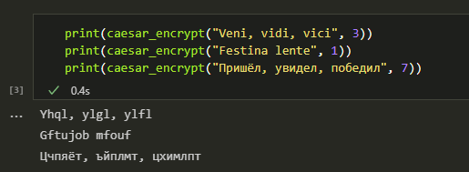
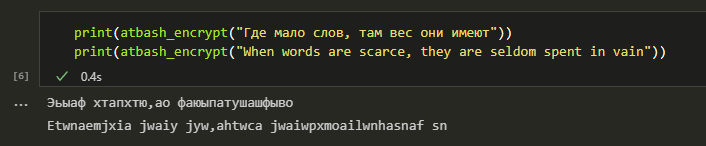

---
## Front matter
lang: ru-RU
title: |
    Отчёт по лабораторной работе №1.  
    Шифры простой замены
author: |
    *Дисциплина: Математические основы защиты информации*  
    *и информационной безопасности*  
    \vspace{2pt}  
    **Студент:** Аронова Юлия Вадимовна, 1032212303  
		**Группа:** НФИмд-01-21  
		**Преподаватель:** д-р.ф.-м.н., проф. Кулябов Дмитрий Сергеевич  
    \vspace{2pt}
date: 11 ноября, 2021, Москва

## Formatting
toc: false
slide_level: 2
theme: metropolis
header-includes:
 - \metroset{progressbar=frametitle,sectionpage=progressbar,numbering=fraction}
 - '\makeatletter'
 - '\beamer@ignorenonframefalse'
 - '\makeatother'
aspectratio: 43
section-titles: true
linestretch: 1.25

mainfont: PT Serif
romanfont: PT Serif
sansfont: PT Sans
monofont: PT Mono
mainfontoptions: Ligatures=TeX
romanfontoptions: Ligatures=TeX
sansfontoptions: Ligatures=TeX,Scale=MatchLowercase
monofontoptions: Scale=MatchLowercase,Scale=0.7
---

# Цели и задачи работы

## Цель лабораторной работы

\centering \Large \textbf{Целью} данной лабораторной работы является ознакомление с двумя простейшими методами шифрования: шифром Цезаря и шифром Атбаш, -- а так же их реализация на произвольном языке программирования.

## Задание

\begin{exampleblock}{Задание 1}
      Реализовать шифр Цезаря с произвольным ключом $k$.
      $$y = (x + k) \; mod \; m,$$
      где $x$ -- символ открытого текста, $y$ -- символ шифрованного текста, $m$ -- мощность алфавита, $k$ -- ключ.
\end{exampleblock}

\begin{exampleblock}{Задание 2}
      Реализовать шифр Атбаш.
      $$y = m - x - 1$$
\end{exampleblock}

# Ход выполнения и результаты

## Шифр Цезаря. Реализация

```python
n_eng = 26 # мощность английского алфавита
n_rus = 32 # мощность русского алфавита

lang_dict = {
    "eng" : {"a" : ord('a'), "z" : ord('z'), "m" : n_eng},
    "rus" : {"a" : ord('а'), "z" : ord('я'), "m" : n_rus}
    }
```

## Шифр Цезаря. Реализация

```python
def shift(letter, k, language):
    a = ord(letter) # Unicode-код символа

    # если этот символ буквенный..
    if lang_dict[language]['a'] <= a <= lang_dict[language]['z']:
        T_new = (a - lang_dict[language]['a'] + k) %
          % lang_dict[language]['m'] +
          + lang_dict[language]['a']

        return chr(T_new) # и возвращаем новую букву
    else: # иначе..
        return letter # возвращаем символ без изменений
```

## Шифр Цезаря. Реализация

```python
def caesar_encrypt(message, k):
    message_encrypted = []
    caps = [True if letter.isupper() else False for letter in message]  
    if lang_dict['eng']['a'] <= ord(message[0].lower())
                                          <= lang_dict['eng']['z']:
        language = "eng" <...>
    for i in range(len(message)):
        message_encrypted.append(shift(message.lower()[i], k, language))
    for i in range(len(caps)):
        if caps[i]:
            message_encrypted[i] = message_encrypted[i].upper()
    return "".join(message_encrypted)
```

## Шифр Цезаря. Результаты

{ #fig:001 width=100% }

## Шифр Атбаш. Реализация

```python
eng_abc = [chr(code) for code
      in range(lang_dict['eng']['a'], lang_dict['eng']['z'] + 1)]
eng_abc.append(' ')

rus_abc = [chr(code) for code
      in range(lang_dict['rus']['a'], lang_dict['rus']['z'] + 1)]
rus_abc.append(' ')

abc_s = {
    "eng" : eng_abc,
    "rus" : rus_abc
}
```

## Шифр Атбаш. Реализация

```python
def atbash_encrypt(message):
    message_encrypted = []
    caps = [True if letter.isupper() else False for letter in message]

    if message[0].lower() in eng_abc[:-1]:
        language = "eng"
    <...>

    abc = abc_s[language] # получаем алфавит соответствующего языка
    cba = list(reversed(abc)) # записываем его в обратном порядке

    # приводим сообщение к нижнему регистру
    message_lowered = message.lower()
```

## Шифр Атбаш. Реализация

```python
    for i in range(len(message)): # для каждого символа в сообщении:
        if message_lowered[i] in abc:
            code = abc.index(message_lowered[i])
            message_encrypted.append(cba[code])
        else:
            message_encrypted.append(message_lowered[i])

    for i in range(len(caps)):
        if caps[i]:
            message_encrypted[i] = message_encrypted[i].upper()

    return "".join(message_encrypted)
```

## Шифр Атбаш. Результаты

{ #fig:002 width=100% }


## {.standout}

Спасибо за внимание
