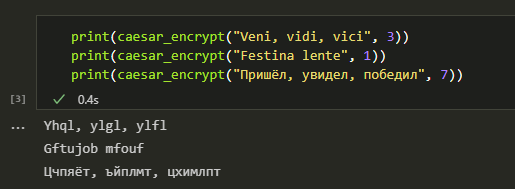
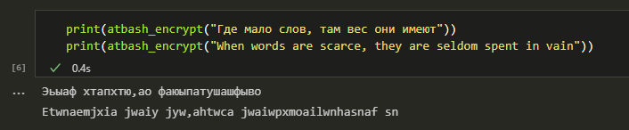

---
# Титульный лист
title: |
    Отчёт по лабораторной работе №1.  
    Шифры простой замены
author:
- "Студент: Аронова Юлия Вадимовна, 1032212303"
- "Группа: НФИмд-01-21"
- "Преподаватель: Кулябов Дмитрий Сергеевич,"
- "д-р.ф.-м.н., проф."
date: "Москва 2021"

# Общие опции
lang: ru-RU
toc-title: "Содержание"

# Библиография
bibliography: bib/cite.bib
csl: pandoc/csl/gost-r-7-0-5-2008-numeric.csl

# Конвертация в ПДФ
toc: true # Содержание
toc_depth: 2
lof: true # Список изображений
lot: true # Список таблиц
fontsize: 12pt
linestretch: 1.5
papersize: a4
documentclass: scrreprt

## I18n
polyglossia-lang:
  name: russian
  options:
	- spelling=modern
	- babelshorthands=true
polyglossia-otherlangs:
  name: english
### Шрифты
mainfont: PT Serif
romanfont: PT Serif
sansfont: PT Sans
monofont: PT Mono
mainfontoptions: Ligatures=TeX
romanfontoptions: Ligatures=TeX
sansfontoptions: Ligatures=TeX,Scale=MatchLowercase
monofontoptions: Scale=MatchLowercase,Scale=0.8
## Biblatex
biblatex: true
biblio-style: "gost-numeric"
biblatexoptions:
  - parentracker=true
  - backend=biber
  - hyperref=auto
  - language=auto
  - autolang=other*
  - citestyle=gost-numeric

## Misc options
indent: true
header-includes:
  - \linepenalty=10 # the penalty added to the badness of each line within a paragraph (no associated penalty node) Increasing the value makes tex try to have fewer lines in the paragraph.
  - \interlinepenalty=0 # value of the penalty (node) added after each line of a paragraph.
  - \hyphenpenalty=50 # the penalty for line breaking at an automatically inserted hyphen
  - \exhyphenpenalty=50 # the penalty for line breaking at an explicit hyphen
  - \binoppenalty=700 # the penalty for breaking a line at a binary operator
  - \relpenalty=500 # the penalty for breaking a line at a relation
  - \clubpenalty=150 # extra penalty for breaking after first line of a paragraph
  - \widowpenalty=150 # extra penalty for breaking before last line of a paragraph
  - \displaywidowpenalty=50 # extra penalty for breaking before last line before a display math
  - \brokenpenalty=100 # extra penalty for page breaking after a hyphenated line
  - \predisplaypenalty=10000 # penalty for breaking before a display
  - \postdisplaypenalty=0 # penalty for breaking after a display
  - \floatingpenalty = 20000 # penalty for splitting an insertion (can only be split footnote in standard LaTeX)
  - \raggedbottom # or \flushbottom
  - \usepackage{float} # keep figures where there are in the text
  - \floatplacement{figure}{H} # keep figures where there are in the text

  - \usepackage{titling}
  - \setlength{\droptitle}{-9em}
  - \pretitle{\begin{center}
      \textbf{РОССИЙСКИЙ УНИВЕРСИТЕТ ДРУЖБЫ НАРОДОВ}\\
      \textbf{Факультет физико-математических и естественных наук}\\
      \textbf{Кафедра прикладной информатики и теории вероятностей}
      \vspace{9cm}
      \LARGE\\}
  - \posttitle{\vskip 1em \Large \emph{\textit{Дисциплина$:$ Математические основы защиты информации и информационной безопасности}} \end{center}}
  - \preauthor{\vskip 3em \begin{flushright} \large \begin{tabular}[t]{c}}
  - \postauthor{\end{tabular}\par\end{flushright} \vfill \vskip 5em}
---

# Цель работы

Целью данной лабораторной работы является ознакомление с двумя простейшими методами шифрования, являющимися древними прародителями современной криптографии: шифром Цезаря и шифром Атбаш, -- а так же их реализация на произвольном языке программирования.

# Задание

1. Реализовать шифр Цезаря с произвольным ключом $k$.

2. Реализовать шифр Атбаш.

# Теоретическое введение

**Шифр Цезаря** является классическим примером древней криптографии [@jason:caesar]. Это один из самых простых и наиболее широко известных методов шифрования [@wiki:caesar], моноалфавитный шифр подстановки [@conrad:caesar], который, как утверждается, использовался римским полководцем Юлием Цезарем в секретных переписках со своими генералами. Шифр Цезаря основан на перестановках и включает в себя сдвиг каждой буквы открытого текста сообщения на определенное количество букв $k$. Так, Цезарь получал зашифрованное сообщение, сдвигая каждую букву открытого текста вперёд на три позиции, так что A превращалось в D, B становилось E и так далее, как показано в табл. [-@tbl:caesar] [@conrad:caesar].

: Шифровальная таблица для шифра Цезаря (Rot-3) {#tbl:caesar}

| a | b | c | d | e | f | g | h | i | j | k | l | m | n | o | p | q | r | s | t | u | v | w | x | y | z |
|---|---|---|---|---|---|---|---|---|---|---|---|---|---|---|---|---|---|---|---|---|---|---|---|---|---|
| d | e | f | g | h | i | j | k | l | m | n | o | p | q | r | s | t | u | v | w | x | y | z | a | b | c |

Зашифрованный текст можно расшифровать, применив такое же количество сдвигов в противоположном направлении [@jason:caesar]. Так, если сопоставить каждому символу алфавита его порядковый номер (начиная с 0), то математически процедуру шифрования и дешифрования можно выразить следующим образом:

$$y = (x + k) \; mod \; m \;\; \leftrightarrow \;\; x = (y - k) \; mod \; m,$$

где $x$ -- символ открытого текста, $y$ -- символ шифрованного текста, $m$ -- мощность алфавита, $k$ -- ключ, а $mod$ -- операция нахождения остатка от целочисленного деления.

**Шифр Атбаш** -- это моноалфавитный шифр подстановки, один из простейших методов шифрования [@atbash]. Первоначально шифр был разработан для использования с еврейским алфавитом. Так, например, в книге пророка Иеремии им было зашифровано несколько слов.

Подстановка, используемая в шифре Атбаш, переводит алфавит в его запись в обратном порядке. Так, для алфавита, состоящего только из русских букв и пробела, таблица шифрования будет иметь вид, как в табл. [-@tbl:atbash].

: Шифровальная таблица для шифра Атбаш {#tbl:atbash}

| а | б | в | г | д | е | ж | з | и | й | ... | ч | ш | щ | ъ | ы | ь | э | ю | я |   |
|---|---|---|---|---|---|---|---|---|---|-----|---|---|---|---|---|---|---|---|---|---|
|   | я | ю | э | ь | ы | ъ | щ | ш | ч | ... | й | и | з | ж | е | д | г | в | б | а |

Описанные шифры -- да и в целом моноалфавитные шифры -- редко используются сегодня за пределами словесных игр, потому что легко могут быть взломаны путем исчерпывающего поиска возможных комбинаций алфавитов [@monoabc]. Моноалфавитные шифры также уязвимы для частотного анализа, потому что даже при замене букв конечная частота появления каждой буквы будет примерно соответствовать известным частотным характеристикам языка.

# Выполнение лабораторной работы

## Шифр Цезаря

Начнём с реализации шифра Цезаря. Создадим две функции на языке **Python**:

---
linestretch: 0.6
---

```python
n_eng = 26 # мощность английского алфавита
n_rus = 32 # мощность русского алфавита

# словарь вида
# язык : {
# "a" : Unicode-код первой строчной буквы алфавита,
# "z" : Unicode-код последней строчной буквы алфавита,
# "m" : число букв в алфавите
# }
lang_dict = {
    "eng" : {"a" : ord('a'), "z" : ord('z'), "m" : n_eng},
    "rus" : {"a" : ord('а'), "z" : ord('я'), "m" : n_rus}
    }

def shift(letter, k, language):
    """
    Получает букву языка language на k позиций дальше буквы letter.
    Если символ letter не является буквой языка language, то возвращается он сам
    """
    a = ord(letter) # юникод символа

    # если этот символ буквенный..
    if lang_dict[language]['a'] <= a <= lang_dict[language]['z']:
        T_new = (a - lang_dict[language]['a'] + k) % lang_dict[language]['m'] +
        + lang_dict[language]['a'] # производим сдвиг на k позиций

        return chr(T_new) # и возвращаем новую букву
    else: # иначе..
        return letter # возвращаем символ без изменений

def caesar_encrypt(message, k):
    """
    Получает криптограмму сообщения message с помощью шифра Цезаря
    с ключом k. Небуквенные символы оставляет неизменными
    """
    message_encrypted = [] # зашифрованное сообщение, массив из символов

    # отмечаем индексы заглавных букв, чтобы сохранить правильные регистры
    # в сообщении
    caps = [True if letter.isupper() else False for letter in message]  

    # определяем язык сообщения на основе его первой буквы. Способ I
    if lang_dict['eng']['a'] <= ord(message[0].lower()) <= lang_dict['eng']['z']:
        language = "eng"
    elif lang_dict['rus']['a'] <= ord(message[0].lower()) <= lang_dict['rus']['z']:
        language = "rus"
    else:
        # выводим соответствующее сообщение
        print("Ошибка: первый символ должен быть кириллицей или латиницей")
        return "" # и выходим из функции

    for i in range(len(message)): # для каждого символа в сообщении..
        # зашифровываем его и добавляем к итоговому массиву символов
        message_encrypted.append(shift(message.lower()[i], k, language))

    # переводим в верхний регистр все соответствующие символы
    for i in range(len(caps)):
        if caps[i]:
            message_encrypted[i] = message_encrypted[i].upper()

    # объединяем символы в одну строку и возвращаем полученную криптограмму
    return "".join(message_encrypted)
```

---
linestretch: 1.5
---

Данный код позволяет зашифровать сообщения на двух языках: русском и английском. Основной язык открытого текста определяется как язык той буквы, с которой начинается текст. Язык определяется путём проверки принадлежности кода символа одному из заданных интервалов. Все буквы основного языка, встречающиеся в сообщении, зашифровываются, в то время как остальные символы остаются неизменными. Так, например, в сообщении *"Ave, Цезарь"* будет зашифровано только первое слово. Если текст начинается не с кириллицы или латиницы, выводится сообщение об ошибке. Также при шифровании сохраняется написание слов с прописной или строчной буквы.

Теперь зашифруем три сообщения с различными значениями ключа $k$ (см. рис. [-@fig:001]). Результаты шифрования первых двух сообщений можно сравнить с примерами, приведёнными в задании к лабораторной, и убедиться, что они корректны.

{ #fig:001 width=100% }

## Шифр Атбаш


---
linestretch: 0.6
---

```python
# английский алфавит + пробел
eng_abc = [chr(code) for code in range(lang_dict['eng']['a'],lang_dict['eng']['z']+1)]
eng_abc.append(' ')

# русский алфавит + пробел
rus_abc = [chr(code) for code in range(lang_dict['rus']['a'],lang_dict['rus']['z']+1)]
rus_abc.append(' ')

abc_s = {
    "eng" : eng_abc,
    "rus" : rus_abc
}

def atbash_encrypt(message):
    """
    Получает криптограмму сообщения message с помощью шифра Атбаша.
    Небуквенные символы оставляет неизменными
    """
    message_encrypted = [] # зашифрованное сообщение, массив из символов

    # отмечаем индексы заглавных букв
    caps = [True if letter.isupper() else False for letter in message]

    # определяем язык сообщения на основе его первой буквы. Способ II
    if message[0].lower() in eng_abc[:-1]:
        language = "eng"
    elif message[0].lower() in rus_abc[:-1]:
        language = "rus"
    else:
        print("Ошибка: первый символ должен быть кириллицей или латиницей")
        return ""

    abc = abc_s[language] # получаем алфавит соответствующего языка
    cba = list(reversed(abc)) # записываем его в обратном порядке

    message_lowered = message.lower() # приводим сообщение к нижнему регистру

    for i in range(len(message)): # для каждого символа в сообщении:
        if message_lowered[i] in abc: # если символ - буквенный..

            # получаем его порядковый номер в алфавите
            code = abc.index(message_lowered[i])

            # и берем букву под тем же номером в инвертированном алфавите
            message_encrypted.append(cba[code])

        else: # в противном случае..
            # оставляем символ неизменным
            message_encrypted.append(message_lowered[i])

    # переводим в верхний регистр все соответствующие символы
    for i in range(len(caps)):
        if caps[i]:
            message_encrypted[i] = message_encrypted[i].upper()

    # объединяем символы в одну строку и возвращаем полученную криптограмму
    return "".join(message_encrypted)
```

---
linestretch: 1.5
---

Здесь для удобства мы уже используем не Юникод-кодировку символов, а выносим английский и русский алфавиты в отдельные массивы и идентифицируем буквы по их порядковому номеру. Определение основного языка сообщения теперь осуществляется посредством проверки принадлежности первого символа сообщения к одному из массивов.

Зашифруем два сообщения: на английском и на русском языке (см. рис. [-@fig:002]).

{ #fig:002 width=100% }

# Выводы

Таким образом, была достигнута цель, поставленная в начале лабораторной работы: я ознакомилась с двумя простейшими методами шифрования -- шифром Цезаря и шифром Атбаш, -- а так же реализовала их на языке программирования **Python**.

# Список литературы{.unnumbered}

::: {#refs}
:::
