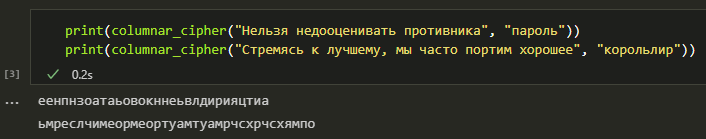
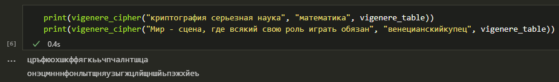
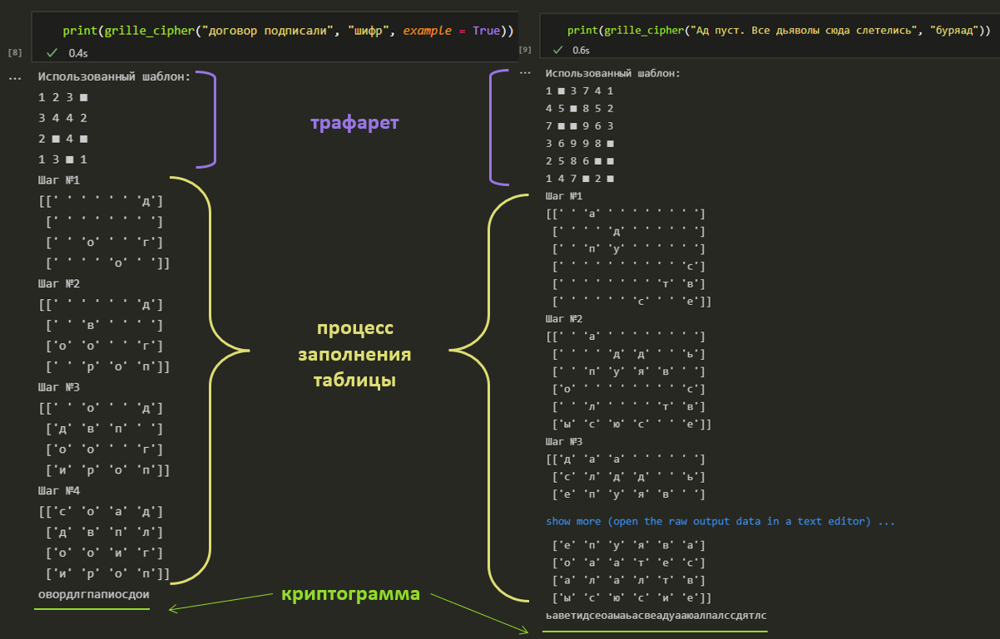

---
## Front matter
lang: ru-RU
title: |
    Отчёт по лабораторной работе №2.  
    Шифры перестановки
author: |
    *Дисциплина: Математические основы защиты информации*  
    *и информационной безопасности*  
    \vspace{2pt}  
    **Студент:** Аронова Юлия Вадимовна, 1032212303  
		**Группа:** НФИмд-01-21  
		**Преподаватель:** д-р.ф.-м.н., проф. Кулябов Дмитрий Сергеевич  
    \vspace{2pt}
date: 18 ноября, 2021, Москва

## Formatting
toc: false
slide_level: 2
theme: metropolis
header-includes:
 - \metroset{progressbar=frametitle,sectionpage=progressbar,numbering=fraction}
 - '\makeatletter'
 - '\beamer@ignorenonframefalse'
 - '\makeatother'
 - \usepackage{amsmath}
aspectratio: 43
section-titles: true
linestretch: 1.15

mainfont: PT Serif
romanfont: PT Serif
sansfont: PT Sans
monofont: PT Mono
mainfontoptions: Ligatures=TeX
romanfontoptions: Ligatures=TeX
sansfontoptions: Ligatures=TeX,Scale=MatchLowercase
monofontoptions: Scale=MatchLowercase,Scale=0.7
---

## Цели и задачи работы

\textbf{Целью} данной лабораторной работы является ознакомление с одним методом полиалфавитного шифрования -- *шифром Виженера* -- и двумя широко известными шифрами перестановки -- *маршрутным шифрованием* и *шифрованием с помощью решёток*, -- а также их последующая программная реализация.

\textbf{Задачи:} рассмотреть и реализовать на языке программирования Python:

1. Шифрование методом столбцовой перестановки;

2. Шифрование с помощью поворотных решёток;

3. Шифр Виженера.

# Теоретическое введение

## Шифры перестановки

\begin{alertblock}{Шифр перестановки}
      \vspace{1pt}
      Шифр, преобразования из которого изменяют только порядок следования символов исходного текста, но не изменяют их самих, называется \textit{шифром перестановки}.
\end{alertblock}

\begin{alertblock}{Подстановка}
      \vspace{1pt}
      Таблица, в первой строке которой указывается позиция символа в исходном сообщении, а во второй -- его позиция в шифрограмме, называется \textit{подстановкой} степени $n$.
      $$\begin{pmatrix}
      1 & 2 & \cdots & n\\
      i_1 & i_2 & \cdots & i_n
      \end{pmatrix}$$
\end{alertblock}

## Маршрутное шифрование. Столбцовая перестановка

\begin{alertblock}{Маршрутная перестановка}
      \vspace{1pt}
      Шифр, преобразования которого состоят в том, что в некоторую геометрическую фигуру исходный текст вписывается по ходу одного "маршрута", а затем по ходу другого выписывается с нее, называют \textit{маршрутной перестановкой}.
\end{alertblock}

\begin{alertblock}{Столбцовая перестановка}
      \vspace{1pt}
      Маршрутная перестановка на основе прямоугольной таблицы, вписывание в которую осуществляется по строкам слева-направо, а выписывание -- по столбцам сверху-вниз в порядке, определяемым некоторым ключом, называют \textit{столбцовой перестановкой}.
\end{alertblock}

## Шифрование с помощью решёток

 - \textbf{Решётка Кардано} представляла собой трафарет с прорезанными в нем отверстиями. При шифровании трафарет накладывался на таблицу, и в её видимые ячейки выписывались буквы исходного текста. Пустые ячейки в таблице затем заполняются "мусором".

 - \textbf{Поворотная решётка} подразумевает повороты трафарета и последовательное выписывание символов сообщения в таблицу блоками до её заполнения. Шифрограмму выписывают из итоговой таблицы по определенному маршруту.

## Поворотная решётка. Подготовка трафарета

{ #fig:001 width=100% }

## Шифр Виженера

\begin{alertblock}{Шифр Виженера}
      \vspace{1pt}
      \textit{Шифр Виженера} -- это полиалфавитный шифр подстановки, представляющий собой последовательность из нескольких шифров Цезаря с различными значениями сдвига, задаваемыми некоторым ключом. Так, если $n$ -- количество букв в алфавите, $m_j$ -- номер буквы открытого текста, $k_j$ -- номер буквы ключа, $c_j$ -- номер буквы шифротекста, то:
      $$c_j = (m_j + k_j) \; mod \; n$$
\end{alertblock}

## Таблица Виженера

{ #fig:002 width=100% }

# Ход выполнения и результаты

## Подготовка

```python
import math
import numpy as np
import string

# русский алфавит
abc  = [chr(code) for code in range(ord('а'), ord('я') + 1)]

# словарь вида {буква : порядковый номер}
letter2number = {abc[i] : i for i in range(len(abc))}
```

```python
mes = message.lower().replace(" ", "")
mes = mes.translate(str.maketrans('', '', string.punctuation))
```

## Столбцовая перестановка. Фрагменты кода

```python
table = np.full((m, n), 'а')
for i in range(m):
    for j in range(n):
        if i * n + j < len(mes):
            table[i][j] = mes[i * n + j]
        else:
            break
```

```python
nums = sorted([letter2number[letter] for letter in key])
route_order = [abc[number] for number in nums]
route_order = [key.index(letter) for letter in route_order]
```

```python
for j in route_order: # проходим по столбцам в заданном порядке
    for i in range(m): # проходим по всем строкам
        message_encrypted += table[i][j]
```

## Шифр Виженера. Фрагменты кода

```python
vigenere_table = np.array(abc)
for i in range(1, len(abc)):
    row = np.roll(abc, -i)
    vigenere_table = np.vstack((vigenere_table, row))
```

```python
long_key = key # удлинним ключ так, чтобы он покрывал всё сообщение
n = len(key)
while len(long_key) < len(mes):
    m = len(long_key)
    long_key = long_key + long_key[m - n]
```

```python    
for i in range(len(mes)):
    column = letter2number[mes[i]]
    row = letter2number[long_key[i]]
    message_encrypted += vigenere_table[row][column]
```

## Столбцовая перестановка и шифр Виженера. Результаты

{ #fig:003 width=100% }

{ #fig:004 width=100% }

## Шифрование с помощью решёток. Фрагменты кода (1)

```python
def rotare_cell(cell, k):
    cell_r = cell.T # транспонируем исходную матрицу
    result = np.full((k, k), 'а') # результирующая решетка
    for i in range(k):
        for j in range(k):
            result[i][j] = cell_r[i][k - j - 1] <...>
```

```python
def get_holes(cell, k):
    cell_nums = np.random.randint(0, 4, k ** 2)
    intervals = { 0 : [[0, k], [0, k]] <...> }
```

```python
    for i in range(k ** 2): <...>
        for j in range(interval[0][0], interval[0][1]):
            for l in range(interval[1][0], interval[1][1]):
                if cell[j][l] == number:
                    hole_indexes.append((j, l)) <...>
```
## Шифрование с помощью решёток. Фрагменты кода (2)

```python
n = len(mes)
k = math.ceil(math.ceil(np.sqrt(n)) / 2)
while len(mes) < (2 * k) ** 2:
    mes += 'а'
```

```python
cell_1 = np.full((k, k), 0)
for i in range(k):
    for j in range(k):
        cell_1[i][j] = str(i * k + j + 1)
cell_2 = rotare_cell(cell_1, k) <...>
```

```python
cell = np.full((2 * k, 2 * k), '0')
cell[:k, :k] = cell_1 <...>
```

```python
holes = sorted(get_holes(cell, k), key = lambda x : (x[0], x[1]))
```

## Шифрование с помощью решёток. Фрагменты кода (3)

```python
table = np.full((2 * k, 2 * k), ' ') # таблица
template = np.full((2 * k, 2 * k), '0') # трафарет
```

```python
for i in range(2 * k): # заполняем трафарет
    for j in range(2 * k):
        if (i, j) in holes:
            template[i][j] = '1'
```

```python
for i in range(4):
    for j in range(k ** 2):
        table[holes[j][0]][holes[j][1]] = mes[i * (k ** 2) + j]
    template = rotare_cell(template, 2 * k) # поворачиваем трафарет
    holes = [(hole[0], hole[1])
              for hole in np.array(np.where(template == '1')).T]
```

## Шифрование с помощью решёток. Результаты

{ #fig:005 width=100% }

## Заключение

Таким образом, была достигнула цель, поставленная в начале лабораторной работы:

- Было проведено знакомство с шифром Виженера, а также с шифрами перестановки на примере маршрутного шифрования и шифрования с помощью решёток;

- Были реализованы шифрование методом столбцовой перестановки, шифрование с помощью поворотных решёток и шифр Виженера для русского алфавита.

## {.standout}

Спасибо за внимание
