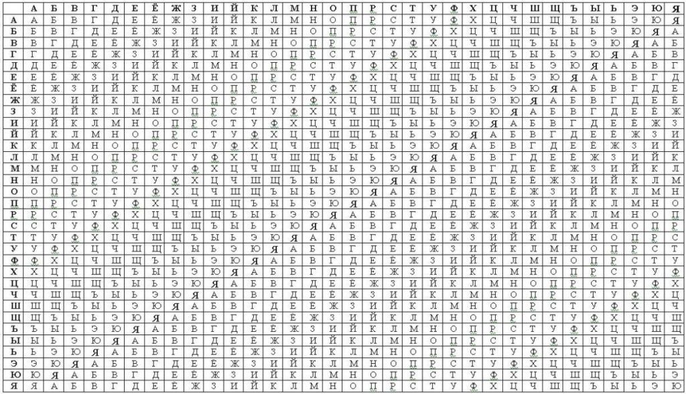

---
# Титульный лист
title: |
    Отчёт по лабораторной работе №2.  
    Шифры перестановки
author:
- "Студент: Аронова Юлия Вадимовна, 1032212303"
- "Группа: НФИмд-01-21"
- "Преподаватель: Кулябов Дмитрий Сергеевич,"
- "д-р.ф.-м.н., проф."
date: "Москва 2021"

# Общие опции
lang: ru-RU
toc-title: "Содержание"

# Библиография
bibliography: bib/cite.bib
csl: pandoc/csl/gost-r-7-0-5-2008-numeric.csl

# Конвертация в ПДФ
toc: true # Содержание
toc_depth: 2
lof: true # Список изображений
lot: true # Список таблиц
fontsize: 12pt
linestretch: 1.5
papersize: a4
documentclass: scrreprt

## I18n
polyglossia-lang:
  name: russian
  options:
	- spelling=modern
	- babelshorthands=true
polyglossia-otherlangs:
  name: english
### Шрифты
mainfont: PT Serif
romanfont: PT Serif
sansfont: PT Sans
monofont: PT Mono
mainfontoptions: Ligatures=TeX
romanfontoptions: Ligatures=TeX
sansfontoptions: Ligatures=TeX,Scale=MatchLowercase
monofontoptions: Scale=MatchLowercase,Scale=0.8
## Biblatex
biblatex: true
biblio-style: "gost-numeric"
biblatexoptions:
  - parentracker=true
  - backend=biber
  - hyperref=auto
  - language=auto
  - autolang=other*
  - citestyle=gost-numeric

## Misc options
indent: true
header-includes:
  - \linepenalty=10 # the penalty added to the badness of each line within a paragraph (no associated penalty node) Increasing the value makes tex try to have fewer lines in the paragraph.
  - \interlinepenalty=0 # value of the penalty (node) added after each line of a paragraph.
  - \hyphenpenalty=50 # the penalty for line breaking at an automatically inserted hyphen
  - \exhyphenpenalty=50 # the penalty for line breaking at an explicit hyphen
  - \binoppenalty=700 # the penalty for breaking a line at a binary operator
  - \relpenalty=500 # the penalty for breaking a line at a relation
  - \clubpenalty=150 # extra penalty for breaking after first line of a paragraph
  - \widowpenalty=150 # extra penalty for breaking before last line of a paragraph
  - \displaywidowpenalty=50 # extra penalty for breaking before last line before a display math
  - \brokenpenalty=100 # extra penalty for page breaking after a hyphenated line
  - \predisplaypenalty=10000 # penalty for breaking before a display
  - \postdisplaypenalty=0 # penalty for breaking after a display
  - \floatingpenalty = 20000 # penalty for splitting an insertion (can only be split footnote in standard LaTeX)
  - \raggedbottom # or \flushbottom
  - \usepackage{float} # keep figures where there are in the text
  - \floatplacement{figure}{H} # keep figures where there are in the text

  - \usepackage{titling}
  - \setlength{\droptitle}{-9em}
  - \pretitle{\begin{center}
      \textbf{РОССИЙСКИЙ УНИВЕРСИТЕТ ДРУЖБЫ НАРОДОВ}\\
      \textbf{Факультет физико-математических и естественных наук}\\
      \textbf{Кафедра прикладной информатики и теории вероятностей}
      \vspace{9cm}
      \LARGE\\}
  - \posttitle{\vskip 1em \Large \emph{\textit{Дисциплина$:$ Математические основы защиты информации и информационной безопасности}} \end{center}}
  - \preauthor{\vskip 3em \begin{flushright} \large \begin{tabular}[t]{c}}
  - \postauthor{\end{tabular}\par\end{flushright} \vfill \vskip 5em}

  - \usepackage{amsmath}
---

# Цель работы

Целью данной лабораторной работы является ознакомление с одним методом полиалфавитного шифрования -- *шифром Виженера* -- и двумя широко известными шифрами перестановки -- *маршрутным шифрованием* (в частности столбцовой перестановкой) и *шифрованием с помощью решёток* (а именно посредством поворотных решёток), -- а также их последующая программная реализация.

# Задание

Рассмотреть и реализовать на языке программирования Python:

1. Шифрование методом столбцовой перестановки;

2. Шифрование с помощью поворотных решёток;

3. Шифр Виженера.

# Теоретическое введение

Шифр, преобразования из которого изменяют только порядок следования символов исходного текста, но не изменяют их самих, называется *шифром перестановки* [@intro_1]. Типичным примером перестановки являются анаграммы, ставшие популярными в XVII веке, -- литературные приёмы, состоящие в перестановке букв или звуков определённого слова, что в результате дают другое слово или словосочетание [@intro_2]. Например: *апельсин -- спаниель*, *полковник -- клоповник*, *лепесток -- телескоп* и так далее.

Рассмотрим преобразование, лежащее в основе некоторого шифра перестановки и предназначенное для зашифрования сообщения длиной $n$ символов. Его можно представить с помощью таблицы перестановок следующего вида:

$$\begin{pmatrix}
1 & 2 & \cdots & n\\
i_1 & i_2 & \cdots & i_n
\end{pmatrix}$$

Такая таблица называется подстановкой степени $n$: в первой её строке указывается позиция символа в исходном сообщении, а во второй -- его позиция в шифрограмме. Таким образом, максимальное количество ключей для шифров перестановки равно $n!$.

**Пример**. Если для шифрования слова `МОСКВА` используется подстановка:

$$\begin{pmatrix}
1 & 2 & 3 & 4 & 5 & 6\\
5 & 2 & 3 & 1 & 4 & 6
\end{pmatrix}$$

то на выходе мы получим криптограмму `КОСВМА`.

## Маршрутное шифрование. Столбцовая перестановка

Широкое распространение получили шифры перестановки, использующие некоторую геометрическую фигуру. Преобразования из этого шифра состоят в том, что в фигуру исходный текст вписывается по ходу одного "маршрута", а затем по ходу другого выписывается с нее. Такой шифр называют *маршрутной перестановкой* [@intro_1].

Наибольшее распространение получили шифры маршрутной перестановки, основанные на таблицах [@intro_2]: при шифровании таким способом в прямоугольную таблицу размерности $m \times n$ вписывают исходное сообщение согласно некоторому маршруту $A$, а затем выписывают, получая шифрограмму, по некоторому маршруту $B$. Если в таблице после вписывания сообщения остаются пустые ячейки, они заполняются случайным образом. Машруты $A$ и $B$, а также числа $n$ и $m$ являются ключами такого шифра.

Широко распространена разновидность такого шифра, называемая *шифром вертикальной перестановки* [@intro_1] (или "columnar transposition", т.е. столбцовой перестановкой [@wiki:transposition]). В нем сообщение вписывается в таблицу размерности $m \times n$ обычным способом (по строкам слева направо). Выписываются же буквы по вертикали; столбцы при этом берутся в порядке, определяемом ключом длины $n$, каждый символ которого поочередно сопоставляется со столбцом таблицы. Так, если ключ -- словесный, то столбцы берутся в алфавитном порядке.

**Пример**. Зашифруем текст *"нельзя недооценивать противника"*. В качестве ключа возьмём слово *"пароль"*, т.е. $n = 6$. Тогда $m = 5$ и ещё одна ячейка останется пустой. Запишем в ней букву "а". Получим следующую таблицу (см. Табл. [-@tbl:columnar]):

\newpage

Table: Пример заполнения таблицы при шифровании методом столбцовой перестановки {#tbl:columnar}

 п    а    р    о    л    ь
---  ---  ---  ---  ---  ---
 н    е    л    ь    з    я
 н    е    д    о    о    ц
 е    н    и    в    а    т
 ь    п    р    о    т    и
 в    н    и    к    а    а

Выписав бувкы по столбцам в соответствии с алфавитным порядком букв пароля, получим следующую криптограмму: `ЕЕНПНЗОАТАЬОВОКННЕЬВЛДИРИЯЦТИА`.[^1]

[^1]: Результат шифрования отличается от приведённого в задании к лабораторной работе из-за вероятной опечатки: в криптограмме отсутствует третий столбец (*"лдири"*), который нужно было взять предпоследним.

## Шифрование с помощью решёток

*Решётка Кардано* -- один из самый ранних вариантов блочного шифра, чей изначальный вариант разработал итальянский учёный Джероламо Кардано [@cardan_grille], предложив новую технику шифрования в 1550 г. в книге "О тонкостях" [@intro_2].

Изначально решетка Кардано представляла собой трафарет с прорезанными в нем отверстиями. В этих отверстиях на листе бумаги, который клали под решетку, записывались буквы, слоги и слова сообщения. Далее трафарет снимался, и свободное пространство заполнялось более или менее осмысленным текстом для маскировки секретного послания. Такой метод сокрытия информации относится к *стеганографии*.

Позднее был предложен шифр *"поворотная решетка"*, считающийся первым транспозиционным (геометрическим) шифром.[^2] Для шифрования и дешифрования с помощью данного шифра изготовляется прямоугольный трафарет с четным количеством строк и столбцов. В трафарете вырезаются клетки таким образом, чтобы при наложении его на таблицу того же размера четырьмя возможными способами, его вырезы полностью покрывали все ячейки таблицы ровно по одному разу. При шифровании трафарет накладывается на таблицу. В видимые ячейки таблицы выписываются буквы исходного текста слева-направо сверху-вниз. Далее трафарет поворачивается, и вписывается следующая часть букв. Эта операция повторяется ещё два раза. Шифрограмму выписывают из итоговой таблицы по некоторому маршруту. Таким образом, ключом при шифровании является трафарет, порядок его поворотов и маршрут выписывания.

Данный метод шифрования применялся нидерландскими правителями для секретных посланий в 1740-x гг. Он также использовался в армии кайзера Вильгельма в Первую мировую войну. Для шифрования немцы использовали решетки разных размеров, которым французские криптоаналитики дали собственные кодовые имена: Анна (25 букв), Берта (36 букв), Дора (64 буквы) и Эмиль (81 буква). Однако использовались решетки очень недолго (всего четыре месяца) к огромному разочарованию французов, которые только-только начали подбирать к ним ключи.

[^2]: Несмотря на то, что между ним и изначальным предложением Кардано большая разница, методы сокрытия информации, основанные на использовании трафаретов, принято называть "решетками Кардано".

Один из способов, позволяющих подобрать подходящий трафарет, основывается на использовании квадратных решёток и заключается в следующем. Выбирается натуральное число $k > 1$, и квадрат размерности $k \times k$ построчно заполняется числами $1, 2, ..., k$ [@labs]. Квадрат поворачивается по часовой стрелке на $90°$ и размещается вплотную к предыдущему квадрату. Аналогичные действия совершаются еще два раза, так чтобы в результате из четырех малых квадратов образовался один большой с длиной стороны $2k$. Далее из полученного квадрата произвольным образом вырезаются клетки под номерами от $1$ до $k^2$, по одной клетке для каждого номера (см. Рис. [-@fig:001]). Такое правило выбора прорезей гарантирует, что при дальнейшем вращении и заполнении квадрата буква никогда не наложится на другую букву.

{ #fig:001 width=100% }

**Пример**. Зашифруем текст *"договор подписали"*. Возьмём решётку, полученную ранее (см. Рис. [-@fig:001]), а в качестве маршрута испольуем метод шифра вертикальной подстановки [см. Раздел 3.1][Маршрутное шифрование] с паролем *"шифр"*. Тогда открытый текст переводится в криптограмму так, как представлено на Рис. [-@fig:002].

{ #fig:002 width=100% }

Таким образом, итоговая криптограмма: `ОВОРДЛГПАПИОСДОИ`.

## Таблица Виженера

*Шифр Виженера* -- это шифр подстановки, скрывающий исходную структуру открытого текста за счет использования нескольких моноалфавитных шифров подстановки, а не только одного; при этом ключ шифра определяет, какая подстановка будет использоваться для каждого символа открытого текста [@vigenere_cipher]. Такие шифры известны как полиалфавитные и имеют долгую историю использования. Шифр был изобретен в 1553 году итальянским криптографом Джовани Баттиста Беллазо, но на протяжении веков его приписывали французскому криптографу XVI века Блезу де Виженера, который изобрел аналогичный шифр в 1586 году.

Процедура шифрования и дешифрования для этого шифра осуществляется с помощью так называемого квадрата Виженера, изображенного на рисунке [-@fig:003], -- алфавитной таблицы, в которой каждая следующая строка получается путём сдвига предыдущей на одну позицию. При шифровании открытого текста зашифрованная буква находится на пересечении столбца, озаглавленного буквой открытого текста, и строки, отмеченной соответствующей буквой ключа. Для того же, чтобы расшифровать текст, нужно найти пересечение диагонали, содержащей зашифрованную букву, и строки, содержащей ключевую букву, -- расшифрованная буква будет в заголовке столбца найденной ячейки.

{ #fig:003 width=100% }

По сути шифр Виженера представляет собой последовательность из нескольких шифров Цезаря с различными значениями сдвига. Так, если $n$ -- количество букв в алфавите, $m_j$ -- номер буквы открытого текста в алфавите, $k_j$ -- номер буквы ключа в алфавите, $c_j$ -- номер буквы шифротекста в алфавите, а нумерация начинается с нуля, то шифрование и расшифровывание шифра Виженера можно записать следующим образом [@wiki:vigenere]:

$$c_j = (m_j + k_j) \; mod \; n \;\; \leftrightarrow \;\; m_j = (c_j + n - k_j) \; mod \; n$$

**Пример**. Зашифруем текст *"криптография серьезная наука"* шифром Виженера с ключевым словом *"математика"*. Ключ должен охватывать весь текст сообщения, поэтому записывается с повторениями (см. Табл. [-@tbl:columnar]).

Table: Пример удлинения ключа при шифровании сообщения с помощью таблицы Виженера {#tbl:vigenere}

 м    а    т    е    м    а    т    и    к    а    м    а    т    е    м    а    т    и    к    а    м    а    т    е    м    а
---  ---  ---  ---  ---  ---  ---  ---  ---  ---  ---  ---  ---  ---  ---  ---  ---  ---  ---  ---  ---  ---  ---  ---  ---  ---
 к    р    и    п    т    о    г    р    а    ф    и    я    с    е    р    ь    е    з    н    а    я    н    а    у    к    а

Поочередно откладывая буквы ключа по горизонтали и буквы сообщения по вертикали, получаем следующую криптограмму: `ЦРЪФЯОХШКФФЯГКЬЬЧПЧАЛНТШЦА`.[^3]

[^3]: Результат шифрования отличается от приведённого в задании к лабораторной работе в нескольких позициях, поскольку в таблице Виженера, использованной в нём, отсутствует буква "ъ".

В целом шифр имел репутацию очень надежного [@kasp:vigenere] и был известен как `le chiffre indéchiffrable`, то есть "неразгаданный шифр". Его называл невзламываемым математик Чарльз Лутвидж Доджсон (более известный как писатель Льюис Кэрролл), и восхвалял журнал Scientific American, однако гораздо более широкое распространение получила его модификация, известная как шифр Гронсфилда. Он отличался тем, что алфавитов замены в нем было всего 10 (по числу цифр), а ключевая фраза была не словом, а числом. Первым успешную атаку на шифр Виженера осуществил в 1854 году Чарльз Бэббидж, один из пионеров вычислительной техники. Но опубликовал схему анализа уже другой исследователь — Фридрих Касиски, девятью годами позже. Это послужило отправной точкой для работы по усилению этого шифра -- использованию ключевой фразы, равной по длине самому сообщению, что исключало возможность частотного анализа, а затем к применению не осмысленного текста в качестве ключа, а случайной последовательности знаков. Данная идея была реализована в виде одноразового шифровального блокнота, которые в свою очередь стали на какое-то время принципиально невзламываемыми и получили широкое распространение в гражданской и военной криптографии.

# Выполнение лабораторной работы

Реализуем вышеописанные методы шифрования на языке **Python** в среде Jupyter Notebook. Для последующей работы импортируем следующие библиотеки, а также создадим список и словарь, которые понадобятся нам в дальнейшем:

```python
import math
import numpy as np
import string

# русский алфавит
abc  = [chr(code) for code in range(ord('а'), ord('я') + 1)]

# словарь вида {буква : порядковый номер}
letter2number = {abc[i] : i for i in range(len(abc))}
```

## Столбцовая перестановка

Начнём с реализации шифра вертикальной перестановки, или столбцовой перестановки. Создадим следующую функцию:

```python
def columnar_cipher(message, key):
    """
    Шифрует сообщение message методом столбцовой перестановки с ключом key
    """
    n = len(key) # длина ключа aka число столбцов

    # приводим сообщение к нижнему регистру,
    # избавляемся от пробелов и знаков препинания
    mes = message.lower().replace(" ", "")
    mes = mes.translate(str.maketrans('', '', string.punctuation))

    m = math.ceil(len(mes) / n) # число строк

    # таблица для записи сообщения; лишние ячейки заполняются буквами "а"
    table = np.full((m, n), 'а')

    for i in range(m): # проходим по всем строкам..
        for j in range(n): # и столбцам:
            # если в сообщении ещё есть незаписанные символы
            if i * n + j < len(mes):
                table[i][j] = mes[i * n + j] # записываем букву в таблицу
            else: # иначе
                break # выходим из цикла

    # порядковые номера букв в ключевом слове, отстортированные по возрастанию
    nums = sorted([letter2number[letter] for letter in key])

    # меняем номера обратно на буквы..
    route_order = [abc[number] for number in nums]
    # и получаем порядок, в котором нужно брать столбцы
    route_order = [key.index(letter) for letter in route_order]

    # криптограмма
    message_encrypted = ""

    for j in route_order: # проходим по столбцам в заданном порядке
        for i in range(m): # проходим по всем строкам
            # добавляем очередную букву в криптограмму
            message_encrypted += table[i][j]

    return message_encrypted
```

Теперь с помощью данной функции зашифруем два сообщения с ключами различной длины (см. Рис. [-@fig:004]). Результат шифрования первого сообщения можно сравнить с примером, описанным ранее (см. Табл. [-@tbl:columnar]), и убедиться, что шифрование произведено корректно.

{ #fig:004 width=100% }

## Шифрование с помощью поворотных решёток

Перейдем к шифрованию методом поворотных решёток. Напишем три следующих функции:

```python
def rotare_cell(cell, k):
    """
    Поворачивает квадратную решетку cell со стороной k по часовой стрелке
    на 90 градусов
    """
    cell_r = cell.T # транспонируем исходную матрицу

    result = np.full((k, k), 'а') # результирующая решетка

    # теперь нужно инвертировать порядок столбцов;
    # перебираем все элементы в решетке..
    for i in range(k):
        for j in range(k):
            # и отражаем их относительно центрального столбца
            # (или условной вертикальной оси)
            result[i][j] = cell_r[i][k - j - 1]

    return result

def get_holes(cell, k):
    """
    Генерирует случайное расположение трафаретных отверстий в квадрате cell
    размерности k, подходящее для дальнейшего использования шифрования
    с помощью решеток
    """
    # номера четырех под-решеток (далее "клеток"),
    # из которых будут удаляться номера с 1 до k ** 2
    cell_nums = np.random.randint(0, 4, k ** 2)

    # границы клеток
    intervals = {
        0 : [[0, k], [0, k]],
        1 : [[0, k], [k, 2 * k]],
        2 : [[k, 2 * k], [k, 2 * k]],
        3 : [[k, 2 * k], [0, k]]
    }

    # индексы ("координаты") трафаретных отверстий
    hole_indexes = []

    for i in range(k ** 2):
        # номер клетки, из которой нужно удалить очередной номер
        cell_num = cell_nums[i]
        interval = intervals[cell_num] # границы этой клетки
        number = str(i + 1) # номер, который нужно удалить

        for j in range(interval[0][0], interval[0][1]): #####
            for l in range(interval[1][0], interval[1][1]): #проходим по клетке
                if cell[j][l] == number: # если номер - тот, который ищем..
                    hole_indexes.append((j, l)) #добавляем его индексы в массив
                    break # и прерываем цикл

    return hole_indexes

def grille_cipher(message, key, example = False):
    """
    Шифрует сообщение message с помощью решёток с ключом key.
    Если example == True, используется трафарет из задания к лабораторной
    """
    # приводим сообщение к нижнему регистру,
    # избавляемся от пробелов и знаков препинания
    mes = message.lower().replace(" ", "")
    mes = mes.translate(str.maketrans('', '', string.punctuation))

    # длина сообщений
    n = len(mes)

    # размер клетки
    k = math.ceil(math.ceil(np.sqrt(n)) / 2)

    # если сообщение не умещается в решетку 2k x 2k
    if (2 * k) ** 2 < n:
        k += 1 # увеличиваем k на единицу

    # если сообщение не заполняет решетку (должны остаться пустые ячейки),
    # то пока длина сообщения не равна площади решетки..
    while len(mes) < (2 * k) ** 2:
        mes += 'а' # дописываем в конец сообщения "мусор" - букву "а"

    # 1-я клетка (левая верхняя)
    cell_1 = np.full((k, k), 0)

    # заполянем её натуральными числами сверху-вниз слева-направо
    for i in range(k):
        for j in range(k):
            cell_1[i][j] = str(i * k + j + 1)

    # следующие клетки получаем поворотом предыдущих
    cell_2 = rotare_cell(cell_1, k) # 2-я клетка (правая верхняя)
    cell_3 = rotare_cell(cell_2, k) # 3-я клетка (правая нижняя)
    cell_4 = rotare_cell(cell_3, k) # 4-я клетка (левая нижняя)

    # теперь составим из клеток одну решетку размера 2k x 2k
    cell = np.full((2 * k, 2 * k), '0')
    cell[:k, :k] = cell_1
    cell[:k, k:] = cell_2
    cell[k:, k:] = cell_3
    cell[k:, :k] = cell_4

    if example: # если параметр example - True..
        # используем трафарет из примера
        holes = [(0, 3), (2, 1), (2, 3), (3, 2)]
    else: # иначе..
        # генерируем случайный трафарет и сортируем координаты отверстий
        # так, чтобы они шли сверху-вниз и слева-направо, т.е.
        # во-первых, по возрастанию первого индекса и во-вторых, - второго
        holes = sorted(get_holes(cell, k), key = lambda x : (x[0], x[1]))

    table = np.full((2 * k, 2 * k), ' ') # таблица
    template = np.full((2 * k, 2 * k), '0') # трафарет

    # отметим положение отверстий в трафарете
    # и заодно выведем его на экран
    print("Использованный шаблон: ")
    for i in range(2 * k):
        for j in range(2 * k):
            if (i, j) in holes: # если на месте ячейки должно быть отверстие
                template[i][j] = '1' # ставим в трафарете единицу
                print('\u25A0', end = ' ') # и выводим черный квадрат
            else: # в противном случае..
                # выводим число из ранее заготовленной решетки
                print(cell[i][j], end = ' ')
        print()

    for i in range(4): # четыре раза:
        for j in range(k ** 2): # проходим по всем отверстиям в трафарете
            # и записываем туда очередную букву
            table[holes[j][0]][holes[j][1]] = mes[i * (k ** 2) + j]

        # поворачиваем трафарет
        template = rotare_cell(template, 2 * k)
        # и обновляем расположение отверстий
        holes = [(hole[0], hole[1])
                        for hole in np.array(np.where(template == '1')).T]

        # выводим результат после текущего шага
        print("Шаг №{}".format(i + 1))
        print(table)

    # порядковые номера букв в ключевом слове, отстортированные по возрастанию
    nums = sorted([letter2number[letter] for letter in key])

    # меняем номера обратно на буквы..
    route_order = [abc[number] for number in nums]
    # и получаем порядок, в котором нужно брать столбцы
    route_order = [key.index(letter) for letter in route_order]

    # криптограмма
    message_encrypted = ""

    for j in route_order: # проходим по столбцам в заданном порядке
        for i in range(2 * k): # проходим по всем строкам
            # добавляем очередную букву в криптограмму
            message_encrypted += table[i][j]

    return message_encrypted
```

С помощью данной функции зашифруем два сообщения с ключами различной длины (см. Рис. [-@fig:005]). Результат шифрования первого сообщения можно сравнить с примером, приведённым в задании к лабораторной работе и описанным ранее (см. Рис. [-@fig:003]), и убедиться, что шифрование произведено корректно.

{ #fig:005 width=110% }

## Таблица Виженера

Наконец, реализуем шифр Виженера. Составим таблицу Виженера и создадим функцию, производящую шифрование:

```python
# составим таблицу Виженера для русского алфавита
vigenere_table = np.array(abc) # первая строчка - сам алфавит

for i in range(1, len(abc)):
    # получаем очередную строку, сдвигая алфавит на i позиций
    row = np.roll(abc, -i)
    # добавляем строку к таблице
    vigenere_table = np.vstack((vigenere_table, row))

    def vigenere_cipher(message, key, vigenere_table):
        """
        Шифрует сообщение message шифром Виженера с ключом key
        """
        # приводим сообщение к нижнему регистру,
        # избавляемся от пробелов и знаков препинания
        mes = message.lower().replace(" ", "")
        mes = mes.translate(str.maketrans('', '', string.punctuation))

        #теперь, если нужно, удлиним ключ так, чтобы он покрывал всё сообщение
        long_key = key
        n = len(key) # длина изначального ключа

        # пока длина ключа меньше длины сообщения..
        while len(long_key) < len(mes):
            m = len(long_key)
            # добавляем к ключу символ, стоящий на n позиций раньше
            long_key = long_key + long_key[m - n]

        # криптограмма
        message_encrypted = ""

        for i in range(len(mes)):
            # порядковый номер очередного символа открытого текста
            column = letter2number[mes[i]]
            # порядковый номер соответствующего символа ключа
            row = letter2number[long_key[i]]

            # получаем зашифрованный символ из таблицы Виженера
            # и добавляем его к криптограмме
            message_encrypted += vigenere_table[row][column]

        return message_encrypted
```

Зашифруем два сообщения с ключами различной длины с помощью данной функции (см. Рис. [-@fig:006]). Результат шифрования первого сообщения можно сравнить с примером, приведённым в задании к лабораторной работе и описанным ранее (см. Табл. [-@tbl:columnar]), и убедиться, что шифрование произведено корректно.

{ #fig:006 width=100% }

# Выводы

Таким образом, была достигнута цель, поставленная в начале лабораторной работы: я провела краткий обзор двух шифров перестановки -- шифра вертикальной перестановки, являющегося самым распространенным примером маршрутной перестановки и также известного как "столбцовая перестановка", и поворотных решёток, -- а также полиалфавитного шифра подстановки под названием "шифр Виженера". Все три шифра были успешно реализованы на языке программирования **Python**.

# Список литературы{.unnumbered}

::: {#refs}
:::
