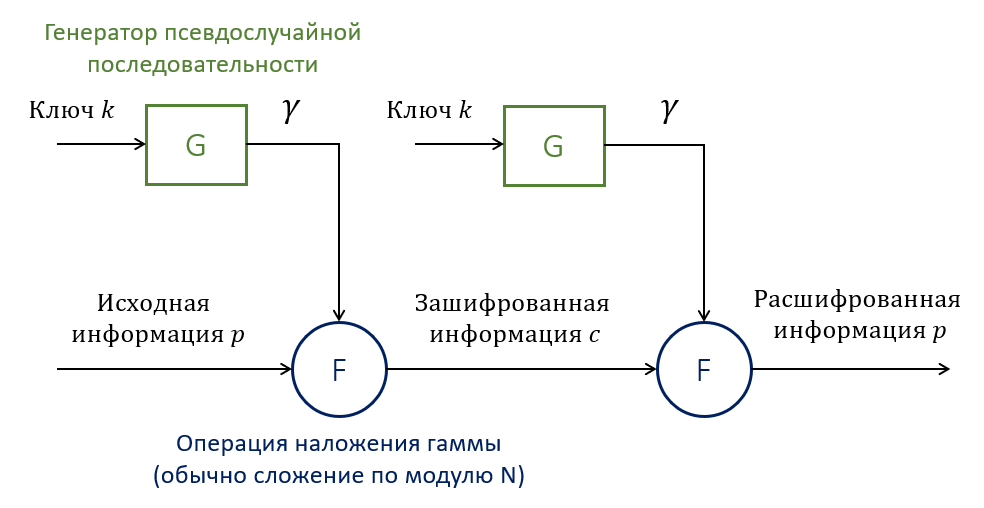
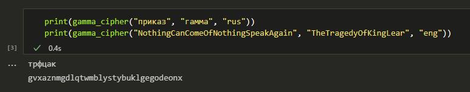

---
# Титульный лист
title: |
    Отчёт по лабораторной работе №3.  
    Шифрование гаммированием
author:
- "Студент: Аронова Юлия Вадимовна, 1032212303"
- "Группа: НФИмд-01-21"
- "Преподаватель: Кулябов Дмитрий Сергеевич,"
- "д-р.ф.-м.н., проф."
date: "Москва 2021"

# Общие опции
lang: ru-RU
toc-title: "Содержание"

# Библиография
bibliography: bib/cite.bib
csl: pandoc/csl/gost-r-7-0-5-2008-numeric.csl

# Конвертация в ПДФ
toc: true # Содержание
toc_depth: 2
lof: true # Список изображений
lot: true # Список таблиц
fontsize: 12pt
linestretch: 1.5
papersize: a4
documentclass: scrreprt

## I18n
polyglossia-lang:
  name: russian
  options:
	- spelling=modern
	- babelshorthands=true
polyglossia-otherlangs:
  name: english
### Шрифты
mainfont: PT Serif
romanfont: PT Serif
sansfont: PT Sans
monofont: PT Mono
mainfontoptions: Ligatures=TeX
romanfontoptions: Ligatures=TeX
sansfontoptions: Ligatures=TeX,Scale=MatchLowercase
monofontoptions: Scale=MatchLowercase,Scale=0.8
## Biblatex
biblatex: true
biblio-style: "gost-numeric"
biblatexoptions:
  - parentracker=true
  - backend=biber
  - hyperref=auto
  - language=auto
  - autolang=other*
  - citestyle=gost-numeric

## Misc options
indent: true
header-includes:
  - \linepenalty=10 # the penalty added to the badness of each line within a paragraph (no associated penalty node) Increasing the value makes tex try to have fewer lines in the paragraph.
  - \interlinepenalty=0 # value of the penalty (node) added after each line of a paragraph.
  - \hyphenpenalty=50 # the penalty for line breaking at an automatically inserted hyphen
  - \exhyphenpenalty=50 # the penalty for line breaking at an explicit hyphen
  - \binoppenalty=700 # the penalty for breaking a line at a binary operator
  - \relpenalty=500 # the penalty for breaking a line at a relation
  - \clubpenalty=150 # extra penalty for breaking after first line of a paragraph
  - \widowpenalty=150 # extra penalty for breaking before last line of a paragraph
  - \displaywidowpenalty=50 # extra penalty for breaking before last line before a display math
  - \brokenpenalty=100 # extra penalty for page breaking after a hyphenated line
  - \predisplaypenalty=10000 # penalty for breaking before a display
  - \postdisplaypenalty=0 # penalty for breaking after a display
  - \floatingpenalty = 20000 # penalty for splitting an insertion (can only be split footnote in standard LaTeX)
  - \raggedbottom # or \flushbottom
  - \usepackage{float} # keep figures where there are in the text
  - \floatplacement{figure}{H} # keep figures where there are in the text

  - \usepackage{titling}
  - \setlength{\droptitle}{-9em}
  - \pretitle{\begin{center}
      \textbf{РОССИЙСКИЙ УНИВЕРСИТЕТ ДРУЖБЫ НАРОДОВ}\\
      \textbf{Факультет физико-математических и естественных наук}\\
      \textbf{Кафедра прикладной информатики и теории вероятностей}
      \vspace{9cm}
      \LARGE\\}
  - \posttitle{\vskip 1em \Large \emph{\textit{Дисциплина$:$ Математические основы защиты информации и информационной безопасности}} \end{center}}
  - \preauthor{\vskip 3em \begin{flushright} \large \begin{tabular}[t]{c}}
  - \postauthor{\end{tabular}\par\end{flushright} \vfill \vskip 5em}

  - \usepackage{amsmath}
---

# Цель работы

Целью данной лабораторной работы является ознакомление с методом шифрования гаммированием, а также его последующая программная реализация для случая конечной гаммы.

# Задание

Рассмотреть и реализовать на языке программирования Python алгоритм шифрования гаммированием на основе конечной гаммы.

# Теоретическое введение

*Шифры гаммирования* (или *аддитивные шифры*) являются самыми эффективными с точки зрения стойкости и скорости преобразований (процедур зашифрования и дешифрования) [@crypto_lections]. По стойкости данные шифры относятся к классу *совершенных*, т.е. при правильном использовании они заведомо не поддаются вскрытию, а дешифрование секретного сообщения приводит к нескольким осмысленным равновероятным открытым сообщениям.

Гаммирование представляет собой частный случай многоалфавитной подстановки, шифрование в котором осуществляется путем сложения символов исходного текста и ключа по модулю, равному числу букв в алфавите [@crypto_course]. Такой процесс сложения исходного текста и ключа называется в криптографии *наложением гаммы*.

**Сложение по модулю N**. В 1888 г. француз маркиз де Виари в одной из своих научных статей, посвященных криптографии, доказал, что при замене букв исходного сообщения и ключа на числа справедливы формулы:

$$C_i = (P_i + K_i) \; mod \; N \;\;\; \leftrightarrow \;\;\; P_i = (C_i + N - K_i) \; mod \; N,        (1)$$

где $P_i, C_i$ -- $i$-ый символ открытого и шифрованного сообщения, $N$ -- количество символов в алфавите, $K_i$ -- $i$-ый символ гаммы (ключа) [@crypto_lections].

Так, пусть символам исходного алфавита соответствуют числа от 0 (А) до 31 (Я), как показано в Табл. [-@tbl:abc].

Table: Таблица кодирования символов русского алфавита {#tbl:abc}

--- --- --- --- ---- --- --- ---- --- --- ----
 А   0       И   8        Р   16       Ш   24
 Б   1       Й   9        С   17       Щ   25
 В   2       К   10       Т   18       Ъ   26
 Г   3       Л   11       У   19       Ы   27
 Д   4       М   12       Ф   20       Ь   28
 Е   5       Н   13       Х   21       Э   29
 Ж   6       О   14       Ц   22       Ю   30
 З   7       П   15       Ч   23       Я   31
--- --- --- ---- --- --- ---- --- --- --- ----

*Пример 1*. Зашифуем слово "ПРИКАЗ" гаммой "ГАММА", используя операцию сложения по модулю `32`, и получим криптограмму `ТРФЦАК` (см. Табл. [-@tbl:ex1]). Так как гамма в данном случае конечна и короче, чем сообщение, то она повторяется требуемое число раз.

Table: Пример аддитивного шифрования по модулю 32 {#tbl:ex1}

------  --------  --------  --------  --------  -------- --------
 $P_i$    15 (П)    16 (Р)     8 (И)    10 (К)    0  (А)   7  (З)  
 $K_i$    3  (Г)    0  (А)    12 (М)    12 (М)    0  (А)   3  (Г)  
 $C_i$    18 (Т)    16 (Р)    20 (Ф)    22 (Ц)    0  (А)   10 (К)  
------  --------  --------  --------  --------  -------- --------

Отметим, что результат шифрования отличается от приведённого в задании к лабораторной работе по двум причинам:

- Нумерация букв в алфавите начинается с `0`, а не с `1`. Это изменение необходимо, чтобы выполнялось выражение (1). Если же нумеровать символы с единицы, то при нулевом вычете (остатке от деления) у нас не будет символа для сопоставления.

- В качестве модуля сложения используется `32`, а не `33`, поскольку в используемом алфавите отсутствует буква Ё.

**Сложение по модулю 2**. Наиболее часто на практике встречается двоичное гаммирование [@crypto_course]. При этом используется двоичный алфавит и сложение по модулю два, обозначаемое знаком $\oplus$. В алгебре логики данная операция также называется *исключающее ИЛИ* или *XOR*.

При данном способе шифрования символы текста и гаммы представляются в двоичном виде, а затем каждая пара двоичных разрядов складывается по модулю 2. Поскольку операция является обратимой ($(x \oplus y) \oplus y = x$), процедуры шифрования и дешифрования выполняются следующим образом:

$$C_i = P_i \oplus K_i \;\;\; \leftrightarrow \;\;\; P_i = C_i \oplus K_i,        (2)$$

Стойкость аддитивных шифров определяется, главным образом, качеством гаммы, которое зависит от длины периода (минимального количества символов, после которого последовательность начинает повторяться) и случайности распределения по периоду. Для обеспечения абсолютной стойкости необходимо, чтобы последовательность символов в пределах периода гаммы обладала следующими свойствами:

- была случайной (должна отсутствовать закономерность в появлении символов гаммы);

- символы алфавита гаммы были распределены нормально (равновероятно);

- совпадала по размеру или была больше исходного открытого текста;

- применялась только один раз.

Так, могут использоваться *истинно случайные гаммы* (полученные путем оцифровки случайных физических или антропогенных процессов) или *псевдослучайные гаммы* -- последовательности чисел, вычисленные по определённой процедуре (рекуррентной формуле или полноценному алгоритму), но имеющие все свойства случайной последовательности чисел в рамках решаемой задачи. При этом отсутствие истинной случайности не мешает получать криптографически стойкие последовательности, в том числе и с бесконечным периодом. Схема гаммирования с использованием генератора псевдослучайных чисел показана на Рис. [-@fig:001].

{ #fig:001 width=100% }

В качестве простейшего генератора, например, может использоваться линейный конгруэнтный генератор, в котором каждый новый член последовательности рассчитывается на базе предыдущего через линейную зависимость:

$$\gamma_{i+1} = (a \gamma_i + b) \; mod \; m,$$

где $a, b$ и $m$ -- некоторые коэффициенты. Получаемая последовательность периодична с максимальным периодом $m$.

# Выполнение лабораторной работы

Реализуем вышеописанный метод шифрования конечной гаммой на языке **Python** в среде Jupyter Notebook. Создадим список с алфавитом и словарь "буква-порядковый номер" для русского и английского языка, а также реализуем функцию `gamma_cipher(message, key, language)`:

```python
# русский алфавит
abc_rus = [chr(code) for code in range(ord('а'), ord('я') + 1)]
# английский алфавит
abc_eng = [chr(code) for code in range(ord('a'), ord('z') + 1)]

# словарь вида {буква : её порядковый номер в алфавите}
letter2number_rus = {abc_rus[i] : i for i in range(len(abc_rus))} # (русском)
letter2number_eng = {abc_eng[i] : i for i in range(len(abc_eng))} # (англ-ом)

abc = {
    "rus" : abc_rus,
    "eng" : abc_eng
}

letter2number = {
    "rus" : letter2number_rus,
    "eng" : letter2number_eng
}

def gamma_cipher(message, key, language):
    """
    Шифрует сообщение message на языке language конечной гаммой key
    """
    mes = message.lower() # приводим сообщение к нижнему регистру
    n = len(abc[language]) # размерность алфавита

    gamma = key.lower() # приводим гамму к нижнему регистру
    while len(gamma) < len(mes): # пока она короче сообщения..
        gamma += gamma[len(gamma) - len(key)] # дополняем её повторениями

    message_encrypted = "" # криптограмма

    for i in range(len(mes)): # для каждого символа в сообщении..
        m = letter2number[language][mes[i]] # получаем его порядковый номер
        # и номер соответствующего символа гаммы
        g = letter2number[language][gamma[i]]

        # зашифровываем символ и добавляем его к криптограмме
        message_encrypted += abc[language][(m + g) % n]

    return message_encrypted

```

Теперь с помощью данной функции зашифруем два сообщения: на русском и английском языке (см. Рис. [-@fig:002]). Результат шифрования первого сообщения можно сравнить с примером, описанным ранее (см. Табл. [-@tbl:ex1]), и убедиться, что шифрование произведено корректно.

{ #fig:002 width=100% }

# Выводы

Таким образом, была достигнута цель, поставленная в начале лабораторной работы: было проведено краткое знакомство с шифрованием гаммированием, а его вариация для конечной гаммы была успешно реализована на языке программирования **Python**.

# Список литературы{.unnumbered}

::: {#refs}
:::
