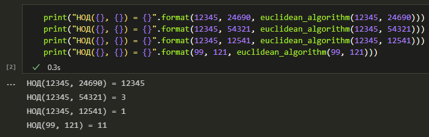
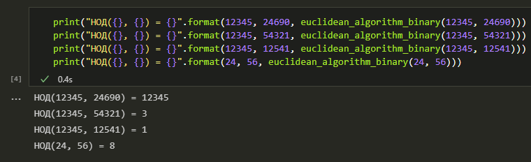
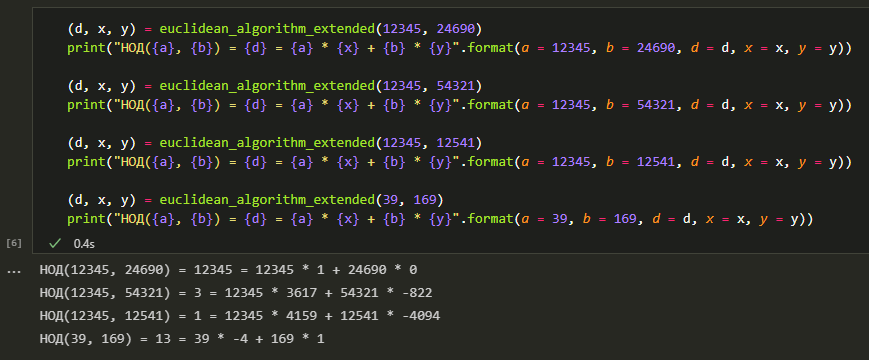
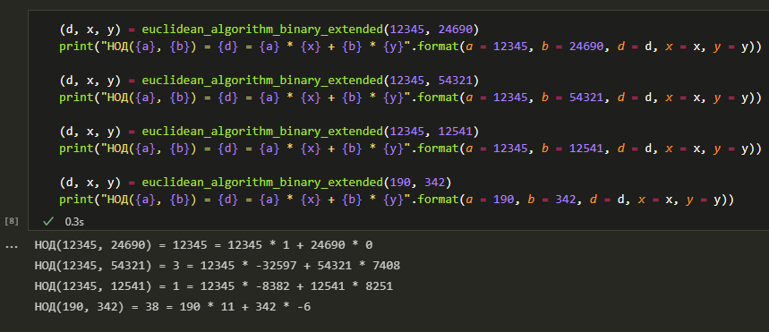

---
# Титульный лист
title: |
    Отчёт по лабораторной работе №4.  
    Вычисление наибольшего общего делителя
author:
- "Студент: Аронова Юлия Вадимовна, 1032212303"
- "Группа: НФИмд-01-21"
- "Преподаватель: Кулябов Дмитрий Сергеевич,"
- "д-р.ф.-м.н., проф."
date: "Москва 2021"

# Общие опции
lang: ru-RU
toc-title: "Содержание"

# Библиография
bibliography: bib/cite.bib
csl: pandoc/csl/gost-r-7-0-5-2008-numeric.csl

# Конвертация в ПДФ
toc: true # Содержание
toc_depth: 2
lof: true # Список изображений
lot: true # Список таблиц
fontsize: 12pt
linestretch: 1.5
papersize: a4
documentclass: scrreprt

## I18n
polyglossia-lang:
  name: russian
  options:
	- spelling=modern
	- babelshorthands=true
polyglossia-otherlangs:
  name: english
### Шрифты
mainfont: PT Serif
romanfont: PT Serif
sansfont: PT Sans
monofont: PT Mono
mainfontoptions: Ligatures=TeX
romanfontoptions: Ligatures=TeX
sansfontoptions: Ligatures=TeX,Scale=MatchLowercase
monofontoptions: Scale=MatchLowercase,Scale=0.8
## Biblatex
biblatex: true
biblio-style: "gost-numeric"
biblatexoptions:
  - parentracker=true
  - backend=biber
  - hyperref=auto
  - language=auto
  - autolang=other*
  - citestyle=gost-numeric

## Misc options
indent: true
header-includes:
  - \linepenalty=10 # the penalty added to the badness of each line within a paragraph (no associated penalty node) Increasing the value makes tex try to have fewer lines in the paragraph.
  - \interlinepenalty=0 # value of the penalty (node) added after each line of a paragraph.
  - \hyphenpenalty=50 # the penalty for line breaking at an automatically inserted hyphen
  - \exhyphenpenalty=50 # the penalty for line breaking at an explicit hyphen
  - \binoppenalty=700 # the penalty for breaking a line at a binary operator
  - \relpenalty=500 # the penalty for breaking a line at a relation
  - \clubpenalty=150 # extra penalty for breaking after first line of a paragraph
  - \widowpenalty=150 # extra penalty for breaking before last line of a paragraph
  - \displaywidowpenalty=50 # extra penalty for breaking before last line before a display math
  - \brokenpenalty=100 # extra penalty for page breaking after a hyphenated line
  - \predisplaypenalty=10000 # penalty for breaking before a display
  - \postdisplaypenalty=0 # penalty for breaking after a display
  - \floatingpenalty = 20000 # penalty for splitting an insertion (can only be split footnote in standard LaTeX)
  - \raggedbottom # or \flushbottom
  - \usepackage{float} # keep figures where there are in the text
  - \floatplacement{figure}{H} # keep figures where there are in the text

  - \usepackage{titling}
  - \setlength{\droptitle}{-9em}
  - \pretitle{\begin{center}
      \textbf{РОССИЙСКИЙ УНИВЕРСИТЕТ ДРУЖБЫ НАРОДОВ}\\
      \textbf{Факультет физико-математических и естественных наук}\\
      \textbf{Кафедра прикладной информатики и теории вероятностей}
      \vspace{9cm}
      \LARGE\\}
  - \posttitle{\vskip 1em \Large \emph{\textit{Дисциплина$:$ Математические основы защиты информации и информационной безопасности}} \end{center}}
  - \preauthor{\vskip 3em \begin{flushright} \large \begin{tabular}[t]{c}}
  - \postauthor{\end{tabular}\par\end{flushright} \vfill \vskip 5em}

  - \usepackage{amsmath}

  - \usepackage{enumitem}
  - \setlist{nosep}

  - \setlength{\abovedisplayskip}{3pt}
  - \setlength{\belowdisplayskip}{3pt}
---

# Цель работы

Целью данной лабораторной работы является ознакомление с двумя алгоритмами нахождения наибольшего общего делителя: алгоритмом Евклида и бинарным алгоритмом Евклида, -- и их расширениями для нахождения линейного представления наибольшего общего делителя, а также их последующая программная реализация.

# Задание

Рассмотреть и реализовать на языке программирования Python:

1. Алгоритм Евклида;

2. Бинарный алгоритм Евклида;

3. Расширенный алгоритм Евклида;

4. Расширенный бинарный алгоритм Евклида.

# Теоретическое введение

## Основные понятия теории чисел

Опр. 3.1.

:   Пусть $x$ и $y$ -- целые числа. Говорят, что $x$ *делит* $y$ (или $y$ *делится на* $x$), если существует такое целое число $k$, что $y = kx$. Обозначение: $x \; | \; y$ [@algebra_and_number_theory].

Опр. 3.2.

:   Если $x \; | \; y$ и $y \; | \; x$, говорят, что числа $x$ и $y$ *ассоциированы*. По сути это означает, что $y = x$ или $y = -x$.

Теорема 3.1.

:   (О делении с остатком). *Пусть $a, b \in \mathbb{Z}, b \ne 0$. Тогда существуют единственные целые числа $q$ (неполное частное) и $r$ (остаток) такие, что $a~=~bq~+~r$ и $0 \le r \le |b| - 1$.*

Опр. 3.3.

:   Пусть $a, b \in \mathbb{Z}$. Говорят, что целое число $d$ является *общим делителем* $a$ и $b$, если $d \; | \; a$ и $d \; | \; b$.

Опр. 3.4.

:   Пусть $a, b \in \mathbb{Z}$. Целое число $d$ называется *наибольшим общим делителем (НОД)* чисел $a$ и $b$, если:

- $d$ -- общий делитель $a$ и $b$;

- если $d'$ -- общий делитель $a$ и $b$, то $d' \; | \; d$.

Пример.
  ~ НОД(12345, 24690) = 12345;
  ~ НОД(12345, 54321) = 3;
  ~ НОД(12345, 12541) = 1.

Теорема 3.2.

:   *Наибольший общий делитель двух целых чисел $a, b$ существует и представляется в виде $d = a u_0 + b v_0$ для некоторых целых $u_0, v_0$*.

Опр. 3.5.

:   Выражение $d = a u_0 + b v_0$ из теоремы 3.2 называется *линейным представлением НОД*.

**Свойства НОД**:

1. $\text{НОД}(x, y) = x \Leftrightarrow x \; | \; y$.

2. $\text{НОД}(\text{НОД}(x, y), z) = \text{НОД}(x, \text{НОД}(y, z))$.

3. $\text{НОД}(zx, zy) = z \cdot \text{НОД}(x, y)$.

Опр. 3.6.

:   Числа $a, b$ называются *взаимно простыми*, если $\text{НОД}(a, b) = 1$.

## Алгоритм Евклида

Алгоритм Евклида нахождения наибольшего общего делителя основывается на следующем простом результате [@number_theory]:

> *Если $a = bq + r$, то НОД($a, b$) = НОД($b, r$).* (1)

> **Алгоритм 1. Алгоритм Евклида** [@numerical_methods_lections]
>
> *Вход.* Целые числа $a, b$; $0 < b \le a$.
>
> *Выход.* $d = \text{НОД}(a, b)$
>
> 1. Положить $r_0 \leftarrow a, r_1 \leftarrow b, i \leftarrow 1$.
> 2. Найти остаток $r_{i+1}$ от деления $r_{i-1}$ на $r_i$.
> 3. Если $r_{i+1} = 0$, то положить $d \leftarrow r_i$. В противном случае положить $i \leftarrow i + 1$ и вернуться на шаг 2.
> 4. Результат: $d$.

Теорема 3.3.

:   Для любых $a, b > 0$ алгоритм Евклида останавливается, и выдаваемое им число $d$ является наибольшим общим делителем чисел $a$ и $b$.

Доказательство

:   По теореме 3.1 для любого $i \ge 1$ имеем $r_{i-1} = q_i r_r + r_{i+1}$, где $0 \le r_{i+1} \le r_i$. Получаем монотонно убывающую последовательность неотрицательных целых чисел $a > b > r_1 > r_2 > r_3 > \ldots > r_n > \ge 0$, ограниченную снизу. Такая последовательность не может быть бесконечной, следовательно, алгоритм Евклида останавливается. Тогда, по результату (1), получаем $\text{НОД}(a, b) = \text{НОД}(b, r_1) = \text{НОД}(r_1, r_2) = \ldots = \text{НОД}(r_{n-1}, r_n) = \text{НОД}(r_n, 0) = r_n$.

## Бинарный алгоритм Евклида

Бинарный алгоритм Евклида вычисления НОД оказывается более быстрым при реализации этого алгоритма на компьютере, поскольку использует двоичное представление чисел $а$ и $b$. Бинарный алгоритм Евклида основан на следующих свойствах наибольшего общего делителя (считаем, что $0 < b \le a$) [@numerical_methods_lections]: $\vspace{2pt}$

- если оба числа $a$ и $b$ чётные, то $\text{НОД}(a, b) = 2 \cdot \text{НОД}(\frac{a}{2}, \frac{b}{2})$; $\vspace{2pt}$

- если число $a$ -- нечётное, число $b$ -- чётное, то $\text{НОД}(a, b) = \text{НОД}(a, \frac{b}{2})$; $\vspace{2pt}$

- если оба числа $a$ и $b$ нечётные, то $\text{НОД}(a, b) = \text{НОД}(a - b, b)$ $\vspace{2pt}$

- если $a = b$, то $\text{НОД}(a, b) = a$ $\vspace{-3pt}$

> **Алгоритм 2. Бинарный алгоритм Евклида** [@numerical_methods_lections]
>
> *Вход.* Целые числа $a, b$; $0 < b \le a$.
>
> *Выход.* $d = \text{НОД}(a, b)$
>
> 1. Положить $g \leftarrow 1$.
> 2. Пока оба числа $a$ и $b$ чётные, выполнять $a \leftarrow \frac{a}{2}, b \leftarrow \frac{b}{2}, g \leftarrow 2g$ до получения хотя бы одного нечётного значения $a$ или $b$.
> 3. Положить $u \leftarrow a, v \leftarrow b$.
> 4. Пока $u \ne 0$ выполнять следующие действия:
>
>     4.1. Пока $u$ чётное, полагать $u \leftarrow \frac{u}{2}$.
>
>     4.2. Пока $v$ чётное, полагать $v \leftarrow \frac{v}{2}$.
>
>     4.3. При $u >= v$ положить $u \leftarrow u - v$. В противном случае положить $v \leftarrow v - u$.
>
> 5. Положить $d \leftarrow gv$.
> 6. Результат: $d$.

## Расширенный алгоритм Евклида

Помимо наибольшего общего делителя $d$ чисел $a$ и $b$ расширенный алгоритм Евклида также находит его линейное представление, т.е. целые числа $x$ и $y$, для которых $ax + by = d$.

> **Алгоритм 3. Расширенный алгоритм Евклида** [@numerical_methods_lections]
>
> *Вход.* Целые числа $a, b$; $0 < b \le a$.
>
> *Выход.* $d = \text{НОД}(a, b)$; такие целые числа $x, y$, что $a x + b y = d$.
>
> 1. Положить $r_0 \leftarrow a, r_1 \leftarrow b, x_0 \leftarrow 1, x_1 \leftarrow 0, y_0 \leftarrow 0$, $y_1~\leftarrow~1, i \leftarrow 1$.
> 2. Разделить с остатком $r_{i-1}$ на $r_i$: $r_{i-1} = q_i r_i + r_{i+1}$.
> 3. Если $r_{i+1} = 0$, то положить $d \leftarrow r_i, x \leftarrow x_i$, $y~\leftarrow~y_i$. В противном случае положить $x_{i+1} \leftarrow x_{i-1} - q_i x_i$, $y_{i+1}~\leftarrow~y_{i-1}~-~q_i y_i, i \leftarrow i + 1$ и вернуться на шаг 2.
> 4. Результат: $d, x, y$.

Теорема 3.4.

:   На каждой итерации алгоритма выполняется равенство $a x_i + b y_i = r_i$ при $i \ge 0$.

Доказательство

:   Воспользуемся методом математической индукции. Для $i = 0$ и $i = 1$ требуемое равенство имеет место в силу шага 1. Допустим, что оно справедливо для $i - 1$ и для $i$. Тогда на шаге 3 получаем: $x_{i+1} = x_{i-1} - q_i x_i$ и $y_{i+1} = y_{i-1} - q_i y_i$. Следовательно, $a x_{i+1} + b y_{i+1} = a(x_{i-1} - q_i x_i) + b(y_{i-1} - q_i y_i) = a x_{i-1} + b y_{i-1} - q_i (a x_i + b y_i) = r_{i-1} - q_i r_i = r_{i+1}$.

## Расширенный бинарный алгоритм Евклида

> **Алгоритм 4. Расширенный бинарный алгоритм Евклида** [@numerical_methods_lections]
>
> *Вход.* Целые числа $a, b$; $0 < b \le a$.
>
> *Выход.* $d = \text{НОД}(a, b)$; такие целые числа $x, y$, что $a x + b y = d$.
>
> 1. Положить $g \leftarrow 1$.
> 2. Пока числа $a$ и $b$ чётные, выполнять $a \leftarrow \frac{a}{2}, b \leftarrow \frac{b}{2}, g \leftarrow 2g$ до получения хотя бы одного нечётного значения $a$ или $b$.
> 3. Положить $u \leftarrow a, v \leftarrow b, A \leftarrow 1, B \leftarrow 0, C \leftarrow 0, D \leftarrow 1$.
> 4. Пока $u \ne 0$ выполнять следующие действия:
>
>     4.1. Пока $u$ чётное:
>
>     $\qquad$ 4.1.1. Положить $u \leftarrow \frac{u}{2}$.
>
>     $\qquad$ 4.1.2. Если оба числа $A$ и $B$ чётные, то положить $A~\leftarrow~\frac{A}{2}$, $B~\leftarrow~\frac{B}{2}$. В противном случае положить $A \leftarrow~\frac{A + b}{2}$, $B~\leftarrow~ \frac{B - a}{2}$.
>
>     4.2. Пока $v$ чётное:
>
>     $\qquad$ 4.2.1. Положить $v \leftarrow \frac{v}{2}$.
>
>     $\qquad$ 4.2.2. Если оба числа $C$ и $D$ чётные, то положить $C~\leftarrow~\frac{C}{2}$, $D \leftarrow \frac{D}{2}$. В противном случае положить $C~\leftarrow~\frac{C + b}{2}$, $D~\leftarrow~ \frac{D - a}{2}$.
>
>     4.3. При $u \ge v$ положить $u \leftarrow u - v, A \leftarrow A - C, B \leftarrow B - D$. В противном случае положить $v \leftarrow v - u, C \leftarrow C - A, D \leftarrow D - B$.
>
> 5. Положить $d \leftarrow g v, x \leftarrow C, y \leftarrow D$.
> 6. Результат: $d, x, y$.

# Выполнение лабораторной работы

## Алгоритм Евклида

Реализуем вышеописанные алгоритмы на языке **Python** в среде Jupyter Notebook. Начнём с алгоритма Евклида: создадим функцию `euclidean_algorithm(a, b)` следующего вида:

```python
def euclidean_algorithm(a, b):
    """
    Находит НОД чисел a и b с помощью алгоритма Евклида
    """
    # убеждаемся, что числа - целые и положительные
    (a, b) = (abs(int(a)), abs(int(b)))

    # по условнию 0 < b <= a, поэтому
    if b > a: # если оно не выполняется
        (a, b) = (b, a) # меняем a и b местами

    # поскольку на каждом шаге мы используем только два значения,
    # сохранять будем только их
    r = [a, b] # шаг 1; задаем r0 и r1

    # шаги 2-3
    while r[1] != 0: # пока r_{i+1} не равно нулю
        # находим очередной остаток от деления и
        # имитируем увеличение индекса, сдвигая значения
        (r[0], r[1]) = (r[1], r[0] % r[1])

    return r[0] # шаг 4; d = r_i
```

Теперь с помощью данной функции найдём наибольший общий делитель для нескольких пар чисел (см. Рис. [-@fig:001]).

{ #fig:001 width=100% }

## Бинарный алгоритм Евклида

Реализуем бинарный алгоритм Евклида: создадим две функции -- `is_even(a)` для проверки чётности числа и `euclidean_algorithm_binary(a, b)`:

```python
def is_even(a):
    """
    Проверяет чётность числа a
    """
    return (True if a % 2 == 0 else False)
```

```python
def euclidean_algorithm_binary(a, b):
    """
    Находит НОД чисел a и b с помощью бинарного алгоритма Евклида
    """
    # убеждаемся, что числа - целые и положительные
    (a, b) = (abs(int(a)), abs(int(b)))

    # убеждаемся, что выполняется условие 0 < b <= a
    if b > a:
        (a, b) = (b, a)

    g = 1 # шаг 1

    # шаг 2; пока числа a и b чётные
    while is_even(a) and is_even(b):
        (a, b, g) = (int(a / 2), int(b / 2), 2 * g)

    (u, v) = (a, b) # шаг 3

    # шаг 4
    while u != 0:
        # шаг 4.1
        while is_even(u): # пока u - чётное
            u = int(u / 2)

        # шаг 4.2
        while is_even(v): # пока v - чётное
            v = int(v / 2)

        # шаг 4.3
        if u >= v:
            u -= v
        else:
            v -= u

    return g * v # шаги 5-6
```

Теперь с помощью данной функции найдём наибольший общий делитель для нескольких пар чисел (см. Рис. [-@fig:002]).

{ #fig:002 width=100% }

## Расширенный алгоритм Евклида

Создадим функцию `euclidean_algorithm_extended(a, b)`, реализующую расширенный алгоритм Евклида:

```python
def euclidean_algorithm_extended(a, b):
    """
    Находит d = НОД(a, b), а также такие целые числа x и y,
    что ax + by = d, с помощью расширенного алгоритма Евклида
    """
    # убеждаемся, что числа - целые и положительные
    (a, b) = (abs(int(a)), abs(int(b)))

    # убеждаемся, что выполняется условие 0 < b <= a
    reversed = True if b > a else False # флаг
    (a, b) = (b, a) if reversed else (a, b) # меняем местами a и b, если нужно

    (r, x, y) = ([a, b], [1, 0], [0, 1]) # шаг 1

    # шаги 2-3
    # r[0] ~ r_{i}, r[1] ~ r_{i+1}
    while r[1] != 0:
        # r_{i-1} = qi * ri + r_{i+1}
        (r[0], r[1], q) = (r[1], r[0] % r[1], r[0] // r[1])

        if r[1] != 0: # если остаток ещё не нулевой..
            (x[0], x[1]) = (x[1], x[0] - q * x[1])
            (y[0], y[1]) = (y[1], y[0] - q * y[1])

    (d, x_r, y_r) = (r[0], x[1], y[1])

    if reversed: # если a и b были в неправильном порядке
        (x_r, y_r) = (y_r, x_r) # меняем найденные коэффициенты местами

    return (d, x_r, y_r)
```

Теперь с помощью данной функции найдём наибольший общий делитель и его линейное представление для нескольких пар чисел (см. Рис. [-@fig:003]).

{ #fig:003 width=100% }

## Расширенный бинарный алгоритм Евклида

Реализуем расширенный бинарный алгоритм Евклида, создав функцию `euclidean_algorithm_binary_extended(a, b)` следующего вида:

```python
def euclidean_algorithm_binary_extended(a, b):
    """
    Находит d = НОД(a, b), а также такие целые числа x и y,
    что ax + by = d, с помощью расширенного бинарного алгоритма Евклида
    """
    # убеждаемся, что числа - целые и положительные
    (a, b) = (abs(int(a)), abs(int(b)))

    # убеждаемся, что выполняется условие 0 < b <= a
    reversed = True if b > a else False # флаг
    (a, b) = (b, a) if reversed else (a, b) # меняем местами a и b, если нужно

    g = 1 # шаг 1

    # шаг 2; пока числа a и b чётные
    while is_even(a) and is_even(b):
        (a, b, g) = (int(a / 2), int(b / 2), 2 * g)

    # шаг 3; задаем начальные значения
    (u, v, A, B, C, D) = (a, b, 1, 0, 0, 1)

    # шаг 4; пока u не равно нулю
    while u != 0:
        # шаг 4.1
        while is_even(u):
            u = int(u / 2) # шаг 4.1.1

            # шаг 4.1.2
            if is_even(A) and is_even(B):
                (A, B) = (int(A / 2), int(B / 2))
            else:
                (A, B) = (int((A + b) / 2), int((B - a) / 2))

        # шаг 4.2
        while is_even(v):
            v = int(v / 2) # шаг 4.2.1

            # шаг 4.2.2
            if is_even(C) and is_even(D):
                (C, D) = (int(C / 2), int(D / 2))
            else:
                (C, D) = (int((C + b) / 2), int((D - a) / 2))

        # шаг 4.3
        if u >= v:
            (u, A, B) = (u - v, A - C, B - D)
        else:
            (v, C, D) = (v - u, C - A, D - B)

    # шаг 5
    (d, x, y) = (g * v, C, D)

    # если a и b были в неправильном порядке
    if reversed:
        (x, y) = (y, x) # меняем найденные коэффициенты местами

    return (d, x, y)
```

Теперь с помощью данной функции найдём наибольший общий делитель и его линейное представление для нескольких пар чисел (см. Рис. [-@fig:004]).

{ #fig:004 width=100% }

# Выводы

Таким образом, была достигнута цель, поставленная в начале лабораторной работы: было проведено краткое знакомство с двумя алгоритмами нахождения наибольшего общего делителя -- алгоритмом Евклида, бинарным алгоритмом Евклида, -- и их расширенными версиями для нахождения линейного представления этого делителя, после чего все четыре алгоритма были успешно реализованы на языке программирования **Python**.

# Список литературы{.unnumbered}

::: {#refs}
:::
