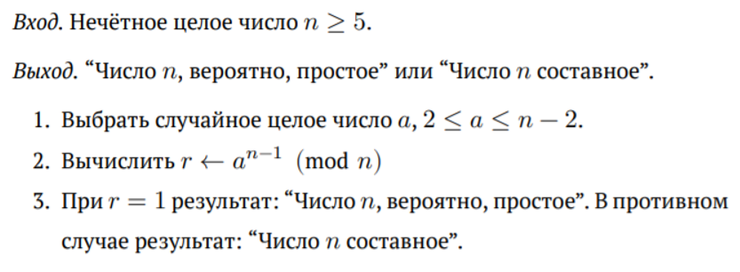
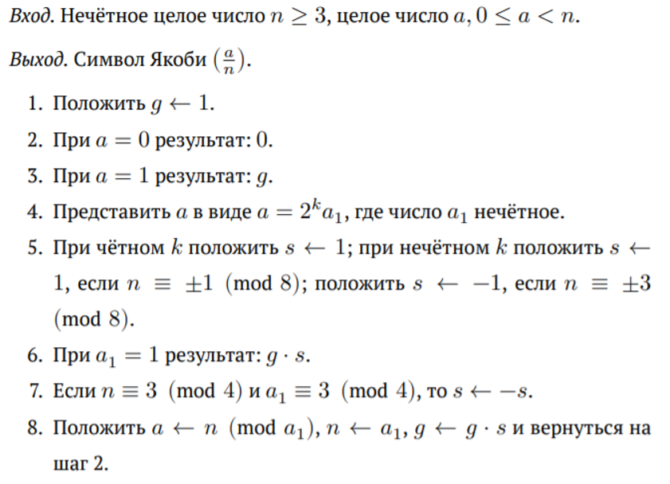
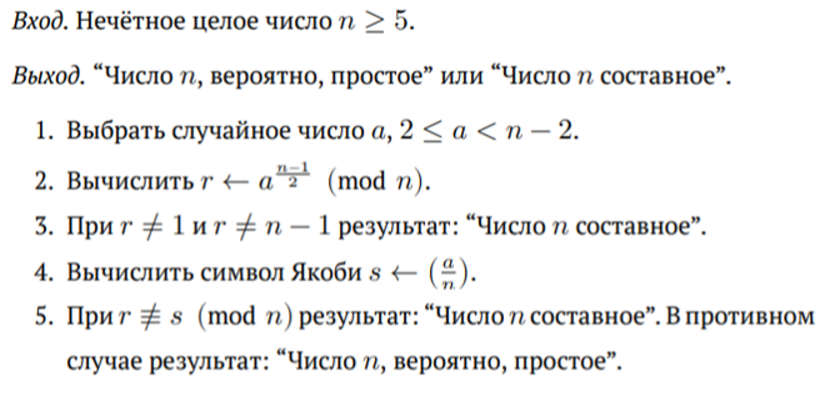
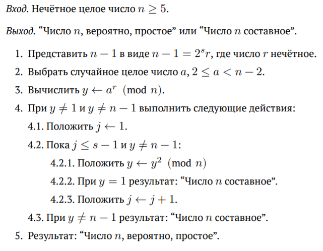
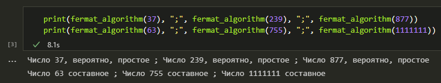
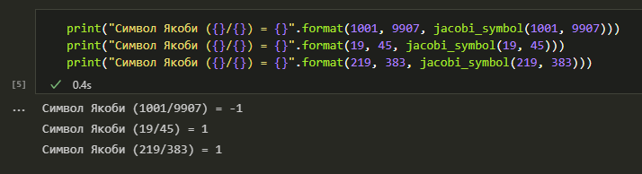
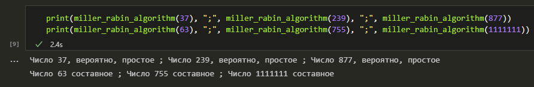

---
## Front matter
lang: ru-RU
title: |
    Отчёт по лабораторной работе №5.  
    Вероятностные алгоритмы проверки чисел на простоту
author: |
    *Дисциплина: Математические основы защиты информации*  
    *и информационной безопасности*  
    \vspace{2pt}  
    **Студент:** Аронова Юлия Вадимовна, 1032212303  
		**Группа:** НФИмд-01-21  
		**Преподаватель:** д-р.ф.-м.н., проф. Кулябов Дмитрий Сергеевич  
    \vspace{2pt}
date: 9 декабря, 2021, Москва

## Formatting
toc: false
slide_level: 2
theme: metropolis
header-includes:
 - \metroset{progressbar=frametitle,sectionpage=progressbar,numbering=fraction}
 - '\makeatletter'
 - '\beamer@ignorenonframefalse'
 - '\makeatother'
 - \usepackage{amsmath}
aspectratio: 43
section-titles: true
linestretch: 1.15

mainfont: PT Serif
romanfont: PT Serif
sansfont: PT Sans
monofont: PT Mono
mainfontoptions: Ligatures=TeX
romanfontoptions: Ligatures=TeX
sansfontoptions: Ligatures=TeX,Scale=MatchLowercase
monofontoptions: Scale=MatchLowercase,Scale=0.7
---

## Цели и задачи работы

\textbf{Целью} данной лабораторной работы является ознакомление с тремя вероятностными алгоритмами проверки чисел на простоту, а также их последующая программная реализация.

\textbf{Задачи:} Рассмотреть и реализовать на языке программирования Python:

1. Алгоритм, реализующий тест Ферма;

2. Алгоритм, реализующий тест Соловея-Штрассена (включающий в себя алгоритм вычисления символа Якоби);

3. Алгоритм, реализующий тест Миллера-Рабина.

# Теоретическое введение

## Общие понятия

\begin{alertblock}{Простые числа}
      \vspace{1pt}
      Натуральное $p > 1$ называется \textit{простым}, если оно делится только на $1$ и на $p$. Целое $a > 1$, имеющее другие делители кроме $a$ и $1$, называется \textit{составным}.
\end{alertblock}

Существует два типа критериев простоты: детерминированные и вероятностные.

\textbf{Детерминированные тесты} действуют по одной и той же схеме и гарантированно позволяют доказать, что тестируемое число -- простое.

\textbf{Вероятностные тесты} не дают гарантированного ответа. Их можно эффективно использовать для тестирования отдельных чисел, однако их результаты с некоторой вероятностью могут быть неверными.

## Тест Ферма

\begin{alertblock}{Малая теорема Ферма}
      \vspace{1pt}
      Для простого числа $p$ и $a: 1 \le a \le p - 1$, выполняется сравнение $a^{p-1} \equiv 1 \pmod{p}$.

      Если для нечётного $n$ $\exists a \in \mathbb{Z}: 1 \le a < n$, НОД$(a, n) = 1$ и $a^{n-1} \ne 1 \pmod{n}$, то число $n$ составное.
\end{alertblock}

{width=90%}

## Символ Якоби (1 / 2)

Пусть $p$ -- простое число, $p > 2, a \in \mathbb{Z}, \text{НОД}(a, p) = 1$. Число $a$ называется \textbf{квадратичным вычетом} по модулю $p$, если уравнение $x^2 \equiv a \pmod{p}$ разрешимо.

\textbf{Символ Лежандра} $\left( \frac{a}{p} \right)$ (где $a \in \mathbb{Z}$) равен: $+1$, если $a$ -- квадратичный вычет по модулю $p$; $-1$, если $a$ -- квадратичный невычет; и $0$, если $a \equiv 0 \pmod{p}$.

Если $m \in \mathbb{N}$, $m$ -- нечётное составное число и $m = \prod_{j=1}^{k} p_{j}^{\alpha^{j}}$ есть разложение $m$ на простые множители, то для $a \in \mathbb{Z}$ \textbf{символ Якоби} $\left( \frac{a}{m} \right)$ определяется равенством

$$\vspace{-4pt} \left( \frac{a}{m} \right) = \prod_{j = 1}^{k} \left( \frac{a}{p_j} \right)^{\alpha^{j}}$$

## Символ Якоби (2 / 2)

{width=80%}

## Тест Соловея-Штрассена

\begin{alertblock}{Критерий Эйлера}
      \vspace{1pt}
      Нечётное число $n$ является простым тогда и только тогда, когда для любого целого числа $a$, $2 \le a \le n - 1$, взаимно простого с $n$, выполняется: $a^{\frac{n-1}{2}}~\equiv~\left( \frac{a}{n} \right)~\pmod{n},$ где $\left( \frac{a}{n} \right)$ -- символ Якоби.
\end{alertblock}

{width=80%}

## Тест Миллера-Рабина (1 / 2)

Пусть число $n$ -- нечётное и $n - 1 = 2^s r$, где $r$ -- нечётное. Если $n$ -- простое, то для любого $2 \le a \le n - 1$ выполняется хотя бы одно из условий:

1. $a^r \equiv 1 \pmod{n}$;

2. $\exists d < s: a^{2^d r} \equiv -1 \pmod{n}$.

## Тест Миллера-Рабина (2 / 2)

{width=80%}

# Ход выполнения и результаты

## Тест Ферма. Реализация

```python
import numpy as np

def equal_by_modulo(a, b, m):
    return (True if (a - b) % m == 0 else False)
```

```python
def fermat_algorithm(n):
    if n < 5 or n % 2 == 0: return "Некорректное число n"
    a = np.random.randint(2, n - 1) # шаг 1
    r = (a ** (n - 1)) % n # шаг 2
    if r == 1: # шаг 3
        return "Число {}, вероятно, простое".format(n)
    else:
        return "Число {} составное".format(n)
```

## Тест Ферма. Результаты



## Алгоритм вычисления символа Якоби. Реализация

```python
def jacobi_symbol(a, n, g = 1): # шаг 1: значение g по умолчанию
    if a == 0: return 0 # шаг 2
    if a == 1: return g # шаг 3
    k = 0 # шаг 4
    while a % (2 ** k) == 0:
        k += 1
    k -= 1; a1 = int(a / (2 ** k))
    s = 1 # шаг 5
    if k%2==1 and (equal_by_modulo(n,3,8) or equal_by_modulo(n,-3,8)):
        s = -1
    if a1 == 1: return g * s # шаг 6
    if equal_by_modulo(n, 3, 4) and equal_by_modulo(a1, 3, 4): # шаг 7
        s = -s
    a = n % a1; n = a1; g = g * s # шаг 8
    return jacobi_symbol(a, n, g)
```

## Алгоритм вычисления символа Якоби. Результаты



## Тест Соловея-Штрассена. Реализация

```python
def solovay_strassen_algorithm(n):
    if n < 5 or n % 2 == 0: return "Некорректное число n"
    a = np.random.randint(2, n - 2) # шаг 1
    r = (a ** int((n - 1) / 2)) % n # шаг 2
    if r != 1 and r != (n - 1): # шаг 3
        return "Число {} составное".format(n)
    s = jacobi_symbol(a, n) # шаг 4
    if not equal_by_modulo(r, s, n): # шаг 5
        return "Число {} составное".format(n)
    else:
        return "Число {}, вероятно, простое".format(n)
```

## Тест Соловея-Штрассена. Результаты


## Тест Миллера-Рабина. Реализация

```python
def miller_rabin_algorithm(n): <...>
    s = 0 # шаг 1
    while (n - 1) % (2 ** s) == 0: s += 1
    s -= 1
    r = int((n - 1) / (2 ** s))
    a = np.random.randint(2, n - 2) # шаг 2
    y = (a ** r) % n # шаг 3
    if y != 1 and y != (n - 1): # шаг 4
        j = 1 # шаг 4.1
        while j <= (s - 1) and y != (n - 1): # шаг 4.2
            y = (y ** 2) % n # шаг 4.2.1
            if y == 1: return "Число {} составное".format(n) # шаг 4.2.2
            j += 1 # шаг 4.2.3
        if y != (n - 1): return "Число {} составное".format(n) # шаг 4.3
    return "Число {}, вероятно, простое".format(n) # шаг 5
```

## Тест Миллера-Рабина. Результаты



## Заключение

Таким образом, была достигнута цель, поставленная в начале лабораторной работы: было проведено краткое знакомство с алгоритмом вычисления символа Якоби и тремя вероятностными алгоритмами проверки чисел на простоту -- на основе теста Ферма, теста Соловея-Штрассена, теста Миллера-Рабина, -- после чего все четыре алгоритма были успешно реализованы на языке программирования **Python**.

## {.standout}

Спасибо за внимание
