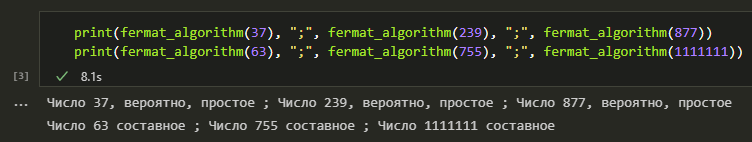
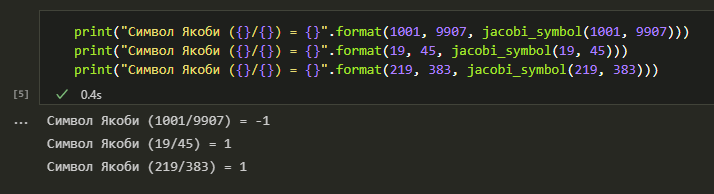
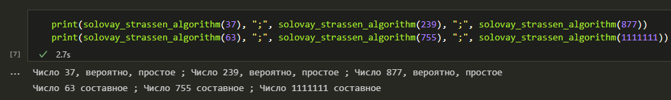
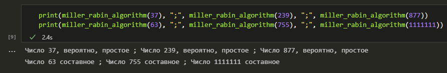

---
# Титульный лист
title: |
    Отчёт по лабораторной работе №5.  
    Вероятностные алгоритмы проверки чисел на простоту
author:
- "Студент: Аронова Юлия Вадимовна, 1032212303"
- "Группа: НФИмд-01-21"
- "Преподаватель: Кулябов Дмитрий Сергеевич,"
- "д-р.ф.-м.н., проф."
date: "Москва 2021"

# Общие опции
lang: ru-RU
toc-title: "Содержание"

# Библиография
bibliography: bib/cite.bib
csl: pandoc/csl/gost-r-7-0-5-2008-numeric.csl

# Конвертация в ПДФ
toc: true # Содержание
toc_depth: 2
lof: true # Список изображений
lot: true # Список таблиц
fontsize: 12pt
linestretch: 1.5
papersize: a4
documentclass: scrreprt

## I18n
polyglossia-lang:
  name: russian
  options:
	- spelling=modern
	- babelshorthands=true
polyglossia-otherlangs:
  name: english
### Шрифты
mainfont: PT Serif
romanfont: PT Serif
sansfont: PT Sans
monofont: PT Mono
mainfontoptions: Ligatures=TeX
romanfontoptions: Ligatures=TeX
sansfontoptions: Ligatures=TeX,Scale=MatchLowercase
monofontoptions: Scale=MatchLowercase,Scale=0.8
## Biblatex
biblatex: true
biblio-style: "gost-numeric"
biblatexoptions:
  - parentracker=true
  - backend=biber
  - hyperref=auto
  - language=auto
  - autolang=other*
  - citestyle=gost-numeric

## Misc options
indent: true
header-includes:
  - \linepenalty=10 # the penalty added to the badness of each line within a paragraph (no associated penalty node) Increasing the value makes tex try to have fewer lines in the paragraph.
  - \interlinepenalty=0 # value of the penalty (node) added after each line of a paragraph.
  - \hyphenpenalty=50 # the penalty for line breaking at an automatically inserted hyphen
  - \exhyphenpenalty=50 # the penalty for line breaking at an explicit hyphen
  - \binoppenalty=700 # the penalty for breaking a line at a binary operator
  - \relpenalty=500 # the penalty for breaking a line at a relation
  - \clubpenalty=150 # extra penalty for breaking after first line of a paragraph
  - \widowpenalty=150 # extra penalty for breaking before last line of a paragraph
  - \displaywidowpenalty=50 # extra penalty for breaking before last line before a display math
  - \brokenpenalty=100 # extra penalty for page breaking after a hyphenated line
  - \predisplaypenalty=10000 # penalty for breaking before a display
  - \postdisplaypenalty=0 # penalty for breaking after a display
  - \floatingpenalty = 20000 # penalty for splitting an insertion (can only be split footnote in standard LaTeX)
  - \raggedbottom # or \flushbottom
  - \usepackage{float} # keep figures where there are in the text
  - \floatplacement{figure}{H} # keep figures where there are in the text

  - \usepackage{titling}
  - \setlength{\droptitle}{-9em}
  - \pretitle{\begin{center}
      \textbf{РОССИЙСКИЙ УНИВЕРСИТЕТ ДРУЖБЫ НАРОДОВ}\\
      \textbf{Факультет физико-математических и естественных наук}\\
      \textbf{Кафедра прикладной информатики и теории вероятностей}
      \vspace{9cm}
      \LARGE\\}
  - \posttitle{\vskip 1em \Large \emph{\textit{Дисциплина$:$ Математические основы защиты информации и информационной безопасности}} \end{center}}
  - \preauthor{\vskip 3em \begin{flushright} \large \begin{tabular}[t]{c}}
  - \postauthor{\end{tabular}\par\end{flushright} \vfill \vskip 5em}

  - \usepackage{amsmath}

  - \usepackage{enumitem}
  - \setlist{nosep}

  - \setlength{\abovedisplayskip}{3pt}
  - \setlength{\belowdisplayskip}{3pt}
---

# Цель работы

Целью данной лабораторной работы является ознакомление с тремя вероятностными алгоритмами проверки чисел на простоту, а также их последующая программная реализация.

# Задание

Рассмотреть и реализовать на языке программирования Python:

1. Алгоритм, реализующий тест Ферма;

2. Алгоритм, реализующий тест Соловея-Штрассена (включающий в себя алгоритм вычисления символа Якоби);

3. Алгоритм, реализующий тест Миллера-Рабина.

# Теоретическое введение

## Тестирование чисел на простоту

Опр. 3.1.

:   Натуральное $p > 1$ называется *простым*, если оно делится только на $1$ и на $p$. Целое $a > 1$, имеющее другие делители кроме $a$ и $1$, называется *составным* [@number_theory].

Пример 3.1.

:   Число $1 111 111$ является составным. Это следует из равенства: $1 111 111 = 239 \cdot 4 649$.

Опр. 3.2.

:   Пусть $x$ и $y$ -- целые числа. Говорят, что $x$ *делит* $y$ (или $y$ *делится на* $x$), если существует такое целое число $k$, что $y = kx$. Обозначение: $x \; | \; y$ [@algebra_and_number_theory].

Теорема

:   (Основная теорема арифметики). *Любое целое $a > 1$ разлагается в произведение простых чисел, причём единственным образом с точностью до порядка следования сомножителей.*

Существует два типа критериев простоты: детерминированные и вероятностные [@lections].

*Детерминированные тесты* действуют по одной и той же схеме и гарантированно позволяют доказать, что тестируемое число -- простое. Практически применимые детерминированные тесты, однако, способны дать положительный ответ не для каждого простого числа, поскольку используют лишь достаточные условия простоты. Детерминированные тесты более полезны, когда необходимо построить большое простое число, а не проверить простоту, скажем, некоторого единственного числа.

В отличие от детерминированных, *вероятностные тесты* можно эффективно использовать для тестирования отдельных чисел, однако их результаты с некоторой вероятностью могут быть неверными: вероятностный алгоритм использует генератор случайных чисел и дает не гарантированно точный ответ. К счастью, ценой количества повторений теста с модифицированными исходными данными вероятность ошибки можно сделать как угодно малой.

На практике рассмотренные алгоритмы чаще всего по отдельности не применяются. Для проверки числа на простоту используют либо их комбинации, либо детерминированные тесты на простоту.

## Вероятностные тесты

### Тест Ферма

*Тест Ферма* основан на малой теореме Ферма: для простого числа $p$ и произвольного числа $a$, $1 \le a \le p - 1$, выполняется сравнение $a^{p-1} \equiv 1 \pmod{p}$. Следовательно, если для нечётного $n$ существует такое целое $a$, что $1 \le a < n$, НОД$(a, n) = 1$ и $a^{n-1} \ne 1 \pmod{n}$, то число $n$ составное. Отсюда получаем следующий вероятностный алгоритм проверки числа на простоту.

> **Алгоритм 1. Алгоритм, реализующий тест Ферма** [@lections]
>
> *Вход.* Нечётное целое число $n \ge 5$.
>
> *Выход.* "Число $n$, вероятно, простое" или "Число $n$ составное".
>
> 1. Выбрать случайное целое число $a$, $2 \le a \le n - 2$.
> 2. Вычислить $r \leftarrow a^{n-1} \pmod{n}$
> 3. При $r = 1$ результат: "Число $n$, вероятно, простое". В противном случае результат: "Число $n$ составное".

На шаге 1 мы не рассматривали числа $a = 1$ и $a = n - 1$, поскольку $1^{n - 1} \equiv 1 \pmod{n}$ для любого целого $n$ и $(n - 1)^{n - 1} \equiv (-1)^{n - 1} \equiv 1 \pmod{n}$  для любого нечётного $n$.

### Символ Якоби

Пусть $p$ -- простое число, $p > 2$. Пусть $a \in \mathbb{Z}, \text{НОД}(a, p) = 1$. Число $a$ называется *квадратичным вычетом* по модулю $p$, если уравнение $x^2 \equiv a \pmod{p}$ разрешимо; иначе оно называется *квадратичным невычетом* [@vasilenko2003].

*Символ Лежандра* $\left( \frac{a}{p} \right)$ (где $a \in \mathbb{Z}$) равен: $+1$, если $a$ -- квадратичный вычет по модулю $p$, $-1$, если $a$ -- квадратичный невычет, и $0$, если $a \equiv 0 \pmod{p}$.

Если $m \in \mathbb{N}$, $m$ -- нечётное составное число и $m = \prod_{j=1}^{k} p_{j}^{\alpha^{j}}$ есть разложение $m$ на простые множители, то для $a \in \mathbb{Z}$ *символ Якоби* $\left( \frac{a}{m} \right)$ определяется равенством

$$\left( \frac{a}{m} \right) = \prod_{j = 1}^{k} \left( \frac{a}{p_j} \right)^{\alpha^{j}}.$$

**Свойства символа Якоби**:

1. если $a \equiv b \pmod{m}$, то $\left( \frac{a}{m} \right) = \left( \frac{b}{m} \right)$;

2. $\left( \frac{1}{m} \right) = 1, \left( \frac{-1}{m} \right) = (-1)^{(m - 1)/2}$;

3. $\left( \frac{a b}{m} \right) = \left( \frac{a}{m} \right) \left( \frac{b}{m} \right)$;

4. $\left( \frac{2}{m} \right) = (-1)^{(m^2 - 1)/8}$;

5. если $m$ и $n$ -- натуральное взаимно простые нечетные числа, то $\left( \frac{m}{n} \right) = (-1)^{(m - 1)(n - 1)/4} \left( \frac{n}{m} \right)$.

Пример 3.2.

:   $\left( \frac{1001}{9907} \right) = \left( \frac{9907}{1001} \right)$[^1] $= \left( \frac{898}{1001} \right) = \left( \frac{2}{1001} \right) \left( \frac{449}{1001} \right) = \left( \frac{449}{1001} \right) = \left( \frac{1001}{449} \right) = \left( \frac{103}{449} \right) = \left( \frac{449}{103} \right) = \left( \frac{37}{103} \right) = \left( \frac{103}{37} \right) = \left( \frac{29}{37} \right) = \left( \frac{37}{29} \right) = \left( \frac{8}{29} \right) = \left( \frac{2}{29} \right)^3$, причём $2 \equiv x^2 \pmod{29}$ не имеет решения. Следовательно $\left( \frac{2}{29} \right)^3 = \left( \frac{1001}{9907} \right) = -1$.

[^1]: $9907 \; mod \; 1001 = 898$.

Пример 3.3.

:   $\left( \frac{19}{45} \right) = \left( \frac{19}{3} \right)^2 \left( \frac{19}{5} \right) = \left( \frac{19}{5} \right) = \left( \frac{4}{5} \right)$, причём $4 \equiv x^2 \pmod{5}$ имеет решение $x = 2$. Следовательно $4$ -- квадратичный вычет по модулю $5$, и $\left( \frac{4}{5} \right) = \left( \frac{19}{45} \right) = 1$.

Пример 3.4.

:   $\left( \frac{219}{383} \right) = - \left( \frac{383}{219} \right) = - \left( \frac{164}{219} \right) = - \left( \frac{41}{219} \right) = - \left( \frac{219}{41} \right) = - \left( \frac{14}{41} \right) = - \left( \frac{2}{41} \right) \left( \frac{7}{41} \right) = - \left( \frac{7}{41} \right) = - \left( \frac{41}{7} \right) = - \left( \frac{-1}{7} \right) = 1$.

> **Алгоритм 2. Алгоритм вычисления символа Якоби**
>
> *Вход.* Нечётное целое число $n \ge 3$, целое число $a, 0 \le a < n$.
>
> *Выход.* Символ Якоби $\left( \frac{a}{n} \right)$.
>
> 1. Положить $g \leftarrow 1$.
> 2. При $a = 0$ результат: $0$.
> 3. При $a = 1$ результат: $g$.
> 4. Представить $a$ в виде $a = 2^k a_1$, где число $a_1$ нечётное.
> 5. При чётном $k$ положить $s \leftarrow 1$; при нечётном $k$ положить $s \leftarrow 1$, если $n \equiv \pm 1 \pmod{8}$; положить $s \leftarrow -1$, если $n \equiv \pm 3 \pmod{8}$.
> 6. При $a_1 = 1$ результат: $g \cdot s$.
> 7. Если $n \equiv 3 \pmod{4}$ и $a_1 \equiv 3 \pmod{4}$, то $s \leftarrow -s$.
> 8. Положить $a \leftarrow n \pmod{a_1}$, $n \leftarrow a_1$, $g \leftarrow g \cdot s$ и вернуться на шаг 2.

### Тест Соловея-Штрассена

*Тест Соловея-Штрассена* основан на критерии Эйлера: нечётное число $n$ является простым тогда и только тогда, когда для любого целого числа $a$, $2 \le a \le n - 1$, взаимно простого с $n$, выполняется сравнение:

$$a^{\frac{n-1}{2}} \equiv \left( \frac{a}{n} \right) \pmod{n},$$

где $\left( \frac{a}{n} \right)$ -- символ Якоби.

> **Алгоритм 3. Алгоритм, реализующий тест Соловея-Штрассена** [@lections]
>
> *Вход.* Нечётное целое число $n \ge 5$.
>
> *Выход.* "Число $n$, вероятно, простое" или "Число $n$ составное".
>
> 1. Выбрать случайное число $a$, $2 \le a < n - 2$.
> 2. Вычислить $r \leftarrow a^{\frac{n-1}{2}} \pmod{n}$.
> 3. При $r \ne 1$ и $r \ne n - 1$ результат: "Число $n$ составное".
> 4. Вычислить символ Якоби $s \leftarrow \left( \frac{a}{n} \right)$.
> 5. При $r \not\equiv s \pmod{n}$ результат: "Число $n$ составное". В противном случае результат: "Число $n$, вероятно, простое".

### Тест Миллера-Рабина

На сегодняшний день для проверки чисел на простоту чаще всего используется тест Миллера-Рабина, основанный на следующем наблюдении. Пусть число $n$ -- нечётное и $n - 1 = 2^s r$, где $r$ -- нечётное. Если $n$ -- простое, то для любого $2 \le a \le n - 1$ выполняется хотя бы одно из условий [@wiki]:

1. $a^r \equiv 1 \pmod{n}$;

2. $\exists d < s: a^{2^d r} \equiv -1 \pmod{n}$.

> **Алгоритм 4. Алгоритм, реализующий тест Миллера-Рабина** [@lections]
>
> *Вход.* Нечётное целое число $n \ge 5$.
>
> *Выход.* "Число $n$, вероятно, простое" или "Число $n$ составное".
>
> 1. Представить $n - 1$ в виде $n - 1 = 2^s r$, где число $r$ нечётное.
> 2. Выбрать случайное целое число $a$, $2 \le a < n - 2$.
> 3. Вычислить $y \leftarrow a^r \pmod{n}$.
> 4. При $y \ne 1$ и $y \ne n - 1$ выполнить следующие действия:
>
>     4.1. Положить $j \leftarrow 1$.
>
>     4.2. Пока $j \le s - 1$ и $y \ne n - 1$:
>
>     $\qquad$ 4.2.1. Положить $y \leftarrow y^2 \pmod{n}$
>
>     $\qquad$ 4.2.2. При $y = 1$ результат: "Число $n$ составное".
>
>     $\qquad$ 4.2.3. Положить $j \leftarrow j + 1$.
>
>     4.3. При $y \ne n - 1$ результат: "Число $n$ составное".
>
> 5. Результат: "Число $n$, вероятно, простое".

# Выполнение лабораторной работы

Реализуем вышеописанные алгоритмы на языке **Python** в среде Jupyter Notebook. Для начала импортируем библиотеку `numpy` для генерации случайных чисел и реализуем функцию `equal_by_modulo(a, b, m)`, которая нам понадобится в дальнейшем:

```python
import numpy as np

def equal_by_modulo(a, b, m):
    """
    Проверяет, сравнимы ли числа a и b по модулю m
    """
    return (True if (a - b) % m == 0 else False)
```

## Алгоритм, реализующий тест Ферма

Начнём с реализации теста Ферма: создадим функцию `fermat_algorithm(n)` следующего вида:

```python
def fermat_algorithm(n):
    """
    Проверяет простоту числа n с помощью теста Ферма
    """
    # удостоверяемся, что n - нечетное
    # (иначе проверка не имеет смысла)
    # и не меньше, чем 5
    if n < 5 or n % 2 == 0:
        return "Некорректное число n"

    a = np.random.randint(2, n - 1) # шаг 1
    r = (a ** (n - 1)) % n # шаг 2

    # шаг 3
    if r == 1:
        return "Число {}, вероятно, простое".format(n)
    else:
        return "Число {} составное".format(n)
```

Теперь с помощью данной функции проверим на простоту несколько чисел (см. Рис. [-@fig:001]).

{ #fig:001 width=100% }

## Алгоритм вычисления символа Якоби

Реализуем алгоритм вычисления символа Якоби: создадим функцию `jacobi_symbol(a, n, g = 1)`:

```python
def jacobi_symbol(a, n, g = 1):
    """
    Вычисляет символ Якоби (a / n);
    параметр g используется для рекурсивного вызова функции
    """
    # шаг первый: значение параметра g по умолчанию
    if a == 0: # шаг 2
        return 0
    elif a == 1: # шаг 3
        return g

    # шаг 4: представляем число a
    # в виде 2^k * a1
    k = 0

    # для этого увеличиваем k до тех пор,
    # пока а не перестанет нацело делиться на 2^k
    while a % (2 ** k) == 0:
        k += 1
    k -= 1

    a1 = int(a / (2 ** k))

    # шаг 5
    s = 1
    if k % 2 == 1 and (equal_by_modulo(n, 3, 8) or equal_by_modulo(n, -3, 8)):
        s = -1

    # шаг 6
    if a1 == 1:
        return g * s

    # шаг 7
    if equal_by_modulo(n, 3, 4) and equal_by_modulo(a1, 3, 4):
        s = -s

    # шаг 8
    a = n % a1
    n = a1
    g = g * s

    return jacobi_symbol(a, n, g)
```

Теперь с помощью данной функции вычислим символы Якоби из примеров 3.2-3.4 (см. Рис. [-@fig:002]).

{ #fig:002 width=100% }

## Алгоритм, реализующий тест Соловея-Штрассена

Создадим функцию `solovay_strassen_algorithm(m)`, реализующую тест Соловея-Штрассена:

```python
def solovay_strassen_algorithm(n):
    """
    Проверяет простоту числа n с помощью теста Соловея-Штрассена
    """
    if n < 5 or n % 2 == 0:
        return "Некорректное число n"

    a = np.random.randint(2, n - 2) # шаг 1
    r = (a ** int((n - 1) / 2)) % n # шаг 2

    if r != 1 and r != (n - 1): # шаг 3
        return "Число {} составное".format(n)

    s = jacobi_symbol(a, n) # шаг 4

    if not equal_by_modulo(r, s, n): # шаг 5
        return "Число {} составное".format(n)
    else:
        return "Число {}, вероятно, простое".format(n)
```

Теперь с помощью данной функции проверим на простоту несколько чисел (см. Рис. [-@fig:003]).

{ #fig:003 width=100% }

## Алгоритм, реализующий тест Миллера-Рабина

Наконец, реализуем тест Миллера-Рабина, создав функцию `miller_rabin_algorithm(n)` следующего вида:

```python
def miller_rabin_algorithm(n):
    """
    Проверяет простоту числа n с помощью теста Миллера-Рабина
    """
    # удостоверяемся, что n - нечетное
    # (иначе проверка не имеет смысла)
    # и не меньше, чем 5
    if n < 5 or n % 2 == 0:
        return "Некорректное число n"

    # шаг 1
    s = 0

    while (n - 1) % (2 ** s) == 0:
        s += 1

    s -= 1
    r = int((n - 1) / (2 ** s))

    a = np.random.randint(2, n - 2) # шаг 2
    y = (a ** r) % n # шаг 3

    # шаг 4
    if y != 1 and y != (n - 1):
        j = 1 # шаг 4.1

        # шаг 4.2
        while j <= (s - 1) and y != (n - 1):
            y = (y ** 2) % n # шаг 4.2.1

            # шаг 4.2.2
            if y == 1:
                return "Число {} составное".format(n)

            j += 1 # шаг 4.2.3

        # шаг 4.3
        if y != (n - 1):
            return "Число {} составное".format(n)

    # шаг 5
    return "Число {}, вероятно, простое".format(n)
```

И с помощью полученной функции проверим на простоту несколько чисел (см. Рис. [-@fig:004]).

{ #fig:004 width=100% }

# Выводы

Таким образом, была достигнута цель, поставленная в начале лабораторной работы: было проведено краткое знакомство с алгоритмом вычисления символа Якоби и тремя вероятностными алгоритмами проверки чисел на простоту -- на основе теста Ферма, теста Соловея-Штрассена, теста Миллера-Рабина, -- после чего все четыре алгоритма были успешно реализованы на языке программирования **Python**.

# Список литературы{.unnumbered}

::: {#refs}
:::
