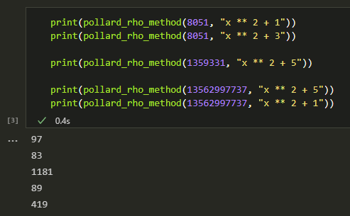

---
# Титульный лист
title: |
    Отчёт по лабораторной работе №6.  
    Разложение чисел на множители
author:
- "Студент: Аронова Юлия Вадимовна, 1032212303"
- "Группа: НФИмд-01-21"
- "Преподаватель: Кулябов Дмитрий Сергеевич,"
- "д-р.ф.-м.н., проф."
date: "Москва 2021"

# Общие опции
lang: ru-RU
toc-title: "Содержание"

# Библиография
bibliography: bib/cite.bib
csl: pandoc/csl/gost-r-7-0-5-2008-numeric.csl

# Конвертация в ПДФ
toc: true # Содержание
toc_depth: 2
lof: true # Список изображений
lot: true # Список таблиц
fontsize: 12pt
linestretch: 1.5
papersize: a4
documentclass: scrreprt

## I18n
polyglossia-lang:
  name: russian
  options:
	- spelling=modern
	- babelshorthands=true
polyglossia-otherlangs:
  name: english
### Шрифты
mainfont: PT Serif
romanfont: PT Serif
sansfont: PT Sans
monofont: PT Mono
mainfontoptions: Ligatures=TeX
romanfontoptions: Ligatures=TeX
sansfontoptions: Ligatures=TeX,Scale=MatchLowercase
monofontoptions: Scale=MatchLowercase,Scale=0.8
## Biblatex
biblatex: true
biblio-style: "gost-numeric"
biblatexoptions:
  - parentracker=true
  - backend=biber
  - hyperref=auto
  - language=auto
  - autolang=other*
  - citestyle=gost-numeric

## Misc options
indent: true
header-includes:
  - \linepenalty=10 # the penalty added to the badness of each line within a paragraph (no associated penalty node) Increasing the value makes tex try to have fewer lines in the paragraph.
  - \interlinepenalty=0 # value of the penalty (node) added after each line of a paragraph.
  - \hyphenpenalty=50 # the penalty for line breaking at an automatically inserted hyphen
  - \exhyphenpenalty=50 # the penalty for line breaking at an explicit hyphen
  - \binoppenalty=700 # the penalty for breaking a line at a binary operator
  - \relpenalty=500 # the penalty for breaking a line at a relation
  - \clubpenalty=150 # extra penalty for breaking after first line of a paragraph
  - \widowpenalty=150 # extra penalty for breaking before last line of a paragraph
  - \displaywidowpenalty=50 # extra penalty for breaking before last line before a display math
  - \brokenpenalty=100 # extra penalty for page breaking after a hyphenated line
  - \predisplaypenalty=10000 # penalty for breaking before a display
  - \postdisplaypenalty=0 # penalty for breaking after a display
  - \floatingpenalty = 20000 # penalty for splitting an insertion (can only be split footnote in standard LaTeX)
  - \raggedbottom # or \flushbottom
  - \usepackage{float} # keep figures where there are in the text
  - \floatplacement{figure}{H} # keep figures where there are in the text

  - \usepackage{titling}
  - \setlength{\droptitle}{-9em}
  - \pretitle{\begin{center}
      \textbf{РОССИЙСКИЙ УНИВЕРСИТЕТ ДРУЖБЫ НАРОДОВ}\\
      \textbf{Факультет физико-математических и естественных наук}\\
      \textbf{Кафедра прикладной информатики и теории вероятностей}
      \vspace{9cm}
      \LARGE\\}
  - \posttitle{\vskip 1em \Large \emph{\textit{Дисциплина$:$ Математические основы защиты информации и информационной безопасности}} \end{center}}
  - \preauthor{\vskip 3em \begin{flushright} \large \begin{tabular}[t]{c}}
  - \postauthor{\end{tabular}\par\end{flushright} \vfill \vskip 5em}

  - \usepackage{amsmath}

  - \usepackage{enumitem}
  - \setlist{nosep}

  - \setlength{\abovedisplayskip}{3pt}
  - \setlength{\belowdisplayskip}{3pt}
---

# Цель работы

Целью данной лабораторной работы является краткое ознакомление с $\rho$-методом Полларда для нахождения нетривиального делителя целого числа, а также его последующая программная реализация.

# Задание

Рассмотреть и реализовать на языке программирования Python $\rho$-метод Полларда для нахождения нетривиального делителя целого числа.

# Теоретическое введение

## Факторизация чисел

*Факторизацией целого числа* называется его разложение в произведение простых сомножителей [@ishmuhametov2011]. Такое разложение, согласно основной теореме арифметики, всегда существует и является единственным (с точностью до порядка следования множителей).

Мы будем ограничиваться поиском разложения на два (*нетривиальных*) множителя: $n = ab, 1 < a \le b < n$. Если алгоритм находит такое разложение за $O(f(n))$ арифметических операций, то полное разложение $n$ на простые множители будет найдено за $O(f(n) \log n)$ арифметических операций, поскольку $n$ состоит из произведения не более чем $\log_2 n$ простых чисел [@vasilenko2003].

## $\rho$-метод Полларда

Этот метод был разработан Джоном Поллардом в 1975 г. Пусть $n \in \mathbb{N}$ – число, которое следует разложить. $\rho$-метод Полларда работает следующим образом [@ishmuhametov2011, @vasilenko2003]:

1 шаг:

:   Выбрать отображение $f: \mathbb{Z}_n \rightarrow \mathbb{Z}_n$. Обычно $f(x)$ -- многочлен степени большей или равной 2, например, $f(x) = x^2 + 1$.

2 шаг:

:   Случайно выбрать $x_0 \in \mathbb{Z}_n$ и вычислять члены рекуррентной последовательности $x_0, x_1, x_2, ...$ по правилу $x_i \equiv f(x_{i-1}) \pmod{n}$.

3 шаг:

:   Для некоторых номеров $j, k$ проверять условие $1 < \text{НОД}(x_j - x_k, n) < n$ до тех пор, пока не будет найден делитель числа $n$.

Сложность алгоритма оценивается как $O(n^{1/4})$ [@wiki]. Метод строит числовую последовательность, элементы которой образуют цикл, начиная с некоторого номера $n$, что может быть проиллюстрировано расположением чисел в виде греческой буквы $\rho$ (см. Рис. [-@fig:000]).

{ #fig:000 width=50% }

> **Алгоритм 1. Алгоритм, реализующий $\rho$-метод Полларда**
>
> *Вход.* Число $n$, начальное значение $c$, функция $f$, обладающая сжимающими свойствами.
>
> *Выход.* Нетривиальный делитель числа $n$.
>
> 1. Положить $a \leftarrow c, b \leftarrow c$.
> 2. Вычислить $a \leftarrow f(a) \pmod{n}, b \leftarrow f(f(b)) \pmod{n}$.
> 3. Найти $d \leftarrow \text{НОД}(a - b, n)$.
> 4. При $1 < d < n$ положить $p \leftarrow d$ и результат: $d$. При $d = n$ результат: "Делитель не найден". При $d = 1$ вернуться на шаг 2.

Пример 1.

:    Найдём $\rho$-методом Полларда нетривиальный делитель числа $n = 1 359 331$. Положим $c = 1, f(x) = x^2 + 5 \pmod{n}$. Работа алгоритма проиллюстрирована в Таблице [-@tbl:ex1].

Table: Пример применения $\rho$-метода Полларда для числа $1,359,331$ {#tbl:ex1}

 i    a            b            d
---  -----------  -----------  --------
 0    1            1            -  
 1    6            41           1  
 2    41           123,939      1  
 3    1,686        391,594      1  
 4    123,939      438,157      1  
 5    435,426      582,738      1  
 6    391,594      1,144,026    1  
 7    1,090,062    885,749      1,181
 -    Ответ:       1,181

Пример 2.

:    Повторим процедуру для числа $n = 8 051$ при $c = 2$ и $f(x) = x^2 + 1$ (см. Табл. [-@tbl:ex2]) или $f(x) = x^2 + 3$ (см. Табл. [-@tbl:ex3]).

Table: Пример применения $\rho$-метода Полларда для числа $8,051$ (1) {#tbl:ex2}

 i    a            b            d
---  -----------  -----------  --------
 0    2            2            -  
 1    5            26           1  
 2    26           7,474        1  
 3    677          871          97  
 -    Ответ:       97

 Table: Пример применения $\rho$-метода Полларда для числа $8,051$ (2) {#tbl:ex3}

  i    a            b            d
 ---  -----------  -----------  --------
  0    2            2            -  
  1    7            52           1  
  2    52           1,442        1  
  3    2,707        778          1  
  4    1,442        3,932        83  
  -    Ответ:       83

# Выполнение лабораторной работы

Реализуем описанный выше алгоритм на языке **Python** в среде Jupyter Notebook. Для работы нам понадобится функция нахождения наибольшего общего делителя. Возьмем функцию, реализующую алгоритм Евклида, реализованную в рамках 4-ой лабораторной работы:

```python
def euclidean_algorithm(a, b):
    """
    Находит НОД чисел a и b с помощью алгоритма Евклида
    """
    (a, b) = (abs(int(a)), abs(int(b)))

    if b > a:
        (a, b) = (b, a)

    r = [a, b] # шаг 1; задаем r0 и r1

    # шаги 2-3
    while r[1] != 0:
        (r[0], r[1]) = (r[1], r[0] % r[1])

    return r[0] # шаг 4
```

## Алгоритм, реализующий $\rho$-метод Полларда

Создадим функцию `pollard_rho_method(n, f, c)` следующего вида:

```python
def pollard_rho_method(n, f, c = 1):
    """
    Находит нетривиальный делитель числа n ро-методом Полларда
    на основе начального значения c и сжимающей функции f
    """
    a = c; b = c # шаг 1

    while True:
        x = a            #
        a = eval(f) % n  #
                         #  шаг 2
        x = b            #
        x = eval(f)      #
        b = eval(f) % n  #

        d = euclidean_algorithm(abs(a - b), n) # шаг 3

        if d > 1 and d < n:              #
            return d                     #
                                         # шаг 4
        if d == n:                       #
            print("Делитель не найден")  #
            return 0                     #
```

Теперь с помощью данной функции найдём нетривиальные делители некоторых чисел (см. Рис. [-@fig:001]).

{ #fig:001 width=100% }

# Выводы

Таким образом, была достигнута цель, поставленная в начале лабораторной работы: было проведено краткое знакомство с алгоритмом, реализующим $\rho$-метод Полларда для нахождения нетривиального делителя целого числа, после чего алгоритм был успешно реализован на языке программирования **Python**.

# Список литературы{.unnumbered}

::: {#refs}
:::
