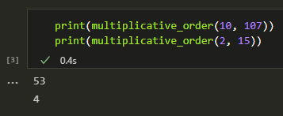
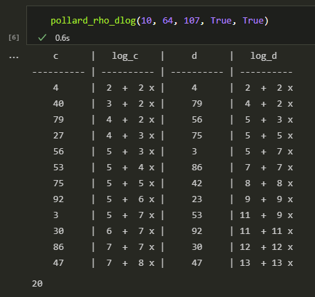
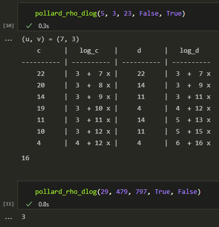

---
## Front matter
lang: ru-RU
title: |
    Отчёт по лабораторной работе №7.  
    Дискретное логарифмирование в конечном поле
author: |
    *Дисциплина: Математические основы защиты информации*  
    *и информационной безопасности*  
    \vspace{2pt}  
    **Студент:** Аронова Юлия Вадимовна, 1032212303  
		**Группа:** НФИмд-01-21  
		**Преподаватель:** д-р.ф.-м.н., проф. Кулябов Дмитрий Сергеевич  
    \vspace{2pt}
date: 22 декабря, 2021, Москва

## Formatting
toc: false
slide_level: 2
theme: metropolis
header-includes:
 - \metroset{progressbar=frametitle,sectionpage=progressbar,numbering=fraction}
 - '\makeatletter'
 - '\beamer@ignorenonframefalse'
 - '\makeatother'
 - \usepackage{amsmath}
aspectratio: 43
section-titles: true
linestretch: 1.15

mainfont: PT Serif
romanfont: PT Serif
sansfont: PT Sans
monofont: PT Mono
mainfontoptions: Ligatures=TeX
romanfontoptions: Ligatures=TeX
sansfontoptions: Ligatures=TeX,Scale=MatchLowercase
monofontoptions: Scale=MatchLowercase,Scale=0.7
---

## Цели и задачи работы

\textbf{Целью} данной лабораторной работы является краткое ознакомление с задачей дискретного логарифмирования и $\rho$-методом Полларда для её решения, а также его последующая программная реализация.

\textbf{Задачи:} Рассмотреть и реализовать на языке программирования Python $\rho$-метод Полларда для задачи дискретного логарифмирования.

# Теоретическое введение

## Задача дискретного логарифмирования

Для конечного поля $\mathbb{F}_p$ (в частности, в простейшем и важнейшем случае $\mathbb{Z}_p^\ast$, где $p$ – большое простое число) \textit{задача дискретного логарифмирования} определяется следующим образом: при заданных ненулевых $a, b \in \mathbb{F}_p$ найти такое целое $x$, что:

$$a^x \equiv b \in \mathbb{F}_p, \text{или} \; a^x \equiv b \pmod{p}.$$

Пусть число $a$ также имеет порядок $r$, то есть $a^r \equiv 1 \pmod{p}$.

## $\rho$-метод Полларда для дискретного логарифмирования

Идея \textbf{$\rho$-метода Полларда}, как и аналогичного метода факторизации, в построении последовательности итеративных значений функции $f$, в которой требуется найти цикл.

Для этого, как и ранее, используем алгоритм "черепахи и зайца" Флойда: к одному значению, $c$, на каждом шаге будем применять функции единожды, к другому, $d$, -- дважды, пока их значения не совпадут и мы не сможем их приравнять.

## $\rho$-метод Полларда. Шаг 1

- Зададим начальные значения $c$ и $d$. Пусть $c = d \equiv a^{u_0} b^{v_0} \pmod{p}$, где $u_0, v_0$ случайные целые числа.

- Поскольку по условию $b \equiv a^x \pmod{p}$, можно записать $c \equiv a^{u_0} (a^x)^{v_0} \pmod{p} \equiv a^{u_0 + v_0 x} \pmod{p}$. Тогда $\log_a c \pmod{p} = u_0 + v_0 x$.

- Таким образом, логарифмы $c$ и $d$ по основанию $a$ могут быть представлены линейно.

## $\rho$-метод Полларда. Определение функции $f$

Зададим отображение $f$, обладающее а) сжимающими свойствами и б) вычислимостью логарифма.

$$f(c) = \begin{cases} ac, & \text{при}\ c < \frac{p}{2} \\ bc, & \text{при}\ c \ge \frac{p}{2} \end{cases}$$

\textbf{1)} $f(c) \equiv (a^{u} b^{v}) a \pmod{p} \equiv~a^{(u + 1) + v x}~\pmod{p}$, и тогда $\log_a f(c) = (u + 1) + v x = \log_a c + 1$.

\textbf{2)} $f(c) \equiv (a^{u} b^{v}) b \pmod{p} \equiv~a^{u + (v + 1) x}~\pmod{p}$, и тогда $\log_a f(c) = u + (v + 1) x = \log_a c + x$.

## $\rho$-метод Полларда. Шаг 2

- Выполнять $c \leftarrow f(c) \pmod{p}, d \leftarrow f(f(d)) \pmod{p}$, вычисляя при этом $\log_a c$ и $\log_a d$ как линейные функции от $x$ по модулю $r$, пока не получим равенство $c \equiv d \pmod{p}$.

## $\rho$-метод Полларда. Шаг 3. Решение сравнения

Приравниваем линейные представления логарифмов и получаем: $u_{i}^{c} + v_{i}^{c} x \equiv u_{i}^{d} + v_{i}^{d} x \pmod{r}$.

Приведем подобные слагаемые: $v x \equiv u \pmod{r}$, где $v = v_{i}^{c} - v_{i}^{d}$, $u = u_{i}^{d} - u_{i}^{c}$.

Чтобы решить такое сравнение, нужно найти \textit{обратный элемент $v^{-1}$ по модулю $r$} и умножить на него левую и правую части сравнения: $x \equiv u v^{-1} \pmod{r}$.

Обратный элемент будет существовать, если НОД$(v, r) = 1$. В этом случае для его поиска можно воспользоваться \textit{расширенным алгоритмом Евклида}.

## $\rho$-метод Полларда. Шаг 3. Обратный элемент

С помощью расширенного алгоритма Евклида получим линейное представление НОД, равного единице: $e_v v + e_r r = 1$, что эквивалентно $e_v v - 1 = -e_r r$, или $(e_v v - 1) \; | \; r$, или $e_v v \equiv 1 \pmod{r}$. Таким образом $v^{-1} = e_v$.

Если же НОД не равен единице, то мы предполагаем, что $gcd = \text{НОД}(v, r) = \text{НОД}(v, u, r)$. Тогда сравнение можно поделить на $gcd$, и получим $\frac{v}{gcd} x \equiv \frac{u}{gcd} \pmod{\frac{r}{gcd}}$.

# Ход выполнения и результаты

## Реализация (1 / 4)

```python
import math; import numpy as np
def multiplicative_order(a, n):
    k = 1; flag = True # начнем перебор с единицы
    while flag:
        if (a ** k - 1) % n == 0: flag = False
        else: k += 1
    return k
```
{ #fig:000 width=50% }

## Реализация (2 / 4)

```python
def euclidean_algorithm_extended(a, b): <...> return (d, x_r, y_r)

def solve_congruence(c, d, p):
    (k_1, b_1) = c; (k_2, b_2) = d # получаем коэффициенты
    k = k_1 - k_2; b = b_2 - b_1 # kx = b (mod p)
    (gcd, k_inverse, _) = euclidean_algorithm_extended(k, p)
    if gcd == 1: # если k и p - взаимно простые..
        return (b * k_inverse) % p
    else: # иначе
        k = int(k / gcd); b = int(b / gcd) # делим сравнение на gcd
        (_,k_inverse,_) = euclidean_algorithm_extended(k, int(p/gcd))

        return (b * k_inverse) % p
```

## Реализация (3 / 4)

```python
def pollard_rho_dlog(a, b, p, def0 = True, to_print = False):
    r = multiplicative_order(a, p) # порядок числа а
    half_p = math.floor(p / 2) # p / 2
    f = "({a} * x % {p}) if x < {half} else ({b} * x % {p})"
                       .format(a = a, p = p, half = half_p, b = b)
    (u, v) = (2, 2) if def0 else (np.random.randint(1, half_p),
                                  np.random.randint(1, half_p))
    c = ((a ** u) * (b ** v)) % p    #  
    d = c                            # шаг 1
    (k_c, l_c) = (k_d, l_d) = (u, v) #

    if to_print: <...>
      print("{:^10} | {:^3} + {:^3}x | {:^10} | {:^3} + {:^3}x"
                              .format(c, l_c, k_c, d, l_d, k_d))
```

## Реализация (4 / 4)

```python
    while True:
        x = c
        if x < half_p: l_c += 1
        else: k_c += 1   
        c = eval(f); x = d             
        if x < half_p: l_d += 1     
        else: k_d += 1
        x = eval(f)
        if x < half_p: l_d += 1
        else: k_d += 1
        d = eval(f) <...>
        if c == d: # шаг 3
            result = solve_congruence((k_c, l_c), (k_d, l_d), r)
            if (a ** result - b) % p == 0: return result
            else: return 0
```

## Результаты (1 / 2)

{ #fig:002 width=70% }

## Результаты (2 / 2)

{ #fig:003 width=60% }

## Заключение

Таким образом, была достигнута цель, поставленная в начале лабораторной работы: было проведено краткое знакомство с задачей дискретного логарифмирования и с алгоритмом, реализующим $\rho$-метод Полларда для её решения, после чего алгоритм был успешно реализован на языке программирования **Python**.

## {.standout}

Спасибо за внимание
