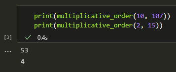
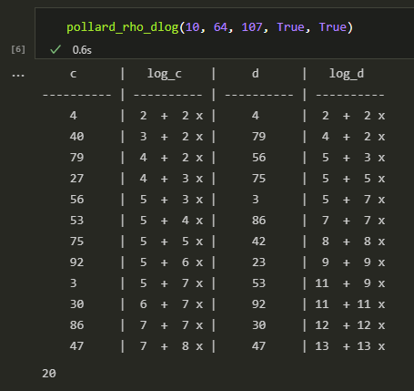
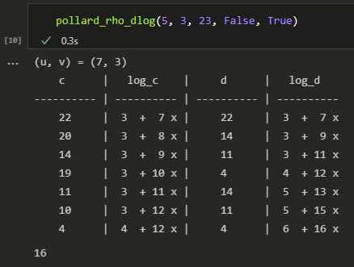
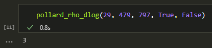

---
# Титульный лист
title: |
    Отчёт по лабораторной работе №7.  
    Дискретное логарифмирование в конечном поле
author:
- "Студент: Аронова Юлия Вадимовна, 1032212303"
- "Группа: НФИмд-01-21"
- "Преподаватель: Кулябов Дмитрий Сергеевич,"
- "д-р.ф.-м.н., проф."
date: "Москва 2021"

# Общие опции
lang: ru-RU
toc-title: "Содержание"

# Библиография
bibliography: bib/cite.bib
csl: pandoc/csl/gost-r-7-0-5-2008-numeric.csl

# Конвертация в ПДФ
toc: true # Содержание
toc_depth: 2
lof: true # Список изображений
lot: true # Список таблиц
fontsize: 12pt
linestretch: 1.5
papersize: a4
documentclass: scrreprt

## I18n
polyglossia-lang:
  name: russian
  options:
	- spelling=modern
	- babelshorthands=true
polyglossia-otherlangs:
  name: english
### Шрифты
mainfont: PT Serif
romanfont: PT Serif
sansfont: PT Sans
monofont: PT Mono
mainfontoptions: Ligatures=TeX
romanfontoptions: Ligatures=TeX
sansfontoptions: Ligatures=TeX,Scale=MatchLowercase
monofontoptions: Scale=MatchLowercase,Scale=0.8
## Biblatex
biblatex: true
biblio-style: "gost-numeric"
biblatexoptions:
  - parentracker=true
  - backend=biber
  - hyperref=auto
  - language=auto
  - autolang=other*
  - citestyle=gost-numeric

## Misc options
indent: true
header-includes:
  - \linepenalty=10 # the penalty added to the badness of each line within a paragraph (no associated penalty node) Increasing the value makes tex try to have fewer lines in the paragraph.
  - \interlinepenalty=0 # value of the penalty (node) added after each line of a paragraph.
  - \hyphenpenalty=50 # the penalty for line breaking at an automatically inserted hyphen
  - \exhyphenpenalty=50 # the penalty for line breaking at an explicit hyphen
  - \binoppenalty=700 # the penalty for breaking a line at a binary operator
  - \relpenalty=500 # the penalty for breaking a line at a relation
  - \clubpenalty=150 # extra penalty for breaking after first line of a paragraph
  - \widowpenalty=150 # extra penalty for breaking before last line of a paragraph
  - \displaywidowpenalty=50 # extra penalty for breaking before last line before a display math
  - \brokenpenalty=100 # extra penalty for page breaking after a hyphenated line
  - \predisplaypenalty=10000 # penalty for breaking before a display
  - \postdisplaypenalty=0 # penalty for breaking after a display
  - \floatingpenalty = 20000 # penalty for splitting an insertion (can only be split footnote in standard LaTeX)
  - \raggedbottom # or \flushbottom
  - \usepackage{float} # keep figures where there are in the text
  - \floatplacement{figure}{H} # keep figures where there are in the text

  - \usepackage{titling}
  - \setlength{\droptitle}{-9em}
  - \pretitle{\begin{center}
      \textbf{РОССИЙСКИЙ УНИВЕРСИТЕТ ДРУЖБЫ НАРОДОВ}\\
      \textbf{Факультет физико-математических и естественных наук}\\
      \textbf{Кафедра прикладной информатики и теории вероятностей}
      \vspace{9cm}
      \LARGE\\}
  - \posttitle{\vskip 1em \Large \emph{\textit{Дисциплина$:$ Математические основы защиты информации и информационной безопасности}} \end{center}}
  - \preauthor{\vskip 3em \begin{flushright} \large \begin{tabular}[t]{c}}
  - \postauthor{\end{tabular}\par\end{flushright} \vfill \vskip 5em}

  - \usepackage{amsmath}

  - \usepackage{enumitem}
  - \setlist{nosep}

  - \setlength{\abovedisplayskip}{3pt}
  - \setlength{\belowdisplayskip}{3pt}
---

# Цель работы

Целью данной лабораторной работы является краткое ознакомление с задачей дискретного логарифмирования и $\rho$-методом Полларда для её решения, а также его последующая программная реализация.

# Задание

Рассмотреть и реализовать на языке программирования Python $\rho$-метод Полларда для задачи дискретного логарифмирования.

# Теоретическое введение

## Основные понятия из теории групп и теории чисел

Для начала введём некоторые базовые понятия.

Опр. 1.

:   *Группа* – это непустое множество $G$ с бинарной операцией $\cdot$, обладающей свойством ассоциативности ($a \cdot (b \cdot c)=(a \cdot b) \cdot c$) и относительно которой существует нейтральный ($\exists e \in G: \forall a \in G \; ae = ea = a$) и обратный элемент ($\forall a \in G \; \exists a^{-1} \in G : a a^{-1} = a^{-1} a = e$). Если операция $\cdot$ коммутативна, группа называется *абелевой* [@bogdanov2016].

Опр. 2.

:   Если $M \subset G$, то *подгруппа, порождённая $M$*, $\langle M \rangle$, -- это пересечение всех групп, содержащих $M$. Если существует $g \in G$ такой, что $\langle g \rangle = G$, то группа $G$ – циклическая. Все циклические группы абелевы.

Опр. 3.

:   Пусть $m \in \mathbb{N}, m \ge 2$. Целые $a$ и $b$ называются *сравнимыми по модулю $m$*, если $m \; | \; (a - b)$, т.е. $m$ является делителем $(a – b)$. Отношение сравнимости записывается следующим образом: $a \equiv b \pmod{m}$ [@illar2016].

Опр. 4.

:   Для любого $a \in \mathbb{Z}$ множество чисел $\bar{a} = \{ x \in \mathbb{Z} : x \equiv a \pmod{m} \}$ называется *классом вычетов по модулю $m$*. Существует ровно $m$ классов вычетов по модулю $m$, причём $\mathbb{Z} = \bar{0} \; \cup \; \bar{1} \; \cup \ldots \cup \; \overline{(m-1)}$.

Опр. 5.

:   *Кольцо* – это множество с двумя операциями $(R, \; +, \; \cdot)$, для которых выполняются свойства: $(R,\; +)$ – абелева группа, $a \cdot \left( b \cdot c \right) = \left( a \cdot b \right) \cdot c$, $a \cdot \left( b + c \right) = a \cdot b + a \cdot c$ и $\left( a + b \right) \cdot c = a \cdot c + b \cdot c$. Кольцо коммутативно, если $\forall a, b \in R \; a \cdot b = b \cdot a$. Кольцо – с единицей, если $\exists 1 \in R : \forall a \in R : 1 \cdot a = a \cdot 1 = a$ [@bogdanov2016].

Опр. 6.

:   *Полем* называется коммутативное кольцо, содержащее не менее двух элементов, в котором все ненулевые элементы образуют группу по умножению [@zelvenskii1997]. Конечное поле с $p$ элементами, где $p$ – простое число, обозначается $\mathbb{F}_p$ [@song2009].

Опр. 7.

:   Через $\mathbb{Z}_m$ (или $\mathbb{Z}/m \mathbb{Z}$) обозначим *множество классов вычетов по модулю $m$*: $\mathbb{Z}_m = \{ \bar{0}, \bar{1}, \ldots, \overline{m-1} \}$. На нём можно определить операции сложения и умножения: $\bar{a} + \bar{b} = \overline{a+b}$, $\bar{a} \cdot \bar{b} = \overline{a \cdot b}$. $\mathbb{Z}_m$ является коммутативным кольцом с единицей $\bar{1}$, в котором нулевой элемент: $\bar{0}$, а обратный по сложению элемент: $-\left( \bar{a} \right) = \overline{(-a)}$. Если $m$ простое, то $\mathbb{Z}_m$ – поле.

Опр. 8.

:   Пусть $\bar{a} \in \mathbb{Z}_m$. Тогда $\bar{b}$ – обратный к $\bar{a}$, если $\bar{a} \cdot \bar{b} = 1$, а $\bar{a}$ является обратимым, если имеет обратный класс. Множество всех обратимых классов в $\mathbb{Z}_m$ обозначается $\mathbb{Z}_m^\ast$, является группой относительно умножения классов и называется *мультипликативной группой кольца вычетов* $\mathbb{Z}_m$ [@veretennikov2014].

## Дискретное логарифмирование

Задача дискретного логарифмирования -- наравне с задачей факторизации -- является одной из фундаментальных в криптоанализе. На её сложности зиждется стойкость ряда криптосистем, включая такие известные, как:

- схема распределения ключей Диффи-Хеллмана (1976);
-	схема Эль-Гамаля (1985), лежащая в основе алгоритма DSA;
- криптосистема Мэсси-Омуры (1978) для передачи сообщений [@song2009].

Для конечного поля $\mathbb{F}_p$ (в частности, в простейшем и важнейшем случае $\mathbb{Z}_p^\ast$, где $p$ – большое простое число) *задача дискретного логарифмирования* определяется следующим образом [@song2009]: при заданных ненулевых $a, b \in \mathbb{F}_p$ найти такое целое $x$, что:

$$a^x \equiv b \in \mathbb{F}_p, \text{или} \; a^x \equiv b \pmod{p}.$$

Пусть число $a$ также имеет порядок $r$, то есть $a^r \equiv 1 \pmod{p}$.

## $\rho$-метод Полларда для задачи дискретного логарифмирования

Рассмотрим $\rho$-метод Полларда, который можно применить и для задач дискретного логарифмирования [@bubnov2012]. Здесь, как и в аналогичном методе факторизации, рассмотренном в предыдущей лабораторной, строится последовательность итеративных значений функции $f$, в которой требуется найти цикл. Для этого, как и ранее, используем алгоритм "черепахи и зайца" Флойда: к одному значению, $c$, на каждом шаге будем применять функции единожды, к другому, $d$, -- дважды, пока их значения не совпадут и мы не сможем их приравнять.

Так, пусть $c = d \equiv a^{u_0} b^{v_0} \pmod{p}$, где $u_0, v_0$ случайные целые числа, -- их начальные значения. Поскольку по условию задачи $b \equiv a^x \pmod{p}$, мы также можем записать $c \equiv a^{u_0} (a^x)^{v_0} \pmod{p} \equiv a^{u_0 + v_0 x} \pmod{p}$. Тогда $\log_a c \pmod{p} = u_0 + v_0 x$. Таким образом, логарифмы $c$ и $d$ по основанию $a$ могут быть представлены линейно.

Теперь зададим отображение $f$. Оно должно обладать не только сжимающими свойствами, но и вычислимостью логарифма, чтобы по мере изменения значений $c$ и $d$ мы могли также отслеживать изменения в линейном представлении их логарифмов. Будем использовать ветвящееся отображение следующего вида:

$$f(c) = \begin{cases} ac, & \text{при}\ c < \frac{p}{2} \\ bc, & \text{при}\ c \ge \frac{p}{2} \end{cases}$$

Таким образом, $c$ будет умножаться или на $a$, или на $b$. В первом случае получим $f(c) \equiv (a^{u} b^{v}) a \pmod{p} \equiv a^{u+1} b^{v} \pmod{p} \equiv a^{(u + 1) + v x} \pmod{p}$, и тогда $\log_a f(c) = (u + 1) + v x = \log_a c + 1$. Во втором случае же получаем $f(c) \equiv (a^{u} b^{v}) b \pmod{p} \equiv a^{u} b^{v + 1} \pmod{p} \equiv a^{u + (v + 1) x} \pmod{p}$, и отсюда $\log_a f(c) = u + (v + 1) x = \log_a c + x$.

Когда значения $c$ и $d$ совпадут, мы сможем приравнять их логарифмы и получим сравнение по $x$: $u_{i}^{c} + v_{i}^{c} x \equiv u_{i}^{d} + v_{i}^{d} x \pmod{r}$.

> **Алгоритм 1. Алгоритм, реализующий $\rho$-метод Полларда для задач дискретного логарифмирования**
>
> *Вход.* Простое число $p$, число $a$ порядка $r$ по модулю $p$, целое число $b, 1 < b < p$; отображение $f$, обладающее сжимающими свойствами и сохраняющее вычислимость логарифма.
>
> *Выход.* Показатель $x$, для которого $a^x \equiv b \pmod{p}$, если такой показатель существует.
>
> 1. Выбрать произвольные целые числа $u, v$ и положить $c \leftarrow a^u b^v \pmod{p}, d \leftarrow c$.
> 2. Выполнять $c \leftarrow f(c) \pmod{p}, d \leftarrow f(f(d)) \pmod{p}$, вычисляя при этом логарифмы для $c$ и $d$ как линейные функции от $x$ по модулю $r$, до получения равенства $c \equiv d \pmod{p}$.
> 3. Приравняв логарифмы для $c$ и $d$, вычислить логарифм $x$ решением сравнения по модулю $r$. Результат: $x$ или "Решений нет".

Пример 1.

:    Решим задачу $10^x \equiv 64 \pmod{107}$. Выберем отображение: $f(c)~=~10 c \pmod{107}$$ при $c < 53$, $f(c) = 64 c \pmod{107}$ при $c \ge 53$.
Порядок числа $10$ по модулю $107$ равен $53$. Пусть $u = 2$, $v = 2$. Результаты вычислений представлены в Таблице [-@tbl:ex1].

Table: Применение $\rho$-метода Полларда для решения примера №1 {#tbl:ex1}

 Шаг      c       $\log_a c$     d      $\log_a d$
-----  -------  -------------  ------  -------------
 0      4         $2 + 2x$      4        $2 + 2x$  
 1      40        $3 + 2x$      79       $4 + 2x$
 2      79        $4 + 2x$      56       $5 + 3x$
 3      27        $4 + 3x$      75       $5 + 5x$
 4      56        $5 + 3x$      3        $5 + 7x$
 5      53        $5 + 4x$      86       $7 + 7x$
 6      75        $5 + 5x$      42       $8 + 8x$
 7      92        $5 + 6x$      23       $9 + 9x$
 8      3         $5 + 7x$      53       $11 + 9x$
 9      30        $6 + 7x$      92       $11 + 11x$
 10     86        $7 + 7x$      30       $12 + 12x$
 11     47        $7 + 8x$      47       $13 + 13x$

Приравниваем полученные логарифмы: $7 + 8x \equiv 13 + 13x \pmod{53}$. Отсюда $-5x \equiv 6 \pmod{53}$. Чтобы решить данное сравнение, нужно найти обратный элемент $k^{-1}$ для $k = -5$ по модулю $m = 53$ ($k^{-1} \cdot k \equiv 1 \pmod{m}$) и умножить на него левую и правую часть сравнения. Так как этот обратный элемент -- сравним сам с собой по модулю $53$, подобное сравнение будет справедливо [@wiki:equiv].

В общем виде пусть решается сравнение $k x \equiv b \pmod{m}$. Если $k$ и $m$ -- взаимно простые, т.е. НОД$(k, m) = 1$, мы можем применить расширенный алгоритм Евклида, разобранный в рамках 4-ой лабораторной работы, и получить линейное представление единицы в виде: $s_k \cdot k + s_m \cdot m = 1$ [@video]. Отсюда $s_k \cdot k - 1 = -s_m \cdot m$, что эквивалентно $m | (s_k \cdot k - 1)$, что эквивалентно $s_k \cdot k \equiv 1 \pmod{m}$, т.е. $k^{-1} = s_k$. Если же НОД не равен единице, то мы предполагаем, что $gcd = \text{НОД}(k, m) = \text{НОД}(k, b, m)$ (поскольку в противном случае обратного элемента не существует), и тогда сравнение можно поделить на $gcd$ [@wiki:equiv], и получим $\frac{k}{gcd} x \equiv \frac{b}{gcd} \pmod{\frac{m}{gcd}}$.

Возвращаясь к примеру, получаем $x = 20 \pmod{53}$. Проверка: $10^{20} \equiv 64 \pmod{107}$.

# Выполнение лабораторной работы

Реализуем описанный выше алгоритм на языке **Python** в среде Jupyter Notebook. Для работы нам понадобится функция вычисления порядка числа по модулю, расширенный алгоритм Евклида, реализацию которого мы возьмем из 4-ой лабораторной работы, а также основанная на нём функция решения сравнения вида $k_1 x + b_1 \equiv k_2 x + b_2 \pmod{p}$:

```python
import math
import numpy as np

def multiplicative_order(a, n):
    """
    Вычисляет порядок числа a по модулю n
    """
    k = 1; flag = True # начнем перебор с единицы

    while flag:
        if (a ** k - 1) % n == 0: # если порядок найден
            flag = False # "опускаем" флаг и выходим из цикла
        else: # иначе
            k += 1 # увеличиваем порядок на единицу

    return k

def euclidean_algorithm_extended(a, b):
    """
    Находит d = НОД(a, b), а также такие целые числа x и y, что ax + by = d,
    с помощью расширенного алгоритма Евклида
    """
    (a, b) = (int(a), int(b))

    reversed = True if abs(b) > abs(a) else False # флаг
    (a, b) = (b, a) if reversed else (a, b) # меняем местами a и b, если нужно

    (r, x, y) = ([a, b], [1, 0], [0, 1]) # шаг 1

    while r[1] != 0:
        (r[0], r[1], q) = (r[1], r[0] % r[1], r[0] // r[1])

        if r[1] != 0: # если остаток ещё не нулевой..
            (x[0], x[1]) = (x[1], x[0] - q * x[1])
            (y[0], y[1]) = (y[1], y[0] - q * y[1])

    (d, x_r, y_r) = (r[0], x[1], y[1])

    if reversed: # если a и b были в неправильном порядке
        (x_r, y_r) = (y_r, x_r) # меняем найденные коэффициенты местами

    return (d, x_r, y_r)

def solve_congruence(c, d, p):
    """
    Решает сравнение вида k_1 * x + b_1 = k_2 * x + b_2 (mod p), где
    c = (k_1, b_1), d = (k_2, b_2)
    """
    (k_1, b_1) = c; (k_2, b_2) = d # получаем коэффициенты

    k = k_1 - k_2; b = b_2 - b_1 # kx = b (mod p)
    # k * k_inverse = gcd (mod p)
    (gcd, k_inverse, _) = euclidean_algorithm_extended(k, p)

    if gcd == 1: # если k и p - взаимно простые..
        return (b * k_inverse) % p
    else: # иначе
        k = int(k / gcd); b = int(b / gcd) # делим сравнение на gcd
        (_, k_inverse, _) = euclidean_algorithm_extended(k, int(p / gcd))

        return (b * k_inverse) % p
```

Примеры работы функции `multiplicative_order(a, n)` представлены на Рис. [-@fig:000].

{ #fig:000 width=100% }

## Алгоритм, реализующий $\rho$-метод Полларда для задачи дискретного логарифмирования

Создадим функцию `pollard_rho_method(n, f, c)` следующего вида:

```python
def pollard_rho_dlog(a, b, p, def0 = True, to_print = False):
    """
    Решает сравнение a^x = b (mod p) ро-методом Полларда;
    def0 = True, если нужно использовать начальные значения u и v по умолчанию,
    и False, если их нужно определить случайно;
    to_print = True, если нужно вывести на экран ход алгоритма
    """
    r = multiplicative_order(a, p) # порядок числа а
    half_p = math.floor(p / 2) # p / 2

    # отображение f
    f = "({a} * x % {p}) if x < {half} else ({b} * x % {p})".format(a = a,
                                                  p = p, half = half_p, b = b)

    # начальные значения u и v
    (u, v) = (2, 2) if def0 else (np.random.randint(1, half_p),
                                            np.random.randint(1, half_p))

    if not def0 and to_print:
        print("(u, v) = ({}, {})".format(u, v))

    c = ((a ** u) * (b ** v)) % p #  
    d = c                         #
                                  # шаг 1
    (k_c, l_c) = (u, v)           #
    (k_d, l_d) = (u, v)           #

    if to_print:
        print("{:^10} | {:^10} | {:^10} | {:^10}"
                                       .format("c", "log_c", "d", "log_d"))
        print("{:^10} | {:^10} | {:^10} | {:^10}"
               .format("----------", "----------", "----------", "----------"))
        print("{:^10} | {:^3} + {:^3}x | {:^10} | {:^3} + {:^3}x"
                                       .format(c, l_c, k_c, d, l_d, k_d))

    while True:
        # вычисляем f(c)
        # и log_a f(c)
        x = c             #
        if x < half_p:    #
            l_c += 1      #
        else:             #
            k_c += 1      #
        c = eval(f)       #
                          #
        # вычисляем f(c)  #
        # и log_a f(c)    #
        x = d             #  шаг 2
        if x < half_p:    #
            l_d += 1      #
        else:             #
            k_d += 1      #
        x = eval(f)       #
        if x < half_p:    #
            l_d += 1      #
        else:             #
            k_d += 1      #
        d = eval(f)       #

        if to_print:
            print("{:^10} | {:^3} + {:^3}x | {:^10} | {:^3} + {:^3}x"
                                            .format(c, l_c, k_c, d, l_d, k_d))

        # шаг 3
        if c == d:
            # приравниваем логарифмы и решаем сравнение
            result = solve_congruence((k_c, l_c), (k_d, l_d), r)

            if (a ** result - b) % p == 0: # проверка
                return result
            else:
                return 0
```

Теперь с помощью данной функции решим несколько задач на вычисление дискретных логарифмов: $10^x \equiv 64 \pmod{107}$ (см. Рис. [-@fig:001]), $5^x \equiv 3 \pmod{23}$ (см. Рис. [-@fig:002]) и $29^x \equiv 479 \pmod{797}$ (см. Рис. [-@fig:003]).

{ #fig:001 width=70% }


{ #fig:002 width=70% }


{ #fig:003 width=90% }

# Выводы

Таким образом, была достигнута цель, поставленная в начале лабораторной работы: было проведено краткое знакомство с задачей дискретного логарифмирования и с алгоритмом, реализующим $\rho$-метод Полларда для её решения, после чего алгоритм был успешно реализован на языке программирования **Python**.

# Список литературы{.unnumbered}

::: {#refs}
:::
