---
## Front matter
lang: ru-RU
title: |
    Отчёт по лабораторной работе №8.  
    Целочисленная арифметика многократной точности
author: |
    *Дисциплина: Математические основы защиты информации*  
    *и информационной безопасности*  
    \vspace{2pt}  
    **Студент:** Аронова Юлия Вадимовна, 1032212303  
		**Группа:** НФИмд-01-21  
		**Преподаватель:** д-р.ф.-м.н., проф. Кулябов Дмитрий Сергеевич  
    \vspace{2pt}
date: 29 декабря, 2021, Москва

## Formatting
toc: false
slide_level: 2
theme: metropolis
header-includes:
 - \metroset{progressbar=frametitle,sectionpage=progressbar,numbering=fraction}
 - '\makeatletter'
 - '\beamer@ignorenonframefalse'
 - '\makeatother'
 - \usepackage{amsmath}
aspectratio: 43
section-titles: true
linestretch: 1.15

mainfont: PT Serif
romanfont: PT Serif
sansfont: PT Sans
monofont: PT Mono
mainfontoptions: Ligatures=TeX
romanfontoptions: Ligatures=TeX
sansfontoptions: Ligatures=TeX,Scale=MatchLowercase
monofontoptions: Scale=MatchLowercase,Scale=0.7
---

## Цели и задачи работы

\textbf{Целью} данной лабораторной работы является ознакомление с алгоритмами целочисленной арифметики многократной точности, а также их последующая программная реализация.

\textbf{Задачи:} Рассмотреть и реализовать на ЯП Python:

1) Алгоритм сложения неотрицательных целых чисел;

2) Алгоритм вычитания неотрицательных целых чисел;

3-4) Алгоритм умножения неотрицательных целых чисел столбиком и быстрым столбиком;

5) Алгоритм деления многоразрядных целых чисел.

# Теоретическое введение

## Высокоточная арифметика

\begin{alertblock}{Высокоточная (длинная) арифметика}
      \vspace{1pt}
      — это операции над числами большой разрядности (многоразрядными числами), т.е. числами, разрядность которых превышает длину машинного слова универсальных процессоров общего назначения (более 128 бит).
\end{alertblock}

В современных асимметричных криптосистемах в качестве ключей, как правило, используются целые числа длиной 1000 и более битов. Они представляются в виде последовательности цифр в некоторой системе счисления: $x = (x_{n-1} x_{n-2} \ldots x_1 x_0)_b,$ где $\forall i \in [0, n - 1]: 0 \le x_i < b$.

## Общая идея алгоритмов

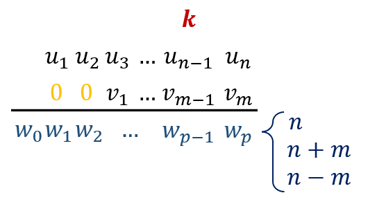

## Сложение неотрицательных целых чисел

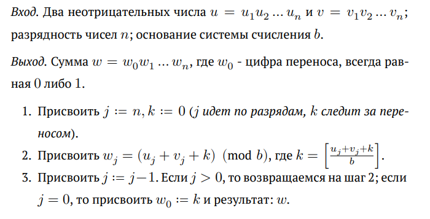

## Вычитание неотрицательных целых чисел

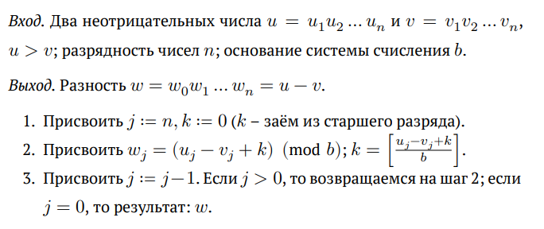

## Умножение неотрицательных целых чисел столбиком

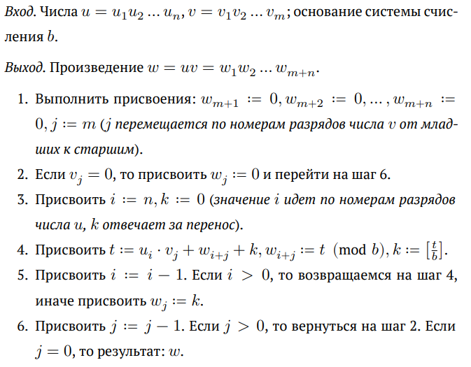{ #fig:004 width=80% }

## Быстрый столбик

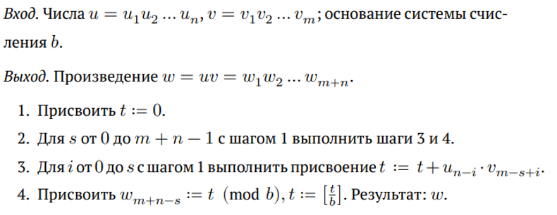

## Деление многоразрядных целых чисел

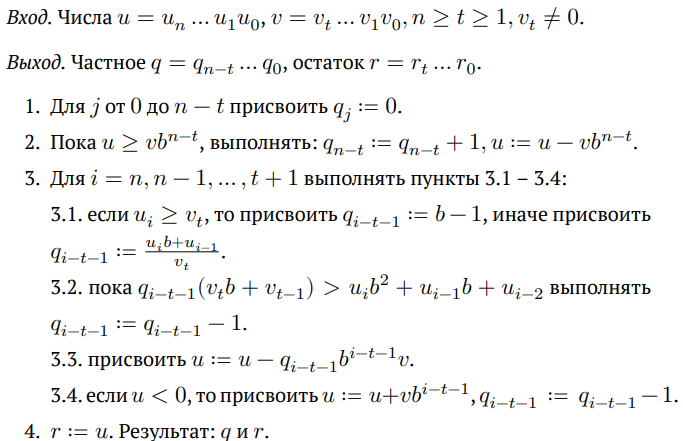{ #fig:005 width=90% }

# Ход выполнения и результаты

## Подготовка

```python
import math

str2num = {chr(letter_ord) : (letter_ord - ord("A") + 10)
                for letter_ord in range(ord("A"), ord("Z") + 1)}
for digit in "0123456789":
    str2num[digit] = int(digit)
num2str = {value : key for (key, value) in str2num.items()}

def fill0(u, n, array = False):
    result = [0] * (n - len(u))
    if array:
        result.extend(u)
        return result
    return "".join([str(i) for i in result]) + u
```

## Сложение неотрицательных целых чисел. Реализация

```python
def addition(u_str, v_str, b):
    u = [str2num[letter] for letter in u_str]
    v = [str2num[letter] for letter in v_str]
    if len(u) != len(v): # если разрядности чисел не совпадают..
        if len(u) < len(v): u = fill0(u, len(v), True)
        else: v = fill0(v, len(u), True)
    n = len(u); k = 0 # шаг 1
    w = [] # сумма
    for j in range(n - 1, -1, -1):             #
        w.append(((u[j] + v[j] + k) % b))      # шаг 2-3
        k = math.floor((u[j] + v[j] + k) / b)  #
    w.append(k); w.reverse() # шаг 3
    return "".join([num2str[digit] for digit in w])
```

## Сложение неотрицательных целых чисел. Результаты

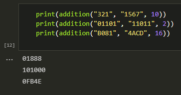

## Вычитание неотрицательных целых чисел. Реализация

```python
def subtraction(u_str, v_str, b):
    u = [str2num[letter] for letter in u_str]
    v = [str2num[letter] for letter in v_str]
    if len(u) != len(v):
        if len(u) < len(v): u = fill0(u, len(v), True)
        else: v = fill0(v, len(u), True)
    elif u < v:
        return "u должно быть больше v"
    n = len(u); w = []; k = 0 # шаг 1
    for j in range(n - 1, -1, -1):             #
        w.append(((u[j] - v[j] + k) % b))      # шаг 2-3
        k = math.floor((u[j] - v[j] + k) / b)  #
    w.reverse()
    return "".join([num2str[digit] for digit in w])
```

## Вычитание неотрицательных целых чисел. Результаты

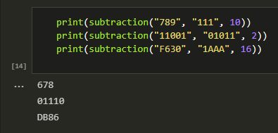

## Умножение неотрицательных целых чисел столбиком. Реализация

```python
def multiply_column(u_str, v_str, b):
    u = [str2num[letter] for letter in u_str]
    v = [str2num[letter] for letter in v_str]
    n = len(u); m = len(v)
    w = [0] * (m + n)     # шаг 1
    for j in range(m - 1, -1, -1):                   
        if v[j] != 0:                                
            k = 0         # шаг 3     
            for i in range(n - 1, -1, -1):           #
                t = u[i] * v[j] + w[i + j + 1] + k   # шаг 4
                w[i + j + 1] = t % b                 #
                k = math.floor(t / b)                #
            w[j] = k                                 # шаг 5                         
    return "".join([num2str[digit] for digit in w])  # шаг 6
```

## Умножение неотрицательных целых чисел столбиком. Результаты

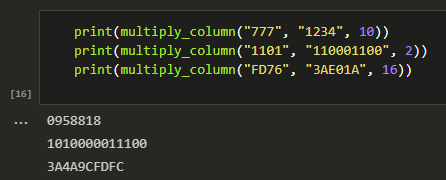

## Быстрый столбик. Реализация

```python
def multiply_quick(u_str, v_str, b):
    u = [str2num[letter] for letter in u_str]
    v = [str2num[letter] for letter in v_str]
    n = len(u); m = len(v)
    w = [0] * (m + n)
    t = 0 # шаг 1
    for s in range(0, m + n): # шаг 2
        for i in range(0, s + 1):                                 #
            if (0 <= n - i - 1 < n) and (0 <= m - s + i - 1 < m): # шаг 3
                t = t + u[n - i - 1] * v[m - s + i - 1]           #
        w[m + n - s - 1] = t % b #
        t = math.floor(t / b)    # шаг 4
    return "".join([num2str[digit] for digit in w])
```

## Быстрый столбик. Результаты

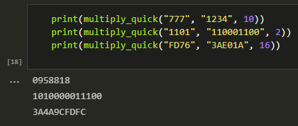

## Деление многоразрядных целых чисел. Реализация

```python
def to10(u_str, b, array = False):
    u_array = u_str if array else [str2num[letter] for letter in u_str]
    u = 0
    for i in range(len(u_array)): u += (b**i)*u_array[len(u_array)-i-1]
    return u
```

```python
def to_b(number, b, n = 1):
    (q, r) = (math.floor(number / b), number % b); w = num2str[r]
    while q >= b: (q, r) = (math.floor(q / b), q % b); w = w+num2str[r]
    if q != 0: w = w + num2str[q]
    while len(w) < n: w = w + "0"
    return w[::-1]
```

```python
def trim_zero(a):
    while a[0] == '0' and len(a) > 1: a = a[1:]
    return a
```

## Деление многоразрядных целых чисел. Реализация

```python
def division(u_str, v_str, b):
    u = u_str; v = v_str
    n = len(u) - 1; t = len(v) - 1 # разрядности чисел
    if v[0] == 0 or not (n >= t >= 1):
        return "Некорректные входные данные"
    q = [0] * (n - t + 1) # шаг 1
    while to10(u, b) >= to10(v, b) * (b ** (n - t)): #
        q[n - t] = q[n - t] + 1                      #
        a = to_b(b ** (n - t), b)                    # шаг 2
        a = multiply_column(v, a, b)                 #
        u = subtraction(u, a, b)                     #
        if len(u) > len(u_str):              # сохраняем начальную
            u = u[1:] if u[0] == '0' else u  # разрядность числа
    u = [str2num[letter] for letter in u]
    v = [str2num[letter] for letter in v_str]
```

## Деление многоразрядных целых чисел. Реализация

```python
    for i in range(n, t, -1): # шаг 3
        if u[n - i] >= v[0]: q[i - t - 1] = b - 1 # шаг 3.1
        else: q[i-t-1] = math.floor((u[n-i] * b + u[n-i+1]) / v[0])
        while q[i-t-1] * (v[0] * b + v[1]) > u[n-i] * (b**2) +
                                   + u[n-i+1] * b + u[n-i+2]:
            q[i - t - 1] = q[i - t - 1] - 1
        u_10 = to10(u, b, True); v_10 = to10(v, b, True) # шаг 3.3
        a = v_10 * q[i-t-1] * (b**(i-t-1)); u_10 -= a   ##                            
        if u_10 < 0:                                     # шаг
            u_10 = u_10 + v_10 * (b ** (i - t - 1))      # 3.4
            q[i - t - 1] = q[i - t - 1] - 1             ##
        u = to_b(u_10, b, n + 1); u = [str2num[letter] for letter in u]
    (q, r) = ("".join([num2str[digit] for digit in q]),
              "".join([num2str[digit] for digit in u]))
    return (trim_zero(q[::-1]), trim_zero(r))
```

## Деление многоразрядных целых чисел. Результаты

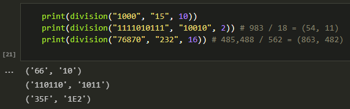

## Заключение

Таким образом, была достигнута цель, поставленная в начале лабораторной работы: было проведено краткое знакомство с алгоритмами целочисленной арифметики многократной точности (сложение неотрицательных целых чисел, вычитание неотрицательных целых чисел, умножение неотрицательных целых чисел столбиком и быстрым столбиком, деление многоразрядных целых чисел), после чего все пять алгоритмов были успешно реализованы на языке программирования **Python**.

## {.standout}

Спасибо за внимание
