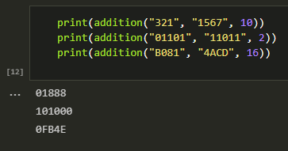
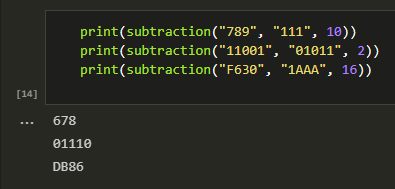
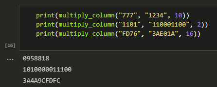
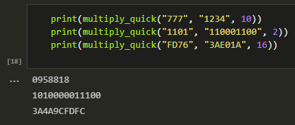
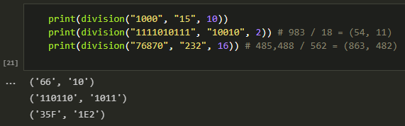

---
# Титульный лист
title: |
    Отчёт по лабораторной работе №8.  
    Целочисленная арифметика многократной точности
author:
- "Студент: Аронова Юлия Вадимовна, 1032212303"
- "Группа: НФИмд-01-21"
- "Преподаватель: Кулябов Дмитрий Сергеевич,"
- "д-р.ф.-м.н., проф."
date: "Москва 2021"

# Общие опции
lang: ru-RU
toc-title: "Содержание"

# Библиография
bibliography: bib/cite.bib
csl: pandoc/csl/gost-r-7-0-5-2008-numeric.csl

# Конвертация в ПДФ
toc: true # Содержание
toc_depth: 2
lof: true # Список изображений
lot: true # Список таблиц
fontsize: 12pt
linestretch: 1.5
papersize: a4
documentclass: scrreprt

## I18n
polyglossia-lang:
  name: russian
  options:
	- spelling=modern
	- babelshorthands=true
polyglossia-otherlangs:
  name: english
### Шрифты
mainfont: PT Serif
romanfont: PT Serif
sansfont: PT Sans
monofont: PT Mono
mainfontoptions: Ligatures=TeX
romanfontoptions: Ligatures=TeX
sansfontoptions: Ligatures=TeX,Scale=MatchLowercase
monofontoptions: Scale=MatchLowercase,Scale=0.8
## Biblatex
biblatex: true
biblio-style: "gost-numeric"
biblatexoptions:
  - parentracker=true
  - backend=biber
  - hyperref=auto
  - language=auto
  - autolang=other*
  - citestyle=gost-numeric

## Misc options
indent: true
header-includes:
  - \linepenalty=10 # the penalty added to the badness of each line within a paragraph (no associated penalty node) Increasing the value makes tex try to have fewer lines in the paragraph.
  - \interlinepenalty=0 # value of the penalty (node) added after each line of a paragraph.
  - \hyphenpenalty=50 # the penalty for line breaking at an automatically inserted hyphen
  - \exhyphenpenalty=50 # the penalty for line breaking at an explicit hyphen
  - \binoppenalty=700 # the penalty for breaking a line at a binary operator
  - \relpenalty=500 # the penalty for breaking a line at a relation
  - \clubpenalty=150 # extra penalty for breaking after first line of a paragraph
  - \widowpenalty=150 # extra penalty for breaking before last line of a paragraph
  - \displaywidowpenalty=50 # extra penalty for breaking before last line before a display math
  - \brokenpenalty=100 # extra penalty for page breaking after a hyphenated line
  - \predisplaypenalty=10000 # penalty for breaking before a display
  - \postdisplaypenalty=0 # penalty for breaking after a display
  - \floatingpenalty = 20000 # penalty for splitting an insertion (can only be split footnote in standard LaTeX)
  - \raggedbottom # or \flushbottom
  - \usepackage{float} # keep figures where there are in the text
  - \floatplacement{figure}{H} # keep figures where there are in the text

  - \usepackage{titling}
  - \setlength{\droptitle}{-9em}
  - \pretitle{\begin{center}
      \textbf{РОССИЙСКИЙ УНИВЕРСИТЕТ ДРУЖБЫ НАРОДОВ}\\
      \textbf{Факультет физико-математических и естественных наук}\\
      \textbf{Кафедра прикладной информатики и теории вероятностей}
      \vspace{9cm}
      \LARGE\\}
  - \posttitle{\vskip 1em \Large \emph{\textit{Дисциплина$:$ Математические основы защиты информации и информационной безопасности}} \end{center}}
  - \preauthor{\vskip 3em \begin{flushright} \large \begin{tabular}[t]{c}}
  - \postauthor{\end{tabular}\par\end{flushright} \vfill \vskip 5em}

  - \usepackage{amsmath}
  - \usepackage{mathtools}

  - \usepackage{enumitem}
  - \setlist{nosep}

  - \setlength{\abovedisplayskip}{3pt}
  - \setlength{\belowdisplayskip}{3pt}
---

# Цель работы

Целью данной лабораторной работы является ознакомление с алгоритмами целочисленной арифметики многократной точности, а также их последующая программная реализация.

# Задание

Рассмотреть и реализовать на языке программирования Python:

1. Алгоритм сложения неотрицательных целых чисел;

2. Алгоритм вычитания неотрицательных целых чисел;

3. Алгоритм умножения неотрицательных целых чисел столбиком;

4. Алгоритм умножения неотрицательных целых чисел быстрым столбиком;

5. Алгоритм деления многоразрядных целых чисел.

# Теоретическое введение

## Арифметика многократной точности

Опр. 3.1.

:   *Высокоточная (длинная) арифметика* — это операции (базовые арифметические действия, элементарные математические функции и пр.) над числами большой разрядности (многоразрядными числами), т.е. числами, разрядность которых превышает длину машинного слова универсальных процессоров общего назначения (более 128 бит) [@isupov2014].

В современных асимметричных криптосистемах в качестве ключей, как правило, используются целые числа длиной 1000 и более битов [@pankratova2009]. Для задания чисел такого размера не подходит ни один стандартный целочисленный тип данных современных языков программирования. Представление чисел в формате с плавающей точкой позволяет задать очень большие числа (например, тип long double языка C++ -- до $10^{5000}$), но не удовлетворяет требованию абсолютной точности, характерному для криптографических приложений. Поэтому большие целые числа представляются в криптографических пакетах в виде последовательности цифр в некоторой системе счисления (обозначим основание системы счисления $b$): $x = (x_{n-1} x_{n-2} \ldots x_1 x_0)_b,$ где $\forall i \in [0, n - 1]: 0 \le x_i < b$.

Основание системы счисления $b$ выбирается так, чтобы существовали машинные команды для работы с однозначными и двузначными числами; как правило, $b$ равно $2^8$, $2^{16}$ или $2^{32}$.

При работе с большими целыми числами знак такого числа удобно хранить в отдельной переменной [@bubnov2012]. Например, при умножении двух чисел знак произведения вычисляется отдельно.

Далее при описании алгоритмов квадратные скобки означают, что берётся целая часть числа.

## Сложение неотрицательных целых чисел

> **Алгоритм 1. Сложение неотрицательных целых чисел** [@bubnov2012]
>
> *Вход.* Два неотрицательных числа $u = u_1 u_2 \ldots u_n$ и $v = v_1 v_2 \ldots v_n$; разрядность чисел $n$; основание системы счисления $b$.
>
> *Выход.* Сумма $w = w_0 w_1 \ldots w_n$, где $w_0$ - цифра переноса, всегда равная $0$ либо $1$.
>
> 1. Присвоить $j \coloneqq n, k \coloneqq 0$ (*$j$ идет по разрядам, $k$ следит за переносом*).
> 2. Присвоить $w_j = (u_j + v_j + k) \pmod{b}$, где $k = \left[ \frac{u_j + v_j + k}{b} \right]$.
> 3. Присвоить $j \coloneqq j - 1$. Если $j > 0$, то возвращаемся на шаг 2; если $j = 0$, то присвоить $w_0 \coloneqq k$ и результат: $w$.

## Вычитание неотрицательных целых чисел

> **Алгоритм 2. Вычитание неотрицательных целых чисел** [@bubnov2012]
>
> *Вход.* Два неотрицательных числа $u = u_1 u_2 \ldots u_n$ и $v = v_1 v_2 \ldots v_n$, $u > v$; разрядность чисел $n$; основание системы счисления $b$.
>
> *Выход.* Разность $w = w_0 w_1 \ldots w_n = u - v$.
>
> 1. Присвоить $j \coloneqq n, k \coloneqq 0$ ($k$ -- заём из старшего разряда).
> 2. Присвоить $w_j = (u_j - v_j + k) \pmod{b}$; $k = \left[ \frac{u_j - v_j + k}{b} \right]$.
> 3. Присвоить $j \coloneqq j - 1$. Если $j > 0$, то возвращаемся на шаг 2; если $j = 0$, то результат: $w$.

## Умножение неотрицательных целых чисел столбиком

> **Алгоритм 3. Умножение неотрицательных целых чисел столбиком** [@bubnov2012]
>
> *Вход.* Числа $u = u_1 u_2 \ldots u_n$, $v = v_1 v_2 \ldots v_m$; основание системы счисления $b$.
>
> *Выход.* Произведение $w = uv = w_1 w_2 \ldots w_{m+n}$.
>
> 1. Выполнить присвоения: $w_{m+1} \coloneqq 0, w_{m+2} \coloneqq 0, \ldots, w_{m+n} \coloneqq 0, j \coloneqq m$ (*$j$ перемещается по номерам разрядов числа $v$ от младших к старшим*).
> 2. Если $v_j = 0$, то присвоить $w_j \coloneqq 0$ и перейти на шаг 6.
> 3. Присвоить $i \coloneqq n, k \coloneqq 0$ (*значение $i$ идет по номерам разрядов числа $u$, $k$ отвечает за перенос*).
> 4. Присвоить $t \coloneqq u_i \cdot v_j + w_{i+j} + k, w_{i+j} \coloneqq t \pmod{b}, k \coloneqq \left[ \frac{t}{b} \right]$.
> 5. Присвоить $i \coloneqq i - 1$. Если $i > 0$, то возвращаемся на шаг 4, иначе присвоить $w_j \coloneqq k$.
> 6. Присвоить $j \coloneqq j - 1$. Если $j > 0$, то вернуться на шаг 2. Если $j = 0$, то результат: $w$.

## Быстрый столбик

> **Алгоритм 4. Быстрый столбик** [@bubnov2012]
>
> *Вход.* Числа $u = u_1 u_2 \ldots u_n$, $v = v_1 v_2 \ldots v_m$; основание системы счисления $b$.
>
> *Выход.* Произведение $w = uv = w_1 w_2 \ldots w_{m+n}$.
>
> 1. Присвоить $t \coloneqq 0$.
> 2. Для $s$ от $0$ до $m + n - 1$ с шагом 1 выполнить шаги 3 и 4.
> 3. Для $i$ от $0$ до $s$ с шагом 1 выполнить присвоение $t~\coloneqq~t~+~u_{n - i}~\cdot~v_{m - s + i}$.
> 4. Присвоить $w_{m + n - s} \coloneqq t \pmod{b}, t \coloneqq \left[ \frac{t}{b} \right]$. Результат: $w$.

## Деление многоразрядных целых чисел

> **Алгоритм 5. Деление многоразрядных целых чисел** [@bubnov2012]
>
> *Вход.* Числа $u = u_n \ldots u_1 u_0$, $v = v_t \ldots v_1 v_0, n \ge t \ge 1, v_t \ne 0$.
>
> *Выход.* Частное $q = q_{n-t} \ldots q_0$, остаток $r = r_t \ldots r_0$.
>
> 1. Для $j$ от $0$ до $n - t$ присвоить $q_j \coloneqq 0$.
> 2. Пока $u \ge v b^{n - t}$, выполнять: $q_{n - t} \coloneqq q_{n - t} + 1, u \coloneqq u - v b^{n - t}$.
> 3. Для $i = n, n - 1, \ldots, t + 1$ выполнять пункты 3.1 -- 3.4:
>
>     3.1. если $u_i \ge v_t$, то присвоить $q_{i - t - 1} \coloneqq b - 1$, иначе присвоить $q_{i - t - 1} \coloneqq \frac{u_i b + u_{i - 1}}{v_t}$.
>
>     3.2. пока $q_{i - t - 1} (v_t b + v_{t - 1}) > u_i b^2 + u_{i - 1} b + u_{i - 2}$ выполнять $q_{i - t - 1} \coloneqq q_{i - t - 1} - 1$.
>
>     3.3. присвоить $u \coloneqq u - q_{i - t - 1} b^{i - t - 1} v$.
>
>     3.4. если $u < 0$, то присвоить $u \coloneqq u + v b^{i - t - 1}$, $q_{i - t - 1}~\coloneqq~q_{i - t - 1}~-~1$.
>
> 4. $r \coloneqq u$. Результат: $q$ и $r$.

# Выполнение лабораторной работы

Реализуем описанные выше алгоритмы на языке **Python** в среде Jupyter Notebook. Для работы нам понадобятся библиотека `math`, словари, отображающие буквы в их числовые аналоги и наоборот ($A \leftrightarrow 10, B \leftrightarrow 11$ и т.д.), а также функция добавления ведущих нулей к числу $fill0(u, n, array)$:

```python
import math

# словарь вида {строковый символ : его числовой аналог}
str2num = {chr(letter_ord) : (letter_ord - ord("A") + 10)
                            for letter_ord in range(ord("A"), ord("Z") + 1)}
for digit in "0123456789":
    str2num[digit] = int(digit)
# словарь вида {число : его стокровый аналог}
num2str = {value : key for (key, value) in str2num.items()}

def fill0(u, n, array = False):
    """
    Добавляет ведущие нули к числу u до разрядности n;
    array = True, если число u передано в виде массива чисел
    """
    result = [0] * (n - len(u))
    if array:
        result.extend(u)
        return result
    return "".join([str(i) for i in result]) + u
```

## Сложение неотрицательных целых чисел

Создадим функцию `addition(u_str, v_str, b)` следующего вида:

```python
def addition(u_str, v_str, b):
    """
    Складывает два неотрицательных числа  в системе счисления b,
    u_str и v_str, представленных в строчном виде
    """
    # представляем числа в виде массивов чисел
    u = [str2num[letter] for letter in u_str]
    v = [str2num[letter] for letter in v_str]

    if len(u) != len(v): # если разрядности чисел не совпадают..
        # добавляем к меньшему числу ведущие нули
        if len(u) < len(v): u = fill0(u, len(v), True)
        else: v = fill0(v, len(u), True)

    # n - разрядность числа, k следит за переносом
    # шаг 1
    n = len(u); k = 0
    w = [] # сумма

    for j in range(n - 1, -1, -1):             #
        w.append(((u[j] + v[j] + k) % b))      # шаг 2-3
        k = math.floor((u[j] + v[j] + k) / b)  #

    w.append(k); w.reverse() # шаг 3
    # преобразуем сумму-массив в строчный вид
    return "".join([num2str[digit] for digit in w])
```

Теперь с помощью данной функции найдём суммы пар чисел в разных системах счисления (см. Рис. [-@fig:001]).

{ #fig:001 width=100% }

## Вычитание неотрицательных целых чисел

Создадим функцию `subtraction(u_str, v_str, b)` следующего вида:

```python
def subtraction(u_str, v_str, b):
    """
    Вычитает число v_str из u_str, представленных в строчном виде,
    в системе счисления b
    """
    # представляем числа в виде массивов чисел
    u = [str2num[letter] for letter in u_str]
    v = [str2num[letter] for letter in v_str]

    # если разрядности чисел не совпадают..
    if len(u) != len(v):
        # добавляем к меньшему числу ведущие нули
        if len(u) < len(v): u = fill0(u, len(v), True)
        else: v = fill0(v, len(u), True)
    elif u < v: # если u меньше v
        return "u должно быть больше v"

    # n - разрядность числа, k следит за переносом,
    # w - разность
    n = len(u); w = []; k = 0 # шаг 1

    for j in range(n - 1, -1, -1):             #
        w.append(((u[j] - v[j] + k) % b))      # шаг 2-3
        k = math.floor((u[j] - v[j] + k) / b)  #

    w.reverse() # записываем массив в обратном порядке

    # преобразуем результат в виде массива в строчный вид
    return "".join([num2str[digit] for digit in w])
```

Теперь с помощью данной функции найдём разности пар чисел в разных системах счисления (см. Рис. [-@fig:002]).

{ #fig:002 width=100% }

## Умножение неотрицательных целых чисел столбиком

Создадим функцию `multiply_column(u_str, v_str, b)` следующего вида:

```python
def multiply_column(u_str, v_str, b):
    """
    Умножает столбиком два неотрицательных числа
    в системе счисления b, u_str и v_str,
    представленных в строчном виде
    """
    # представляем числа в виде массивов чисел
    u = [str2num[letter] for letter in u_str]
    v = [str2num[letter] for letter in v_str]

    # n - разрядность u,
    # m - разрядность v
    n = len(u); m = len(v)
    # произведение
    w = [0] * (m + n) # шаг 1

    # шаг 2 опускаем, поскольку весь массив w
    # изначально заполнен нулями

    for j in range(m - 1, -1, -1):                   
        if v[j] != 0:                                
            k = 0    # шаг 3     
            for i in range(n - 1, -1, -1):           #
                t = u[i] * v[j] + w[i + j + 1] + k   # шаг 4
                w[i + j + 1] = t % b                 #
                k = math.floor(t / b)                #
            w[j] = k # шаг 5                         

    # преобразуем результат в виде массива в строчный вид
    return "".join([num2str[digit] for digit in w]) # шаг 6
```

Теперь с помощью данной функции найдём произведения пар чисел в разных системах счисления (см. Рис. [-@fig:003]).

{ #fig:003 width=100% }

## Быстрый столбик

Создадим функцию `multiply_quick(u_str, v_str, b)` следующего вида:

```python
def multiply_quick(u_str, v_str, b):
    """
    Умножает быстрым столбиком два неотрицательных числа
    в системе счисления b, u_str и v_str,
    представленных в строчном виде
    """
    # представляем числа в виде массивов чисел
    u = [str2num[letter] for letter in u_str]
    v = [str2num[letter] for letter in v_str]

    # n - разрядность u,
    # m - разрядность v
    n = len(u); m = len(v)
    # произведение
    w = [0] * (m + n)

    t = 0 # шаг 1
    for s in range(0, m + n): # шаг 2
        for i in range(0, s + 1):                                 #
            if (0 <= n - i - 1 < n) and (0 <= m - s + i - 1 < m): # шаг 3
                t = t + u[n - i - 1] * v[m - s + i - 1]           #
        w[m + n - s - 1] = t % b #
        t = math.floor(t / b)    # шаг 4

    # преобразуем результат в виде массива в строчный вид
    return "".join([num2str[digit] for digit in w])
```

Теперь с помощью данной функции найдём произведения пар чисел в разных системах счисления (см. Рис. [-@fig:004]).

{ #fig:004 width=100% }

## Деление многоразрядных целых чисел

Начнём с реализации дополнительных функций: для смены системы счисления числа и для удаления ведущих нулей из его представления.

```python
def to10(u_str, b, array = False):
    """
    Переводит число u_str в системе счисления b
    в десятичную систему исчисления;
    array = True, если число u передано в виде массива чисел
    """
    u_array = u_str if array else [str2num[letter] for letter in u_str]
    u = 0
    for i in range(len(u_array)):
        u += (b ** i) * u_array[len(u_array) - i - 1]
    return u

def to_b(number, b, n = 1):
    """
    Переводит десятичное число number в систему счисления
    с основанием b; n - минимальная разрядность
    результирующей записи числа    
    """
    # будем последовательно делить number на b и сохранять остатки
    # q - очередное частое, r - очередной остаток
    # w - результат, в который поелсдовательно записываем остатки
    (q, r) = (math.floor(number / b), number % b); w = num2str[r]

    # пока частоное больше основания системы счисления
    while q >= b:
        # продолжаем деление
        (q, r) = (math.floor(q / b), q % b)
        w = w + num2str[r]

    # если частное ненулевое, тоже добавляем его в результат
    if q != 0: w = w + num2str[q]

    # если разрядность меньше желаемой..
    while len(w) < n:
        # добавляем ведущие нули
        w = w + "0"

    # записываем число в обратном порядке
    return w[::-1]

def trim_zero(a):
    """
    Удаляет ведущие нули числа a
    """
    while a[0] == '0' and len(a) > 1:
        a = a[1:]
    return a
```

Теперь создадим функцию `division(u_str, v_str, b)` следующего вида:

```python
def division(u_str, v_str, b):
    """
    Производит деление целых неотрицательных чисел,
    записанных в строчном виде (u_str на v_str),
    в системе счисления с основанием b
    Результат: (q, r), где q - частное, r - остаток
    """
    u = u_str; v = v_str
    n = len(u) - 1; t = len(v) - 1 # разрядности чисел

    # проверка условий
    if v[0] == 0 or not (n >= t >= 1):
        return "Некорректные входные данные"

    q = [0] * (n - t + 1) # шаг 1

    while to10(u, b) >= to10(v, b) * (b ** (n - t)): #
        q[n - t] = q[n - t] + 1                      #
        a = to_b(b ** (n - t), b)                    # шаг 2
        a = multiply_column(v, a, b)                 #
        u = subtraction(u, a, b)                     #
        if len(u) > len(u_str):              # сохраняем начальную
            u = u[1:] if u[0] == '0' else u  # разрядность числа

    # переводим числа в вид массивов
    u = [str2num[letter] for letter in u]
    v = [str2num[letter] for letter in v_str]

    for i in range(n, t, -1): # шаг 3
        if u[n - i] >= v[0]:       #
            q[i - t - 1] = b - 1   # шаг 3.1.
        else:                      #
            q[i - t - 1] = math.floor((u[n - i] * b + u[n - i + 1]) / v[0])

        # шаг 3.2
        while q[i - t - 1] * (v[0] * b + v[1]) > u[n - i] * (b ** 2) +
                                            + u[n - i + 1] * b + u[n - i + 2]:
            q[i - t - 1] = q[i - t - 1] - 1

        u_10 = to10(u, b, True); v_10 = to10(v, b, True) #
        a = v_10 * q[i - t - 1] * (b ** (i - t - 1))     # шаг 3.3
        u_10 = u_10 - a                                  #

        if u_10 < 0:                                     #
            u_10 = u_10 + v_10 * (b ** (i - t - 1))      # шаг 3.4
            q[i - t - 1] = q[i - t - 1] - 1              #

        # возвращаем число u в систему с основанием b
        u = to_b(u_10, b, n + 1); u = [str2num[letter] for letter in u]

    # преобразуем массивы обратно в строки
    (q, r) = ("".join([num2str[digit] for digit in q]),
                               "".join([num2str[digit] for digit in u]))

    # удаляем ведущие нули и записываем частное в обратном порядке
    return (trim_zero(q[::-1]), trim_zero(r))
```

Теперь с помощью данной функции найдём частные и остоток от деления пар чисел в разных системах счисления (см. Рис. [-@fig:005]).

{ #fig:005 width=100% }

# Выводы

Таким образом, была достигнута цель, поставленная в начале лабораторной работы: было проведено краткое знакомство с алгоритмами целочисленной арифметики многократной точности (сложение неотрицательных целых чисел, вычитание неотрицательных целых чисел, умножение неотрицательных целых чисел столбиком и быстрым столбиком, деление многоразрядных целых чисел), после чего все пять алгоритмов были успешно реализованы на языке программирования **Python**.

# Список литературы{.unnumbered}

::: {#refs}
:::
